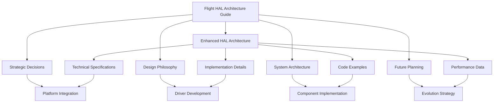

# Flight HAL Architecture Documentation

This directory contains comprehensive architectural documentation for the Flight Hardware Abstraction Layer (HAL) system.

## Documents Overview

### 📐 [Flight HAL Architecture Guide](flight_hal_architecture_guide.md)
**Main architectural reference** - Comprehensive guide covering design philosophy, system architecture, platform abstraction strategy, and future extensibility planning.

**Target Audience**: Architects, senior developers, platform integrators  
**Focus**: High-level design decisions, architectural patterns, and strategic guidance

**Key Sections**:
- Executive overview and architectural achievements
- Core design principles and rationale
- System architecture with visual component diagrams  
- Performance tier system and platform abstraction
- Advanced architectural patterns (resource coordination, event system)
- Future extensibility and evolution roadmap
- Architecture Decision Records (ADRs)

### 🔧 [Enhanced HAL Architecture](enhanced_hal_architecture.md)
**Technical implementation reference** - Detailed technical documentation of the HAL system components, interfaces, and implementation patterns.

**Target Audience**: Implementation developers, driver writers  
**Focus**: Technical specifications, code examples, and implementation details

**Key Sections**:
- Component implementation details
- Interface specifications and usage examples
- Platform-specific optimizations
- Build integration and configuration
- Testing strategies and performance characteristics

## Documentation Relationship

## Reading Path Recommendations

### For System Architects
1. **Start**: [Flight HAL Architecture Guide](flight_hal_architecture_guide.md) - Complete read
2. **Reference**: [Enhanced HAL Architecture](enhanced_hal_architecture.md) - Success metrics and testing strategy sections

### For Platform Integrators  
1. **Start**: [Flight HAL Architecture Guide](flight_hal_architecture_guide.md) - Platform Abstraction Strategy & Future Extensibility sections
2. **Deep Dive**: [Enhanced HAL Architecture](enhanced_hal_architecture.md) - Platform-specific optimizations and build integration

### For Driver Developers
1. **Start**: [Flight HAL Architecture Guide](flight_hal_architecture_guide.md) - Design Philosophy & Advanced Patterns sections  
2. **Implementation**: [Enhanced HAL Architecture](enhanced_hal_architecture.md) - Complete technical reference

### For New Team Members
1. **Overview**: [Flight HAL Architecture Guide](flight_hal_architecture_guide.md) - Executive Overview & System Architecture sections
2. **Examples**: [Enhanced HAL Architecture](enhanced_hal_architecture.md) - Implementation examples and usage patterns

## Related Documentation

- **[Interface Documentation](../api/)** - Detailed API reference for all HAL interfaces
- **[Integration Guidelines](../integration_guidelines.md)** - Practical guidance for using HAL interfaces
- **[Platform Detection System](../platform_detection_system.md)** - Platform detection implementation details
- **[Error Handling System](../error_handling_system.md)** - Error handling patterns and best practices

## Contributing to Architecture Documentation

When contributing to architectural documentation:

1. **Strategic Changes**: Update the [Architecture Guide](flight_hal_architecture_guide.md) first
2. **Implementation Details**: Add to [Enhanced HAL Architecture](enhanced_hal_architecture.md)
3. **Decision Records**: Add new ADRs to the Architecture Guide
4. **Visual Diagrams**: Use Mermaid syntax for consistency
5. **Cross-References**: Maintain links between related sections

## Architecture Principles Quick Reference

🎯 **Universal Platform Support**: Single codebase, 9+ platforms  
⚡ **Zero-Cost Abstractions**: Virtual dispatch only at boundaries  
🔄 **Graceful Degradation**: Capability detection with fallbacks  
🛡️ **Type-Safe Error Handling**: Rich context without exceptions  
🔧 **Self-Organizing Drivers**: Auto-registration ecosystem  
🎮 **Extreme Hardware Range**: 16MB Dreamcast → Unlimited PC  

---

*For the most current architectural guidance, always refer to the [Flight HAL Architecture Guide](flight_hal_architecture_guide.md) as the authoritative source.*
