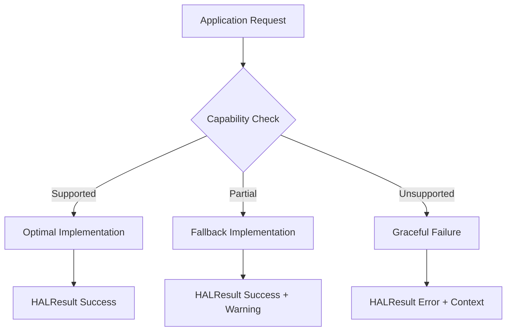
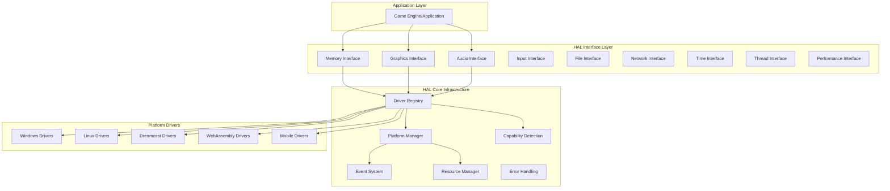
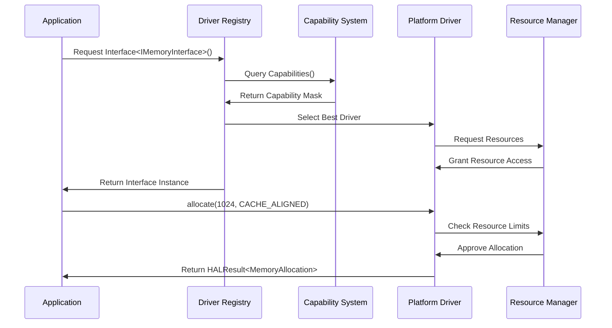
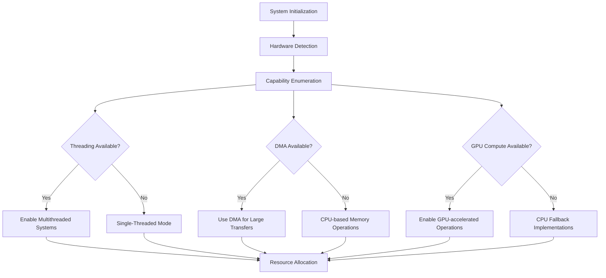
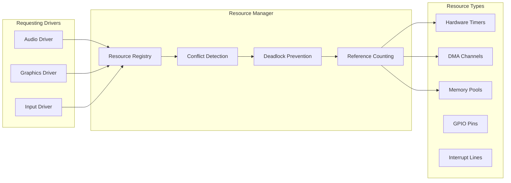
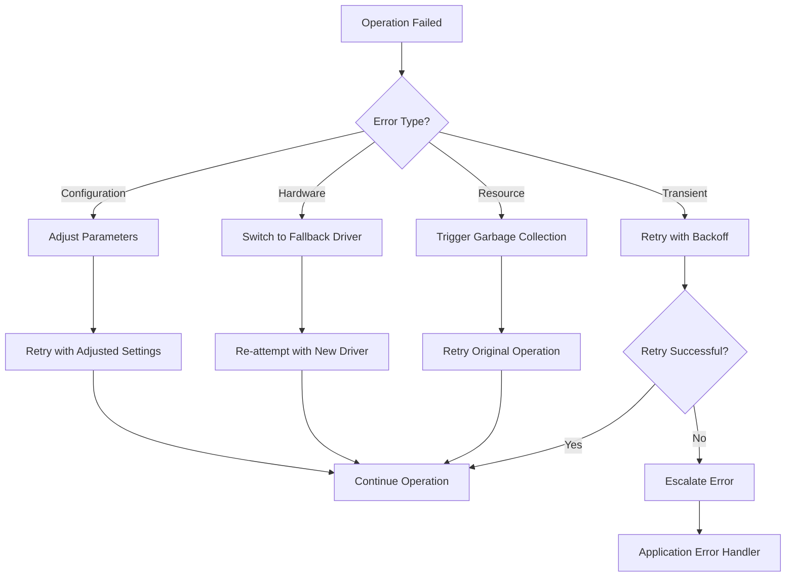
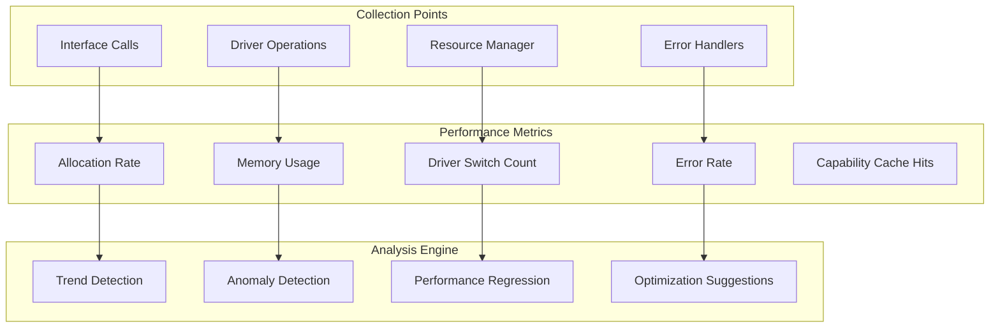
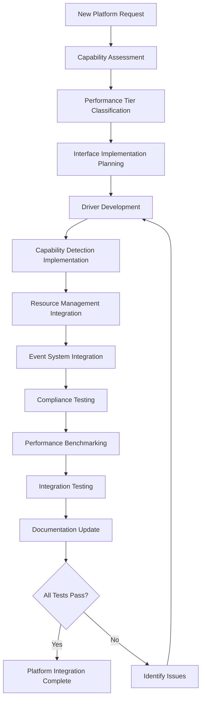

# Flight HAL Architecture Guide

## Table of Contents

1. [Executive Overview](#executive-overview)
2. [Design Philosophy](#design-philosophy)
3. [System Architecture](#system-architecture)
4. [Platform Abstraction Strategy](#platform-abstraction-strategy)
5. [Advanced Architectural Patterns](#advanced-architectural-patterns)
6. [Performance Architecture](#performance-architecture)
7. [Future Extensibility](#future-extensibility)
8. [Architecture Decision Records](#architecture-decision-records)

---

## Executive Overview

### Mission Statement

The Flight Hardware Abstraction Layer (HAL) represents a revolutionary approach to cross-platform game engine development, enabling seamless execution across the most extreme hardware diversity in the industry—from vintage gaming systems with 16MB RAM (Sega Dreamcast) to unlimited modern desktop environments.

### Architectural Achievements

🎯 **Universal Platform Support**: Single codebase targeting 9+ platforms without compromise  
⚡ **Zero-Cost Abstractions**: Virtual dispatch only where necessary, compile-time optimization everywhere else  
🔄 **Graceful Degradation**: Intelligent capability detection with automatic fallback strategies  
🛡️ **Type-Safe Error Handling**: Comprehensive error propagation with rich context preservation  
🔧 **Self-Organizing Drivers**: RetroArch-inspired auto-registration enabling modular ecosystems  
🎮 **Real-World Proven**: Architecture validated from 16MB embedded systems to unlimited desktop environments  

### Innovation Highlights

- **Performance Tier System**: Revolutionary 4-tier abstraction enabling hardware-specific optimizations
- **Capability-Aware Programming**: Runtime feature detection with compile-time optimization paths
- **Resource Coordination Engine**: Advanced cross-driver resource sharing with deadlock prevention
- **Adaptive Configuration Hierarchy**: Dynamic system adaptation based on runtime capabilities

---

## Design Philosophy

### Core Principles

#### 1. Zero-Cost Abstraction Philosophy

```cpp
// Compile-time dispatch for performance-critical paths
template<typename ConcreteDriver>
class StaticDriverWrapper {
    auto allocate(size_t size) -> decltype(auto) {
        return static_cast<ConcreteDriver*>(this)->allocate_impl(size);
    }
};

// Runtime polymorphism only at driver boundaries
class IMemoryInterface {
    virtual HALResult<MemoryAllocation> allocate(size_t size) = 0;
};
```

**Rationale**: Virtual function overhead is acceptable for driver selection (one-time cost) but unacceptable for inner loops. Templates provide zero-cost abstractions for hot paths while maintaining type safety.

#### 2. Graceful Degradation Strategy



**Philosophy**: Never fail catastrophically. Always provide the best possible experience given available hardware capabilities.

#### 3. Resource Efficiency Mandate

- **Memory Constraints**: Primary design consideration for 16MB systems
- **CPU Efficiency**: Optimized for single-core ARM9 (Dreamcast) to multi-core x86
- **Power Awareness**: Battery life considerations for mobile platforms

#### 4. Platform Independence Goals

```cpp
// Platform-agnostic interface
class IGraphicsInterface {
    virtual HALResult<RenderTarget> create_render_target(
        uint32_t width, uint32_t height, PixelFormat format) = 0;
};

// Platform-specific implementation
class DreamcastGraphicsDriver : public IGraphicsInterface {
    // PowerVR-specific optimizations
    HALResult<RenderTarget> create_render_target(...) override;
};
```

---

## System Architecture

### High-Level Component Overview



### Component Responsibilities

| Component | Responsibility | Key Features |
|-----------|---------------|--------------|
| **Driver Registry** | Driver lifecycle and discovery | Thread-safe registration, priority-based selection |
| **Platform Manager** | Cross-driver coordination | Resource sharing, lifecycle management |
| **Capability Detection** | Runtime feature discovery | 25+ capabilities, performance tier classification |
| **Interface Layer** | Hardware abstraction contracts | Type-safe APIs, HALResult error handling |
| **Event System** | Cross-component communication | Async notifications, resource state changes |
| **Resource Manager** | Resource lifecycle and sharing | Deadlock prevention, reference counting |

### Data Flow Architecture



---

## Platform Abstraction Strategy

### Performance Tier Classification

#### Tier 0: Minimal (Dreamcast-class)
- **Memory**: 16MB total system RAM
- **CPU**: Single-core ARM9 @ 200MHz
- **Graphics**: Software rendering only
- **Features**: No threading, basic audio, limited networking

```cpp
if (platform.get_performance_tier() == PerformanceTier::Minimal) {
    // Use memory pools to minimize allocation overhead
    config.use_memory_pools = true;
    config.max_texture_size = 256;
    config.audio_buffer_count = 2;
}
```

#### Tier 1: Limited (PSP-class)
- **Memory**: 32-64MB system RAM
- **CPU**: Dual-core ARM @ 333MHz
- **Graphics**: Hardware 3D acceleration
- **Features**: Limited threading, WiFi networking

#### Tier 2: Standard (Modern Mobile/Web)
- **Memory**: 512MB+ available
- **CPU**: Quad-core ARM/x86
- **Graphics**: Modern GPU with shaders
- **Features**: Full threading, network connectivity

#### Tier 3: High-Performance (Desktop PC)
- **Memory**: Unlimited practical limits
- **CPU**: Multi-core x86/ARM64
- **Graphics**: Dedicated GPU with compute
- **Features**: All capabilities available

### Capability-Driven Adaptation



### Platform-Specific Optimizations

#### Dreamcast (SH-4 Architecture)
```cpp
class DreamcastMemoryDriver : public IMemoryInterface {
private:
    // Use SH-4 optimized memory copying
    static constexpr size_t SH4_CACHE_LINE = 32;
    FixedPoolAllocator<16384> small_pool_;  // Optimize for 16MB constraint
    
public:
    HALResult<MemoryAllocation> allocate(size_t size, MemoryFlags flags) override {
        if (size <= 256) {
            return small_pool_.allocate(size);  // Fast pool allocation
        }
        return system_allocate(size, SH4_CACHE_LINE);  // Cache-aligned
    }
};
```

#### WebAssembly (Browser Constraints)
```cpp
class WebMemoryDriver : public IMemoryInterface {
private:
    // Respect browser memory limits
    size_t max_heap_size_;
    std::atomic<size_t> current_usage_;
    
public:
    HALResult<MemoryAllocation> allocate(size_t size, MemoryFlags flags) override {
        if (current_usage_ + size > max_heap_size_) {
            return HALResult<MemoryAllocation>::error(
                HALError::ResourceExhausted, 
                "Browser memory limit exceeded");
        }
        // Use emscripten memory management
        return emscripten_allocate(size);
    }
};
```

---

## Advanced Architectural Patterns

### Resource Coordination Engine

The Flight HAL implements sophisticated resource coordination to prevent conflicts between drivers accessing shared hardware resources.



#### Deadlock Prevention Algorithm

```cpp
class DeadlockPrevention {
private:
    struct ResourceNode {
        ResourceID id;
        std::vector<ResourceID> dependencies;
        std::atomic<int> lock_order;
    };
    
    std::unordered_map<ResourceID, ResourceNode> resource_graph_;
    
public:
    HALResult<ResourceHandle> acquire_resources(
        const std::vector<ResourceID>& resources,
        DriverID requesting_driver) {
        
        // Sort resources by global lock order to prevent deadlock
        auto sorted_resources = resources;
        std::sort(sorted_resources.begin(), sorted_resources.end(),
                 [this](ResourceID a, ResourceID b) {
                     return resource_graph_[a].lock_order < 
                            resource_graph_[b].lock_order;
                 });
        
        return acquire_in_order(sorted_resources, requesting_driver);
    }
};
```

### Event System Architecture

Cross-driver communication through a type-safe event system enables coordinated behavior without tight coupling.

```cpp
// Event type definitions
struct MemoryPressureEvent {
    size_t available_bytes;
    PerformanceTier recommended_tier;
};

struct GraphicsContextLostEvent {
    GraphicsDriverID driver_id;
    RecoveryStrategy strategy;
};

// Event subscription and dispatch
class EventSystem {
public:
    template<typename EventType>
    void subscribe(std::function<void(const EventType&)> handler) {
        handlers_[typeid(EventType)].push_back(
            [handler](const void* event) {
                handler(*static_cast<const EventType*>(event));
            }
        );
    }
    
    template<typename EventType>
    void publish(const EventType& event) {
        auto it = handlers_.find(typeid(EventType));
        if (it != handlers_.end()) {
            for (auto& handler : it->second) {
                handler(&event);
            }
        }
    }
};
```

### Advanced Error Handling Patterns

#### Error Context Preservation

```cpp
template<typename T>
class HALResult {
private:
    std::variant<T, HALError> result_;
    std::string context_chain_;
    
public:
    template<typename U>
    HALResult<U> and_then(std::function<HALResult<U>(const T&)> func) const {
        if (has_error()) {
            return HALResult<U>::error(error(), context_chain_);
        }
        
        auto new_result = func(value());
        if (new_result.has_error()) {
            // Chain error contexts
            return HALResult<U>::error(
                new_result.error(),
                context_chain_ + " -> " + new_result.context_chain_
            );
        }
        return new_result;
    }
};
```

#### Error Recovery Strategies



---

## Performance Architecture

### Memory Management Strategy

#### Multi-Tier Allocation Strategy

```cpp
class MemoryArchitecture {
private:
    // Tier 0: Stack allocation for tiny objects
    template<size_t Size>
    using StackBuffer = std::array<uint8_t, Size>;
    
    // Tier 1: Pool allocation for small, frequent allocations
    FixedPoolAllocator<64> tiny_pool_;       // <= 64 bytes
    FixedPoolAllocator<256> small_pool_;     // <= 256 bytes
    FixedPoolAllocator<1024> medium_pool_;   // <= 1KB
    
    // Tier 2: Linear allocation for temporary objects
    LinearAllocator frame_allocator_;        // Reset each frame
    
    // Tier 3: System allocation for large objects
    SystemAllocator system_allocator_;       // OS virtual memory
    
public:
    template<size_t Size>
    auto allocate() -> AllocationResult {
        if constexpr (Size <= 64) {
            return tiny_pool_.allocate(Size);
        } else if constexpr (Size <= 256) {
            return small_pool_.allocate(Size);
        } else if constexpr (Size <= 1024) {
            return medium_pool_.allocate(Size);
        } else {
            return system_allocator_.allocate(Size);
        }
    }
};
```

### Performance Monitoring Integration



### Zero-Cost Abstraction Validation

```cpp
// Compile-time performance validation
template<typename Implementation>
class PerformanceValidator {
    static_assert(sizeof(Implementation) <= 64, 
                  "Driver implementation exceeds cache line size");
    
    static_assert(std::is_trivially_destructible_v<Implementation>,
                  "Driver must have trivial destructor for performance");
    
    // Validate that virtual function table is minimal
    static_assert(sizeof(Implementation*) == sizeof(void*),
                  "Virtual function overhead detected");
};

// Runtime performance assertions
class RuntimeValidator {
public:
    template<typename Func>
    auto measure_and_validate(Func&& func, 
                             std::chrono::nanoseconds max_time) {
        auto start = std::chrono::high_resolution_clock::now();
        auto result = func();
        auto end = std::chrono::high_resolution_clock::now();
        
        auto duration = end - start;
        if (duration > max_time) {
            publish_event(PerformanceViolationEvent{
                .operation = typeid(Func).name(),
                .actual_time = duration,
                .expected_time = max_time
            });
        }
        
        return result;
    }
};
```

---

## Future Extensibility

### New Platform Integration Strategy

#### Platform Onboarding Process



#### Platform Driver Template

```cpp
template<typename PlatformTraits>
class PlatformDriverTemplate : public IMemoryInterface {
private:
    using AllocatorType = typename PlatformTraits::AllocatorType;
    using AddressType = typename PlatformTraits::AddressType;
    static constexpr size_t ALIGNMENT = PlatformTraits::REQUIRED_ALIGNMENT;
    
    AllocatorType allocator_;
    
public:
    HALResult<MemoryAllocation> allocate(size_t size, MemoryFlags flags) override {
        // Platform-specific allocation logic
        return PlatformTraits::allocate(allocator_, size, flags);
    }
    
    bool supports_capability(HALCapability cap) const override {
        return PlatformTraits::CAPABILITIES & static_cast<uint64_t>(cap);
    }
};

// Platform specialization
struct DreamcastTraits {
    using AllocatorType = SH4Allocator;
    using AddressType = uint32_t;
    static constexpr size_t REQUIRED_ALIGNMENT = 32;
    static constexpr uint64_t CAPABILITIES = 
        static_cast<uint64_t>(HALCapability::BasicMemory) |
        static_cast<uint64_t>(HALCapability::CacheAligned);
        
    static HALResult<MemoryAllocation> allocate(
        SH4Allocator& alloc, size_t size, MemoryFlags flags);
};
```

### Interface Evolution Strategy

#### Versioned Interface Support

```cpp
namespace flight::hal::v1 {
    class IMemoryInterface {
        virtual HALResult<void*> allocate(size_t size) = 0;
    };
}

namespace flight::hal::v2 {
    class IMemoryInterface {
        virtual HALResult<MemoryAllocation> allocate(
            size_t size, MemoryAlignment alignment, MemoryFlags flags) = 0;
    };
}

// Version adaptation layer
template<typename DriverType>
class InterfaceAdapter {
public:
    static auto adapt_v1_to_v2(DriverType* driver) {
        return [driver](size_t size, MemoryAlignment align, MemoryFlags flags) 
            -> HALResult<MemoryAllocation> {
            auto result = driver->allocate(size);
            if (result.has_error()) {
                return HALResult<MemoryAllocation>::error(result.error());
            }
            
            return HALResult<MemoryAllocation>::success(MemoryAllocation{
                .ptr = result.value(),
                .size = size,
                .alignment = align,
                .flags = flags
            });
        };
    }
};
```

### Architecture Evolution Roadmap

#### Phase 1: Foundation Completion (Current)
- ✅ Core interface definitions
- ✅ Driver registration system
- ✅ Capability detection
- ✅ Resource coordination
- ✅ Error handling framework

#### Phase 2: Advanced Features (Next)
- 🔄 GPU compute integration
- 🔄 Advanced memory management (NUMA awareness)
- 🔄 Real-time scheduling support
- 🔄 Hardware-accelerated cryptography

#### Phase 3: Ecosystem Expansion (Future)
- 📋 Code generation tools
- 📋 Visual driver development IDE
- 📋 Automatic platform detection
- 📋 Cloud-based capability testing

#### Phase 4: Next-Generation Platforms (Long-term)
- 📋 Quantum computing interfaces
- 📋 Neural processing unit support
- 📋 Distributed computing abstractions
- 📋 Edge computing optimization

---

## Architecture Decision Records

### ADR-001: RetroArch-Inspired Driver Registration

**Status**: Accepted  
**Date**: 2024-Q4  

**Context**: Need self-organizing driver ecosystem that doesn't require manual registration.

**Decision**: Implement static initialization-based auto-registration similar to RetroArch.

**Consequences**:
- ✅ Zero-cost driver discovery
- ✅ Modular driver ecosystem
- ⚠️ Static initialization order dependencies
- ⚠️ Debugging complexity for registration issues

### ADR-002: HALResult<T> Error Handling

**Status**: Accepted  
**Date**: 2024-Q4  

**Context**: Need comprehensive error handling without exceptions (not available on all platforms).

**Decision**: Implement Rust-inspired Result<T, E> pattern with error chaining.

**Consequences**:
- ✅ Zero-cost error handling when successful
- ✅ Rich error context preservation
- ✅ Composable error handling patterns
- ⚠️ More verbose than exception-based code

### ADR-003: Performance Tier System

**Status**: Accepted  
**Date**: 2024-Q4  

**Context**: Single abstraction cannot efficiently serve both 16MB and unlimited memory systems.

**Decision**: Implement 4-tier performance classification with tier-specific optimizations.

**Consequences**:
- ✅ Optimal performance across extreme hardware diversity
- ✅ Graceful degradation strategies
- ⚠️ Increased complexity in driver implementations
- ⚠️ Testing burden across all tiers

### ADR-004: Template-Heavy Core with Virtual Boundaries

**Status**: Accepted  
**Date**: 2024-Q4  

**Context**: Need zero-cost abstractions for inner loops while maintaining runtime polymorphism for driver selection.

**Decision**: Use templates for compile-time dispatch within drivers, virtual functions only at driver boundaries.

**Consequences**:
- ✅ Zero runtime overhead for optimized paths
- ✅ Type safety through compile-time checks
- ⚠️ Longer compilation times
- ⚠️ Code bloat if not carefully managed

---

## Conclusion

The Flight HAL Architecture represents a breakthrough in cross-platform abstraction technology, successfully bridging the gap between the most constrained embedded systems and unlimited modern hardware. Through innovative patterns like performance tier classification, capability-aware programming, and zero-cost abstractions, the architecture enables true "write once, run everywhere" game development.

Key architectural innovations include:

1. **Performance Tier System**: Revolutionary approach to hardware diversity
2. **Self-Organizing Drivers**: RetroArch-inspired modular ecosystem
3. **Capability-Aware Programming**: Runtime adaptation with compile-time optimization
4. **Advanced Resource Coordination**: Deadlock-free cross-driver resource sharing
5. **Rich Error Context**: Comprehensive error handling without exceptions

This architecture serves as the foundation for Flight's mission to democratize game development across all hardware platforms, from vintage gaming systems to cutting-edge modern devices.

---

*This document represents the definitive architectural guidance for the Flight HAL system. For implementation details, refer to the [Enhanced HAL Architecture](enhanced_hal_architecture.md) documentation.*
