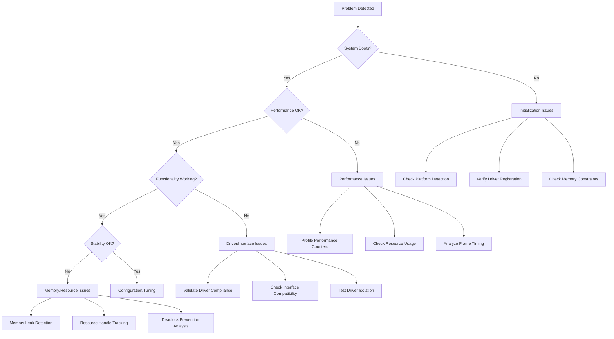

# Flight HAL Troubleshooting Guide

## 🚨 Quick Emergency Reference

### Critical Error Resolution
- **System won't initialize**: Check platform detection and driver registration
- **Out of memory on Dreamcast**: Enable aggressive memory pooling, reduce buffer sizes
- **Performance degradation**: Use performance monitoring to identify bottlenecks
- **Driver not found**: Verify driver registration and platform capabilities
- **Cross-driver communication failure**: Check resource handle management

### Emergency Diagnostic Commands
```cpp
// Quick system health check
auto health = perf_interface->get_system_health();
HAL_LOG_MESSAGE(LogLevel::Critical, "System health: " + std::to_string(health.score));

// Memory pressure check
auto memory_info = memory_interface->get_memory_info();
if (memory_info.available_bytes < (1024 * 1024)) {
    HAL_LOG_MESSAGE(LogLevel::Critical, "CRITICAL: Low memory detected");
}

// Platform verification
auto platform_info = RuntimePlatformDetector::detect_platform_info();
HAL_LOG_MESSAGE(LogLevel::Info, "Platform: " + platform_info.platform_name);
```

---

## 📋 Table of Contents

1. [Systematic Debugging Methodology](#systematic-debugging-methodology)
2. [Common Implementation Issues](#common-implementation-issues)
3. [Performance Problem Diagnosis](#performance-problem-diagnosis)
4. [Platform-Specific Troubleshooting](#platform-specific-troubleshooting)
5. [Error Message Reference](#error-message-reference)
6. [Debugging Tools and Techniques](#debugging-tools-and-techniques)
7. [Resource Coordination Issues](#resource-coordination-issues)
8. [Configuration and Validation Problems](#configuration-and-validation-problems)

---

## 🔍 Systematic Debugging Methodology

### Step 1: Information Gathering

**Essential Diagnostic Information**
```cpp
// Collect comprehensive system state
void collect_diagnostic_info() {
    // Platform information
    auto platform_info = RuntimePlatformDetector::detect_platform_info();
    auto capabilities = create_platform_capability_provider();
    
    // Driver registry state
    auto& registry = DriverRegistry::instance();
    auto registered_drivers = registry.get_registered_interfaces();
    
    // Performance snapshot
    auto perf_interface = registry.get_interface<IPerformanceInterface>();
    auto perf_snapshot = perf_interface->get_current_snapshot();
    
    // Memory status
    auto memory_interface = registry.get_interface<IMemoryInterface>();
    auto memory_info = memory_interface->get_memory_info();
    
    // Error tracking
    auto error_history = HALLogger::get_recent_errors(100);
    
    HAL_LOG_MESSAGE(LogLevel::Info, "=== DIAGNOSTIC REPORT ===");
    HAL_LOG_MESSAGE(LogLevel::Info, "Platform: " + platform_info.platform_name);
    HAL_LOG_MESSAGE(LogLevel::Info, "Memory: " + std::to_string(memory_info.available_bytes) + " bytes available");
    HAL_LOG_MESSAGE(LogLevel::Info, "Drivers: " + std::to_string(registered_drivers.size()) + " registered");
    HAL_LOG_MESSAGE(LogLevel::Info, "Recent errors: " + std::to_string(error_history.size()));
}
```

### Step 2: Problem Classification

Use this decision tree to classify your issue:



### Step 3: Root Cause Analysis

**Systematic Investigation Process**

1. **Reproduce the Issue**
   ```cpp
   // Create reproducible test case
   void reproduce_issue() {
       // Set up minimal environment
       // Execute problematic operation
       // Capture all relevant state
       // Document exact steps
   }
   ```

2. **Isolate Components**
   ```cpp
   // Test individual components
   void isolate_components() {
       // Test with mock drivers
       auto mock_registry = create_mock_driver_registry();
       
       // Test each interface independently
       test_memory_interface_isolation();
       test_graphics_interface_isolation();
       test_audio_interface_isolation();
   }
   ```

3. **Analyze Error Propagation**
   ```cpp
   // Track error flow through system
   void analyze_error_propagation() {
       // Enable comprehensive error tracking
       HALLogger::set_log_level(LogLevel::Debug);
       
       // Use error tracking macros
       auto tracked = HAL_TRACK_ERRORS(problematic_operation());
       
       // Analyze error chain
       if (tracked.is_err()) {
           analyze_error_chain(tracked.error());
       }
   }
   ```

---

## ⚠️ Common Implementation Issues

### 1. Driver Registration Problems

**Symptom**: Interface not found or incorrect driver selected

**Common Causes**:
- Driver not registered before use
- Platform capability mismatch
- Driver registration order issues
- Missing driver dependencies

**Diagnosis**:
```cpp
// Check driver registration status
void diagnose_driver_registration() {
    auto& registry = DriverRegistry::instance();
    
    // List all registered drivers
    auto interfaces = registry.get_registered_interfaces();
    for (const auto& interface_name : interfaces) {
        HAL_LOG_MESSAGE(LogLevel::Debug, "Registered: " + interface_name);
    }
    
    // Check specific interface
    auto memory_interface = registry.get_interface<IMemoryInterface>();
    if (!memory_interface) {
        HAL_LOG_ERROR(errors::driver_not_found(1, "IMemoryInterface"));
        
        // Check if platform supports memory interface
        auto capabilities = create_platform_capability_provider();
        bool supports_memory = capabilities->supports_capability(HALCapability::MemoryManagement);
        HAL_LOG_MESSAGE(LogLevel::Debug, "Platform supports memory: " + std::to_string(supports_memory));
    }
}
```

**Solutions**:
```cpp
// Ensure proper registration order
void fix_driver_registration() {
    auto& registry = DriverRegistry::instance();
    
    // Register core interfaces first
    registry.register_interface<IPlatformInterface>(std::make_unique<PlatformDriver>());
    registry.register_interface<IMemoryInterface>(std::make_unique<MemoryDriver>());
    
    // Register dependent interfaces
    registry.register_interface<IGraphicsInterface>(std::make_unique<GraphicsDriver>());
    
    // Validate registration
    auto validation_result = registry.validate_all_interfaces();
    if (!validation_result.is_ok()) {
        HAL_LOG_ERROR(validation_result.error());
    }
}
```

### 2. Memory Management Issues

**Symptom**: Out of memory, memory leaks, fragmentation

**Dreamcast-Specific (16MB constraint)**:
```cpp
// Dreamcast memory optimization
void optimize_dreamcast_memory() {
    // Configure aggressive pooling
    auto memory_config = MemoryConfiguration::for_platform(Platform::Dreamcast);
    memory_config.enable_aggressive_pooling = true;
    memory_config.pool_sizes = {
        {PoolType::Small, 512 * 1024},   // 512KB for small allocations
        {PoolType::Medium, 2 * 1024 * 1024}, // 2MB for medium allocations
        {PoolType::Large, 8 * 1024 * 1024}   // 8MB for large allocations
    };
    
    auto memory_interface = DriverRegistry::instance().get_interface<IMemoryInterface>();
    memory_interface->configure_memory(memory_config);
    
    // Monitor memory pressure
    auto pressure_monitor = [](const MemoryPressureEvent& event) {
        if (event.pressure_level > 0.8) {
            HAL_LOG_MESSAGE(LogLevel::Warning, "High memory pressure: " + std::to_string(event.pressure_level * 100) + "%");
            // Trigger garbage collection or reduce quality
        }
    };
    
    memory_interface->register_pressure_callback(pressure_monitor);
}
```

**Memory Leak Detection**:
```cpp
// Enable memory tracking for debugging
void debug_memory_leaks() {
    auto memory_interface = DriverRegistry::instance().get_interface<IMemoryInterface>();
    
    // Enable allocation tracking
    memory_interface->enable_allocation_tracking(true);
    
    // Take baseline snapshot
    auto baseline = memory_interface->take_memory_snapshot();
    
    // Run problematic code
    run_suspected_leaky_code();
    
    // Take final snapshot
    auto final_snapshot = memory_interface->take_memory_snapshot();
    
    // Analyze differences
    auto leak_analysis = memory_interface->analyze_snapshots(baseline, final_snapshot);
    if (leak_analysis.potential_leaks.size() > 0) {
        HAL_LOG_MESSAGE(LogLevel::Warning, "Potential memory leaks detected: " + 
                       std::to_string(leak_analysis.potential_leaks.size()));
        
        for (const auto& leak : leak_analysis.potential_leaks) {
            HAL_LOG_MESSAGE(LogLevel::Warning, "Leak: " + std::to_string(leak.size) + 
                           " bytes at " + leak.allocation_site);
        }
    }
}
```

### 3. Threading and Synchronization Issues

**PSP Dual-Core Coordination**:
```cpp
// PSP dual-core debugging
void debug_psp_coordination() {
    // Check if running on PSP
    if constexpr (platform_detection::is_psp()) {
        auto platform_info = RuntimePlatformDetector::detect_platform_info();
        
        if (platform_info.cpu_cores >= 2) {
            // Enable cross-core messaging debugging
            auto messenger = CrossDriverMessenger::instance();
            messenger.enable_debug_logging(true);
            
            // Monitor core utilization
            auto perf_interface = DriverRegistry::instance().get_interface<IPerformanceInterface>();
            auto core_usage = perf_interface->get_per_core_usage();
            
            for (size_t i = 0; i < core_usage.size(); ++i) {
                HAL_LOG_MESSAGE(LogLevel::Debug, "Core " + std::to_string(i) + 
                               " usage: " + std::to_string(core_usage[i] * 100) + "%");
            }
            
            // Check for deadlocks
            auto deadlock_detector = DeadlockPrevention::instance();
            auto potential_deadlocks = deadlock_detector.scan_for_potential_deadlocks();
            
            if (!potential_deadlocks.empty()) {
                HAL_LOG_MESSAGE(LogLevel::Critical, "Potential deadlocks detected!");
                for (const auto& deadlock : potential_deadlocks) {
                    HAL_LOG_MESSAGE(LogLevel::Critical, deadlock.description);
                }
            }
        }
    }
}
```

**Resource Handle Management**:
```cpp
// Debug resource handle issues
void debug_resource_handles() {
    auto resource_manager = ResourceManager::instance();
    
    // Get all active handles
    auto active_handles = resource_manager.get_active_handles();
    HAL_LOG_MESSAGE(LogLevel::Debug, "Active handles: " + std::to_string(active_handles.size()));
    
    // Check for handle leaks
    auto handle_statistics = resource_manager.get_handle_statistics();
    if (handle_statistics.leaked_handles > 0) {
        HAL_LOG_MESSAGE(LogLevel::Warning, "Handle leaks detected: " + 
                       std::to_string(handle_statistics.leaked_handles));
        
        // Get leak details
        auto leak_details = resource_manager.get_leaked_handle_details();
        for (const auto& leak : leak_details) {
            HAL_LOG_MESSAGE(LogLevel::Warning, "Leaked handle: " + leak.resource_type + 
                           " created at " + leak.creation_site);
        }
    }
    
    // Check for circular dependencies
    auto circular_deps = resource_manager.detect_circular_dependencies();
    if (!circular_deps.empty()) {
        HAL_LOG_MESSAGE(LogLevel::Critical, "Circular dependencies detected!");
        for (const auto& cycle : circular_deps) {
            HAL_LOG_MESSAGE(LogLevel::Critical, "Cycle: " + cycle.description);
        }
    }
}
```

---

## 🚀 Performance Problem Diagnosis

### Performance Monitoring Integration

**Basic Performance Analysis**:
```cpp
// Comprehensive performance diagnosis
void diagnose_performance_issues() {
    auto perf_interface = DriverRegistry::instance().get_interface<IPerformanceInterface>();
    
    // Configure detailed monitoring
    auto config = PerformanceMonitoringConfig::for_mode(MonitoringMode::Detailed);
    perf_interface->configure_monitoring(config);
    perf_interface->start_monitoring();
    
    // Run for analysis period
    std::this_thread::sleep_for(std::chrono::seconds(10));
    
    // Get performance snapshot
    auto snapshot_result = perf_interface->get_current_snapshot();
    if (snapshot_result.is_ok()) {
        const auto& snapshot = snapshot_result.value();
        
        // Analyze CPU usage
        if (snapshot.overall_cpu_usage > 80.0) {
            HAL_LOG_MESSAGE(LogLevel::Warning, "High CPU usage: " + 
                           std::to_string(snapshot.overall_cpu_usage) + "%");
            
            // Break down by interface
            for (const auto& [interface_name, usage] : snapshot.per_interface_cpu) {
                if (usage > 20.0) {
                    HAL_LOG_MESSAGE(LogLevel::Warning, interface_name + " using " + 
                                   std::to_string(usage) + "% CPU");
                }
            }
        }
        
        // Analyze memory usage
        if (snapshot.overall_memory_usage > 75.0) {
            HAL_LOG_MESSAGE(LogLevel::Warning, "High memory usage: " + 
                           std::to_string(snapshot.overall_memory_usage) + "%");
        }
        
        // Analyze frame performance
        if (snapshot.frame.current_fps < 50.0) {
            HAL_LOG_MESSAGE(LogLevel::Warning, "Low FPS: " + 
                           std::to_string(snapshot.frame.current_fps));
            
            // Check frame timing consistency
            if (snapshot.frame.frame_time_variance > 5.0) {
                HAL_LOG_MESSAGE(LogLevel::Warning, "Inconsistent frame timing, variance: " + 
                               std::to_string(snapshot.frame.frame_time_variance) + "ms");
            }
        }
    }
}
```

**Platform-Specific Performance Tuning**:

```cpp
// Dreamcast performance optimization
void optimize_dreamcast_performance() {
    if constexpr (platform_detection::is_dreamcast()) {
        auto perf_interface = DriverRegistry::instance().get_interface<IPerformanceInterface>();
        
        // Use minimal monitoring mode
        auto config = PerformanceMonitoringConfig::for_mode(MonitoringMode::Minimal);
        config.collection_interval_ms = 1000; // 1 second intervals
        config.enabled_counters = {
            PerformanceCounterType::FrameRate,
            PerformanceCounterType::MemoryAllocations
        };
        perf_interface->configure_monitoring(config);
        
        // Check for Dreamcast-specific bottlenecks
        auto graphics_interface = DriverRegistry::instance().get_interface<IGraphicsInterface>();
        auto vram_usage = graphics_interface->get_vram_usage();
        
        if (vram_usage.used_bytes > (6 * 1024 * 1024)) { // 6MB of 8MB VRAM
            HAL_LOG_MESSAGE(LogLevel::Warning, "High VRAM usage: " + 
                           std::to_string(vram_usage.used_bytes / (1024 * 1024)) + "MB");
            
            // Suggest optimizations
            HAL_LOG_MESSAGE(LogLevel::Info, "Consider: texture compression, smaller textures, texture streaming");
        }
        
        // Check audio memory usage (2MB ARAM constraint)
        auto audio_interface = DriverRegistry::instance().get_interface<IAudioInterface>();
        auto audio_memory = audio_interface->get_audio_memory_usage();
        
        if (audio_memory.used_bytes > (1.5 * 1024 * 1024)) { // 1.5MB of 2MB ARAM
            HAL_LOG_MESSAGE(LogLevel::Warning, "High audio memory usage: " + 
                           std::to_string(audio_memory.used_bytes / (1024 * 1024)) + "MB");
        }
    }
}
```

### Memory Performance Analysis

```cpp
// Analyze memory performance patterns
void analyze_memory_performance() {
    auto memory_interface = DriverRegistry::instance().get_interface<IMemoryInterface>();
    auto perf_interface = DriverRegistry::instance().get_interface<IPerformanceInterface>();
    
    // Get memory performance data
    auto memory_perf_result = perf_interface->get_memory_performance();
    if (memory_perf_result.is_ok()) {
        const auto& memory_perf = memory_perf_result.value();
        
        // Check allocation patterns
        if (memory_perf.allocations_per_second > 1000) {
            HAL_LOG_MESSAGE(LogLevel::Warning, "High allocation rate: " + 
                           std::to_string(memory_perf.allocations_per_second) + "/sec");
            HAL_LOG_MESSAGE(LogLevel::Info, "Consider: object pooling, reducing temporary allocations");
        }
        
        // Check fragmentation
        if (memory_perf.fragmentation_ratio > 0.3) {
            HAL_LOG_MESSAGE(LogLevel::Warning, "High fragmentation: " + 
                           std::to_string(memory_perf.fragmentation_ratio * 100) + "%");
            HAL_LOG_MESSAGE(LogLevel::Info, "Consider: memory compaction, different allocation strategy");
        }
        
        // Check memory bandwidth
        if (memory_perf.bandwidth_utilization > 0.8) {
            HAL_LOG_MESSAGE(LogLevel::Warning, "High memory bandwidth usage: " + 
                           std::to_string(memory_perf.bandwidth_utilization * 100) + "%");
        }
    }
    
    // Analyze allocation hot spots
    auto allocation_stats = memory_interface->get_allocation_statistics();
    std::vector<std::pair<std::string, size_t>> sorted_allocations(
        allocation_stats.by_call_site.begin(), allocation_stats.by_call_site.end());
    
    std::sort(sorted_allocations.begin(), sorted_allocations.end(),
              [](const auto& a, const auto& b) { return a.second > b.second; });
    
    HAL_LOG_MESSAGE(LogLevel::Info, "Top allocation sites:");
    for (size_t i = 0; i < std::min(size_t(5), sorted_allocations.size()); ++i) {
        HAL_LOG_MESSAGE(LogLevel::Info, sorted_allocations[i].first + ": " + 
                       std::to_string(sorted_allocations[i].second) + " bytes");
    }
}
```

---

## 🎮 Platform-Specific Troubleshooting

### Dreamcast Issues

**Common Problems**:
- **VRAM exhaustion**: 8MB limit quickly reached with textures
- **Main RAM pressure**: 16MB constraint affects asset loading
- **Audio memory limits**: 2MB ARAM for all audio samples
- **Fixed-function pipeline limitations**: No programmable shaders

**Diagnostic Tools**:
```cpp
void diagnose_dreamcast_issues() {
    if constexpr (platform_detection::is_dreamcast()) {
        HAL_LOG_MESSAGE(LogLevel::Info, "=== DREAMCAST DIAGNOSTICS ===");
        
        // Check memory usage across all memory types
        auto memory_interface = DriverRegistry::instance().get_interface<IMemoryInterface>();
        auto main_memory = memory_interface->get_memory_pool_info(MemoryPoolType::Main);
        
        HAL_LOG_MESSAGE(LogLevel::Info, "Main RAM: " + 
                       std::to_string(main_memory.used_bytes / (1024 * 1024)) + "/" +
                       std::to_string(main_memory.total_bytes / (1024 * 1024)) + " MB");
        
        auto graphics_interface = DriverRegistry::instance().get_interface<IGraphicsInterface>();
        auto vram_info = graphics_interface->get_vram_usage();
        
        HAL_LOG_MESSAGE(LogLevel::Info, "VRAM: " + 
                       std::to_string(vram_info.used_bytes / (1024 * 1024)) + "/" +
                       std::to_string(vram_info.total_bytes / (1024 * 1024)) + " MB");
        
        auto audio_interface = DriverRegistry::instance().get_interface<IAudioInterface>();
        auto aram_info = audio_interface->get_audio_memory_usage();
        
        HAL_LOG_MESSAGE(LogLevel::Info, "ARAM: " + 
                       std::to_string(aram_info.used_bytes / (1024 * 1024)) + "/" +
                       std::to_string(aram_info.total_bytes / (1024 * 1024)) + " MB");
        
        // Check for Dreamcast-specific capability issues
        auto capabilities = create_platform_capability_provider();
        
        if (!capabilities->supports_capability(HALCapability::VertexShaders)) {
            HAL_LOG_MESSAGE(LogLevel::Info, "Note: Vertex shaders not supported, using fixed-function pipeline");
        }
        
        if (!capabilities->supports_capability(HALCapability::Threading)) {
            HAL_LOG_MESSAGE(LogLevel::Info, "Note: No threading support, using single-threaded execution");
        }
        
        // Performance recommendations
        auto perf_snapshot = DriverRegistry::instance().get_interface<IPerformanceInterface>()->get_current_snapshot();
        if (perf_snapshot.is_ok()) {
            const auto& snapshot = perf_snapshot.value();
            
            if (snapshot.frame.current_fps < 30.0) {
                HAL_LOG_MESSAGE(LogLevel::Warning, "Low FPS on Dreamcast. Recommendations:");
                HAL_LOG_MESSAGE(LogLevel::Info, "- Reduce texture resolution");
                HAL_LOG_MESSAGE(LogLevel::Info, "- Use texture compression");
                HAL_LOG_MESSAGE(LogLevel::Info, "- Reduce polygon count");
                HAL_LOG_MESSAGE(LogLevel::Info, "- Optimize draw calls");
            }
        }
    }
}
```

### PSP Issues

**Common Problems**:
- **Dual-core coordination**: Media Engine (ME) and main CPU coordination
- **Memory model**: Cached vs uncached memory access
- **Power management**: Battery life optimization
- **WiFi connectivity**: Ad-hoc vs infrastructure mode

**Diagnostic Tools**:
```cpp
void diagnose_psp_issues() {
    if constexpr (platform_detection::is_psp()) {
        HAL_LOG_MESSAGE(LogLevel::Info, "=== PSP DIAGNOSTICS ===");
        
        auto platform_info = RuntimePlatformDetector::detect_platform_info();
        HAL_LOG_MESSAGE(LogLevel::Info, "PSP Model: " + platform_info.model_info);
        HAL_LOG_MESSAGE(LogLevel::Info, "Memory: " + std::to_string(platform_info.total_memory / (1024 * 1024)) + " MB");
        
        // Check dual-core coordination
        if (platform_info.cpu_cores >= 2) {
            auto messenger = CrossDriverMessenger::instance();
            auto message_stats = messenger.get_statistics();
            
            HAL_LOG_MESSAGE(LogLevel::Info, "Cross-core messages: " + std::to_string(message_stats.total_messages));
            HAL_LOG_MESSAGE(LogLevel::Info, "Failed messages: " + std::to_string(message_stats.failed_messages));
            
            if (message_stats.failed_messages > 0) {
                HAL_LOG_MESSAGE(LogLevel::Warning, "Cross-core communication issues detected");
                
                // Check for common ME coordination problems
                auto me_status = check_media_engine_status();
                if (!me_status.is_running) {
                    HAL_LOG_MESSAGE(LogLevel::Error, "Media Engine not responding");
                }
            }
        }
        
        // Check power management
        auto capabilities = create_platform_capability_provider();
        if (capabilities->supports_capability(HALCapability::PowerManagement)) {
            auto power_info = capabilities->get_power_status();
            
            HAL_LOG_MESSAGE(LogLevel::Info, "Battery level: " + std::to_string(power_info.battery_percentage) + "%");
            
            if (power_info.battery_percentage < 20) {
                HAL_LOG_MESSAGE(LogLevel::Warning, "Low battery - consider power optimizations");
            }
            
            if (power_info.is_thermal_throttling) {
                HAL_LOG_MESSAGE(LogLevel::Warning, "Thermal throttling active");
            }
        }
        
        // Check WiFi status
        if (capabilities->supports_capability(HALCapability::WiFi)) {
            auto network_interface = DriverRegistry::instance().get_interface<INetworkInterface>();
            auto network_status = network_interface->get_network_status();
            
            HAL_LOG_MESSAGE(LogLevel::Info, "WiFi status: " + network_status.connection_state);
            
            if (network_status.connection_state == "disconnected") {
                HAL_LOG_MESSAGE(LogLevel::Info, "WiFi troubleshooting:");
                HAL_LOG_MESSAGE(LogLevel::Info, "- Check WiFi switch position");
                HAL_LOG_MESSAGE(LogLevel::Info, "- Verify network settings");
                HAL_LOG_MESSAGE(LogLevel::Info, "- Check signal strength");
            }
        }
    }
}
```

### Web Platform Issues

**Common Problems**:
- **Browser compatibility**: Different WebGL/WebAudio support levels
- **Security restrictions**: CORS, same-origin policy limitations
- **Performance variations**: V8 vs other JavaScript engines
- **Context loss**: WebGL context loss handling

**Diagnostic Tools**:
```cpp
void diagnose_web_issues() {
    if constexpr (platform_detection::is_web()) {
        HAL_LOG_MESSAGE(LogLevel::Info, "=== WEB PLATFORM DIAGNOSTICS ===");
        
        auto platform_info = RuntimePlatformDetector::detect_platform_info();
        HAL_LOG_MESSAGE(LogLevel::Info, "Browser: " + platform_info.browser_info);
        HAL_LOG_MESSAGE(LogLevel::Info, "WebGL version: " + platform_info.webgl_version);
        
        auto capabilities = create_platform_capability_provider();
        
        // Check WebGL capabilities
        if (capabilities->supports_capability(HALCapability::Hardware3D)) {
            auto graphics_interface = DriverRegistry::instance().get_interface<IGraphicsInterface>();
            auto webgl_info = graphics_interface->get_webgl_info();
            
            HAL_LOG_MESSAGE(LogLevel::Info, "WebGL renderer: " + webgl_info.renderer);
            HAL_LOG_MESSAGE(LogLevel::Info, "Max texture size: " + std::to_string(webgl_info.max_texture_size));
            
            // Check for common WebGL issues
            if (webgl_info.context_lost_count > 0) {
                HAL_LOG_MESSAGE(LogLevel::Warning, "WebGL context lost " + 
                               std::to_string(webgl_info.context_lost_count) + " times");
                HAL_LOG_MESSAGE(LogLevel::Info, "Context loss troubleshooting:");
                HAL_LOG_MESSAGE(LogLevel::Info, "- Reduce GPU memory usage");
                HAL_LOG_MESSAGE(LogLevel::Info, "- Implement context restoration");
                HAL_LOG_MESSAGE(LogLevel::Info, "- Check browser GPU blacklist");
            }
        } else {
            HAL_LOG_MESSAGE(LogLevel::Warning, "Hardware 3D acceleration not available");
            HAL_LOG_MESSAGE(LogLevel::Info, "Falling back to software rendering");
        }
        
        // Check Web Audio
        if (capabilities->supports_capability(HALCapability::HardwareAudio)) {
            auto audio_interface = DriverRegistry::instance().get_interface<IAudioInterface>();
            auto webaudio_info = audio_interface->get_webaudio_info();
            
            HAL_LOG_MESSAGE(LogLevel::Info, "Web Audio sample rate: " + std::to_string(webaudio_info.sample_rate));
            
            if (webaudio_info.context_state != "running") {
                HAL_LOG_MESSAGE(LogLevel::Warning, "Web Audio context not running: " + webaudio_info.context_state);
                HAL_LOG_MESSAGE(LogLevel::Info, "Audio troubleshooting:");
                HAL_LOG_MESSAGE(LogLevel::Info, "- Ensure user interaction before audio start");
                HAL_LOG_MESSAGE(LogLevel::Info, "- Check browser audio permissions");
                HAL_LOG_MESSAGE(LogLevel::Info, "- Resume audio context after suspension");
            }
        }
        
        // Check network connectivity for web-specific features
        if (capabilities->supports_capability(HALCapability::NetworkAccess)) {
            auto network_interface = DriverRegistry::instance().get_interface<INetworkInterface>();
            auto network_latency = network_interface->measure_latency("api.example.com");
            
            if (network_latency.is_ok()) {
                HAL_LOG_MESSAGE(LogLevel::Info, "Network latency: " + std::to_string(network_latency.value()) + "ms");
                
                if (network_latency.value() > 200) {
                    HAL_LOG_MESSAGE(LogLevel::Warning, "High network latency detected");
                }
            } else {
                HAL_LOG_MESSAGE(LogLevel::Warning, "Network connectivity test failed: " + network_latency.error().message());
            }
        }
        
        // Check for common web platform issues
        auto web_info = platform_info.web_specific_info;
        if (web_info.is_mobile_browser) {
            HAL_LOG_MESSAGE(LogLevel::Info, "Mobile browser detected - consider touch input optimization");
        }
        
        if (web_info.has_webassembly_support) {
            HAL_LOG_MESSAGE(LogLevel::Info, "WebAssembly support available");
        } else {
            HAL_LOG_MESSAGE(LogLevel::Warning, "No WebAssembly support - performance may be limited");
        }
    }
}
```

### Desktop Platform Issues

**Common Problems**:
- **Driver compatibility**: Graphics driver version mismatches
- **Multiple GPU systems**: Discrete vs integrated GPU selection
- **Audio device selection**: Multiple output devices, ASIO vs DirectSound
- **Multi-monitor setups**: Display coordination and management

**Diagnostic Tools**:
```cpp
void diagnose_desktop_issues() {
    if constexpr (platform_detection::is_desktop()) {
        HAL_LOG_MESSAGE(LogLevel::Info, "=== DESKTOP PLATFORM DIAGNOSTICS ===");
        
        auto platform_info = RuntimePlatformDetector::detect_platform_info();
        HAL_LOG_MESSAGE(LogLevel::Info, "OS: " + platform_info.os_name + " " + platform_info.os_version);
        HAL_LOG_MESSAGE(LogLevel::Info, "CPU: " + platform_info.cpu_name + " (" + std::to_string(platform_info.cpu_cores) + " cores)");
        
        auto capabilities = create_platform_capability_provider();
        
        // Check graphics capabilities
        if (capabilities->supports_capability(HALCapability::Hardware3D)) {
            auto graphics_interface = DriverRegistry::instance().get_interface<IGraphicsInterface>();
            auto gpu_info = graphics_interface->get_gpu_info();
            
            HAL_LOG_MESSAGE(LogLevel::Info, "GPU: " + gpu_info.device_name);
            HAL_LOG_MESSAGE(LogLevel::Info, "Driver: " + gpu_info.driver_version);
            HAL_LOG_MESSAGE(LogLevel::Info, "VRAM: " + std::to_string(gpu_info.total_memory / (1024 * 1024)) + " MB");
            
            // Check for multiple GPUs
            if (gpu_info.gpu_count > 1) {
                HAL_LOG_MESSAGE(LogLevel::Info, "Multiple GPUs detected: " + std::to_string(gpu_info.gpu_count));
                
                for (size_t i = 0; i < gpu_info.gpu_devices.size(); ++i) {
                    const auto& gpu = gpu_info.gpu_devices[i];
                    HAL_LOG_MESSAGE(LogLevel::Info, "GPU " + std::to_string(i) + ": " + gpu.name + 
                                   " (" + (gpu.is_active ? "active" : "inactive") + ")");
                }
                
                // Check for GPU switching issues
                if (gpu_info.active_gpu_index != gpu_info.preferred_gpu_index) {
                    HAL_LOG_MESSAGE(LogLevel::Warning, "Not using preferred GPU - check power settings");
                }
            }
            
            // Check for driver issues
            if (gpu_info.driver_issues.size() > 0) {
                HAL_LOG_MESSAGE(LogLevel::Warning, "Graphics driver issues detected:");
                for (const auto& issue : gpu_info.driver_issues) {
                    HAL_LOG_MESSAGE(LogLevel::Warning, "- " + issue);
                }
            }
        }
        
        // Check audio system
        if (capabilities->supports_capability(HALCapability::HardwareAudio)) {
            auto audio_interface = DriverRegistry::instance().get_interface<IAudioInterface>();
            auto audio_devices = audio_interface->enumerate_audio_devices();
            
            HAL_LOG_MESSAGE(LogLevel::Info, "Audio devices: " + std::to_string(audio_devices.size()));
            
            for (const auto& device : audio_devices) {
                HAL_LOG_MESSAGE(LogLevel::Info, "- " + device.name + 
                               " (" + device.api_name + ", " + 
                               std::to_string(device.channels) + " channels)");
                
                if (device.is_default) {
                    HAL_LOG_MESSAGE(LogLevel::Info, "  ^ Default device");
                }
                
                if (device.has_issues) {
                    HAL_LOG_MESSAGE(LogLevel::Warning, "  ^ Device has issues: " + device.issue_description);
                }
            }
        }
        
        // Check system resources
        auto system_info = capabilities->get_system_resource_info();
        HAL_LOG_MESSAGE(LogLevel::Info, "System RAM: " + std::to_string(system_info.total_ram / (1024 * 1024 * 1024)) + " GB");
        HAL_LOG_MESSAGE(LogLevel::Info, "Available RAM: " + std::to_string(system_info.available_ram / (1024 * 1024 * 1024)) + " GB");
        
        if (system_info.available_ram < (2LL * 1024 * 1024 * 1024)) { // Less than 2GB
            HAL_LOG_MESSAGE(LogLevel::Warning, "Low system memory available");
        }
    }
}
```

---

## 📚 Error Message Reference

### HAL Error Categories and Solutions

The HAL uses a comprehensive error categorization system. Here's a complete reference:

#### Hardware Errors (Category: Hardware)

| Error Code | Message | Cause | Solution |
|------------|---------|-------|----------|
| `HAL_HW_001` | Device not found | Hardware device missing or disconnected | Check physical connections, device drivers |
| `HAL_HW_002` | Device initialization failed | Hardware initialization error | Restart device, check compatibility |
| `HAL_HW_003` | Hardware timeout | Device not responding | Check power, reset device |
| `HAL_HW_004` | Device busy | Resource already in use | Wait or implement resource sharing |
| `HAL_HW_005` | Hardware fault | Physical device malfunction | Replace hardware, check connections |

**Example Resolution**:
```cpp
// Handle hardware device not found
HAL_MATCH(graphics_interface->initialize_device())
    .on_error([](const HALError& error) {
        if (error.code() == HAL_HW_001) {
            HAL_LOG_MESSAGE(LogLevel::Error, "Graphics device not found");
            HAL_LOG_MESSAGE(LogLevel::Info, "Troubleshooting steps:");
            HAL_LOG_MESSAGE(LogLevel::Info, "1. Check graphics driver installation");
            HAL_LOG_MESSAGE(LogLevel::Info, "2. Verify hardware compatibility");
            HAL_LOG_MESSAGE(LogLevel::Info, "3. Check device manager for errors");
            
            // Attempt fallback to software rendering
            return attempt_software_fallback();
        }
        return propagate_error(error);
    });
```

#### Driver Errors (Category: Driver)

| Error Code | Message | Cause | Solution |
|------------|---------|-------|----------|
| `HAL_DRV_001` | Driver incompatible | Version mismatch or wrong driver | Update or reinstall driver |
| `HAL_DRV_002` | Feature not supported | Capability not available | Use alternative implementation |
| `HAL_DRV_003` | Driver not loaded | Missing driver registration | Register driver before use |
| `HAL_DRV_004` | Driver version mismatch | Incompatible driver version | Update driver to compatible version |

#### Configuration Errors (Category: Configuration)

| Error Code | Message | Cause | Solution |
|------------|---------|-------|----------|
| `HAL_CFG_001` | Invalid parameter | Parameter out of valid range | Validate parameters before use |
| `HAL_CFG_002` | Configuration missing | Required config not found | Provide default or prompt user |
| `HAL_CFG_003` | Parameter out of range | Value exceeds limits | Clamp to valid range |
| `HAL_CFG_004` | Conflicting settings | Incompatible configuration | Resolve conflicts or use defaults |

#### Resource Errors (Category: Resource)

| Error Code | Message | Cause | Solution |
|------------|---------|-------|----------|
| `HAL_RES_001` | Out of memory | Insufficient memory available | Free memory or reduce usage |
| `HAL_RES_002` | Resource exhausted | Resource pool depleted | Increase pool size or reuse resources |
| `HAL_RES_003` | Resource locked | Resource in use by another process | Wait or implement sharing |
| `HAL_RES_004` | Handle invalid | Resource handle corrupted | Recreate resource |

**Memory Error Handling Example**:
```cpp
// Handle out of memory on Dreamcast
void handle_memory_exhaustion() {
    HAL_MATCH(memory_interface->allocate(requested_size))
        .on_error([](const HALError& error) {
            if (error.code() == HAL_RES_001) {
                HAL_LOG_MESSAGE(LogLevel::Critical, "Out of memory - attempting recovery");
                
                // Dreamcast-specific memory recovery
                if constexpr (platform_detection::is_dreamcast()) {
                    // Try texture compression
                    auto graphics = DriverRegistry::instance().get_interface<IGraphicsInterface>();
                    graphics->enable_texture_compression(true);
                    
                    // Reduce audio quality
                    auto audio = DriverRegistry::instance().get_interface<IAudioInterface>();
                    audio->set_sample_rate(22050); // Reduce from 44100
                    
                    // Force garbage collection
                    memory_interface->force_garbage_collection();
                    
                    // Retry allocation
                    return memory_interface->allocate(requested_size);
                }
            }
            return propagate_error(error);
        });
}
```

---

## 🔧 Debugging Tools and Techniques

### Built-in HAL Debugging Tools

#### 1. Compliance Validator

**Usage**:
```bash
# Run full compliance validation
./tools/compliance_validator/hal_validate.sh --comprehensive

# Test specific interface
./tools/compliance_validator/hal_validate.sh --interface memory

# Platform-specific validation
./tools/compliance_validator/hal_validate.sh --platform dreamcast
```

**Programmatic Usage**:
```cpp
#include "flight/hal/validation/interface_validator.hpp"

// Validate memory interface compliance
void validate_memory_interface() {
    auto memory_interface = DriverRegistry::instance().get_interface<IMemoryInterface>();
    
    InterfaceValidator validator;
    auto validation_result = validator.validate_interface(memory_interface.get());
    
    if (!validation_result.is_ok()) {
        HAL_LOG_ERROR(validation_result.error());
        
        // Get detailed validation report
        auto report = validator.get_detailed_report();
        for (const auto& issue : report.compliance_issues) {
            HAL_LOG_MESSAGE(LogLevel::Warning, "Compliance issue: " + issue.description);
            HAL_LOG_MESSAGE(LogLevel::Info, "Suggestion: " + issue.suggestion);
        }
    }
}
```

#### 2. Mock Driver Framework

**Setting up Mock Environment**:
```cpp
#include "tests/mock/mock_driver_base.hpp"

// Create mock testing environment
void setup_mock_environment() {
    auto mock_registry = std::make_unique<MockDriverRegistry>();
    
    // Register mock drivers
    mock_registry->register_interface<IMemoryInterface>(
        std::make_unique<MockMemoryDriver>());
    mock_registry->register_interface<IGraphicsInterface>(
        std::make_unique<MockGraphicsDriver>());
    
    // Configure mock behavior
    auto mock_memory = mock_registry->get_mock_driver<IMemoryInterface>();
    mock_memory->set_allocation_failure_rate(0.1); // 10% failure rate
    mock_memory->enable_leak_simulation(true);
    
    // Run tests with mock environment
    run_application_with_registry(std::move(mock_registry));
}
```

#### 3. Stress Testing Framework

**Memory Stress Testing**:
```cpp
#include "tests/stress/framework/stress_test_base.hpp"

// Run memory stress test
void run_memory_stress_test() {
    MemoryStressTest stress_test;
    
    // Configure test parameters
    StressTestConfig config;
    config.duration_seconds = 300; // 5 minutes
    config.target_memory_pressure = 0.9; // 90% memory usage
    config.allocation_pattern = AllocationPattern::Random;
    
    // Run test
    auto result = stress_test.run_test(config);
    
    if (!result.passed) {
        HAL_LOG_MESSAGE(LogLevel::Error, "Memory stress test failed:");
        HAL_LOG_MESSAGE(LogLevel::Error, "Peak memory: " + std::to_string(result.peak_memory_usage));
        HAL_LOG_MESSAGE(LogLevel::Error, "Leaks detected: " + std::to_string(result.memory_leaks));
        HAL_LOG_MESSAGE(LogLevel::Error, "Allocation failures: " + std::to_string(result.allocation_failures));
    }
}
```

### External Debugging Tools

#### Platform-Specific Debuggers

**Dreamcast Debugging**:
```bash
# Using dcload for network debugging
dcload -t your_ip_address game.elf

# Serial debugging
dcload -s /dev/ttyS0 game.elf

# Memory analysis with dcinfo
dcinfo --memory-map game.elf
```

**PSP Debugging**:
```bash
# PPSSPP debugging
ppsspp-headless --debugger --port=5432 game.prx

# PSP Link debugging
psplink-client debug game.prx
```

**Web Platform Debugging**:
```javascript
// Browser console debugging
console.log("HAL Debug Info:", Module.get_hal_debug_info());

// WebGL debugging
const gl = canvas.getContext('webgl', { preserveDrawingBuffer: true });
const debugInfo = gl.getExtension('WEBGL_debug_renderer_info');
console.log('GPU:', gl.getParameter(debugInfo.UNMASKED_RENDERER_WEBGL));
```

### Performance Profiling

#### Using HAL Performance Monitoring

```cpp
// Advanced performance profiling
void profile_application_performance() {
    auto perf_interface = DriverRegistry::instance().get_interface<IPerformanceInterface>();
    
    // Configure profiling mode
    auto config = PerformanceMonitoringConfig::for_mode(MonitoringMode::Profiling);
    config.collection_interval_ms = 1; // High frequency sampling
    config.enable_call_stack_sampling = true;
    config.enable_gpu_profiling = true;
    
    perf_interface->configure_monitoring(config);
    
    // Set up profiling callbacks
    perf_interface->register_profiling_callback([](const ProfilingEvent& event) {
        if (event.type == ProfilingEventType::FrameStart) {
            // Mark frame boundary
            HAL_LOG_MESSAGE(LogLevel::Debug, "Frame " + std::to_string(event.frame_number) + " start");
        } else if (event.type == ProfilingEventType::PerformanceAlert) {
            // Handle performance alerts
            HAL_LOG_MESSAGE(LogLevel::Warning, "Performance alert: " + event.description);
        }
    });
    
    // Start profiling
    perf_interface->start_profiling();
    
    // Run application for profiling period
    run_application_main_loop();
    
    // Stop and export profile data
    perf_interface->stop_profiling();
    auto profile_data = perf_interface->export_profile_data();
    
    // Save profile for analysis
    std::ofstream profile_file("performance_profile.json");
    profile_file << profile_data;
}
```

---

## 🤝 Resource Coordination Issues

### Cross-Driver Communication Problems

**Symptoms**:
- Deadlocks between graphics and audio drivers
- Resource sharing conflicts
- Message passing failures
- Synchronization issues

**Diagnosis**:
```cpp
void diagnose_coordination_issues() {
    auto messenger = CrossDriverMessenger::instance();
    auto resource_manager = ResourceManager::instance();
    
    // Check message queue health
    auto queue_stats = messenger.get_queue_statistics();
    HAL_LOG_MESSAGE(LogLevel::Info, "Message queue depth: " + std::to_string(queue_stats.current_depth));
    HAL_LOG_MESSAGE(LogLevel::Info, "Failed messages: " + std::to_string(queue_stats.failed_deliveries));
    
    if (queue_stats.failed_deliveries > 0) {
        HAL_LOG_MESSAGE(LogLevel::Warning, "Message delivery failures detected");
        
        // Get failure details
        auto failures = messenger.get_failure_details();
        for (const auto& failure : failures) {
            HAL_LOG_MESSAGE(LogLevel::Warning, "Failed: " + failure.sender + " -> " + 
                           failure.receiver + " (" + failure.reason + ")");
        }
    }
    
    // Check resource locks
    auto lock_info = resource_manager.get_lock_information();
    HAL_LOG_MESSAGE(LogLevel::Info, "Active locks: " + std::to_string(lock_info.active_locks));
    
    if (lock_info.has_contention) {
        HAL_LOG_MESSAGE(LogLevel::Warning, "Resource contention detected");
        
        for (const auto& contention : lock_info.contentions) {
            HAL_LOG_MESSAGE(LogLevel::Warning, "Contention: " + contention.resource_name + 
                           " between " + contention.holder + " and " + contention.waiter);
        }
    }
    
    // Check for deadlock potential
    auto deadlock_detector = DeadlockPrevention::instance();
    auto dependency_graph = deadlock_detector.build_dependency_graph();
    
    if (dependency_graph.has_cycles()) {
        HAL_LOG_MESSAGE(LogLevel::Critical, "DEADLOCK DETECTED!");
        
        auto cycles = dependency_graph.get_cycles();
        for (const auto& cycle : cycles) {
            HAL_LOG_MESSAGE(LogLevel::Critical, "Cycle: " + cycle.to_string());
        }
        
        // Attempt automatic resolution
        auto resolution_result = deadlock_detector.attempt_resolution();
        if (resolution_result.is_ok()) {
            HAL_LOG_MESSAGE(LogLevel::Info, "Deadlock resolved: " + resolution_result.value());
        } else {
            HAL_LOG_MESSAGE(LogLevel::Critical, "Could not resolve deadlock: " + 
                           resolution_result.error().message());
        }
    }
}
```

### Resource Handle Management

**Common Issues**:
- Handle leaks
- Double-free errors
- Invalid handle usage
- Circular references

**Debugging Tools**:
```cpp
void debug_handle_management() {
    auto resource_manager = ResourceManager::instance();
    
    // Enable handle tracking
    resource_manager.enable_handle_tracking(true);
    
    // Get current handle statistics
    auto stats = resource_manager.get_detailed_statistics();
    
    HAL_LOG_MESSAGE(LogLevel::Info, "=== RESOURCE HANDLE STATISTICS ===");
    HAL_LOG_MESSAGE(LogLevel::Info, "Total handles created: " + std::to_string(stats.total_created));
    HAL_LOG_MESSAGE(LogLevel::Info, "Total handles destroyed: " + std::to_string(stats.total_destroyed));
    HAL_LOG_MESSAGE(LogLevel::Info, "Currently active: " + std::to_string(stats.currently_active));
    HAL_LOG_MESSAGE(LogLevel::Info, "Peak concurrent: " + std::to_string(stats.peak_concurrent));
    
    // Check for leaks
    if (stats.potential_leaks > 0) {
        HAL_LOG_MESSAGE(LogLevel::Warning, "Potential handle leaks: " + std::to_string(stats.potential_leaks));
        
        // Get leak details
        auto leak_report = resource_manager.generate_leak_report();
        HAL_LOG_MESSAGE(LogLevel::Warning, "Leak report:\n" + leak_report);
    }
    
    // Check handle usage patterns
    auto usage_patterns = resource_manager.analyze_usage_patterns();
    for (const auto& [resource_type, pattern] : usage_patterns) {
        HAL_LOG_MESSAGE(LogLevel::Info, resource_type + " usage pattern: " + pattern.description);
        
        if (pattern.is_problematic) {
            HAL_LOG_MESSAGE(LogLevel::Warning, "Problematic pattern detected: " + pattern.issue);
            HAL_LOG_MESSAGE(LogLevel::Info, "Recommendation: " + pattern.recommendation);
        }
    }
}
```

---

## ⚙️ Configuration and Validation Problems

### Configuration Issues

**Common Problems**:
- Invalid configuration files
- Missing required settings
- Platform-specific configuration errors
- Configuration hierarchy conflicts

**Diagnosis and Resolution**:
```cpp
void diagnose_configuration_issues() {
    auto config_manager = HALConfigHierarchy::instance();
    
    // Validate configuration hierarchy
    auto validation_result = config_manager.validate_configuration();
    
    if (!validation_result.is_ok()) {
        HAL_LOG_ERROR(validation_result.error());
        
        // Get detailed validation errors
        auto errors = config_manager.get_validation_errors();
        for (const auto& error : errors) {
            HAL_LOG_MESSAGE(LogLevel::Error, "Config error: " + error.path + " - " + error.message);
            HAL_LOG_MESSAGE(LogLevel::Info, "Suggestion: " + error.suggestion);
        }
        
        // Attempt automatic fixes
        auto fix_result = config_manager.attempt_automatic_fixes();
        if (fix_result.is_ok()) {
            HAL_LOG_MESSAGE(LogLevel::Info, "Applied automatic fixes: " + fix_result.value());
        }
    }
    
    // Check platform-specific configuration
    auto platform_config = config_manager.get_platform_config();
    auto capabilities = create_platform_capability_provider();
    
    // Validate platform compatibility
    auto compatibility_check = validate_platform_compatibility(platform_config, capabilities);
    
    if (!compatibility_check.is_ok()) {
        HAL_LOG_MESSAGE(LogLevel::Warning, "Platform compatibility issues:");
        
        for (const auto& issue : compatibility_check.error().details) {
            HAL_LOG_MESSAGE(LogLevel::Warning, "- " + issue.setting + ": " + issue.problem);
            HAL_LOG_MESSAGE(LogLevel::Info, "  Fix: " + issue.solution);
        }
    }
    
    // Generate recommended configuration
    auto recommended_config = generate_recommended_configuration(capabilities);
    HAL_LOG_MESSAGE(LogLevel::Info, "Recommended configuration generated");
    
    // Compare with current configuration
    auto diff = config_manager.compare_configurations(platform_config, recommended_config);
    if (!diff.empty()) {
        HAL_LOG_MESSAGE(LogLevel::Info, "Configuration recommendations:");
        for (const auto& recommendation : diff) {
            HAL_LOG_MESSAGE(LogLevel::Info, "- " + recommendation.setting + ": " + 
                           recommendation.current_value + " -> " + recommendation.recommended_value);
            HAL_LOG_MESSAGE(LogLevel::Info, "  Reason: " + recommendation.reason);
        }
    }
}
```

### Validation Framework Issues

**Integration Testing**:
```cpp
void run_comprehensive_validation() {
    auto validator = InterfaceValidator::create_comprehensive_validator();
    
    // Test all registered interfaces
    auto& registry = DriverRegistry::instance();
    auto interfaces = registry.get_all_interfaces();
    
    ValidationReport overall_report;
    
    for (const auto& [interface_name, interface_ptr] : interfaces) {
        HAL_LOG_MESSAGE(LogLevel::Info, "Validating " + interface_name + "...");
        
        auto validation_result = validator.validate_interface(interface_ptr.get());
        
        if (validation_result.is_ok()) {
            HAL_LOG_MESSAGE(LogLevel::Info, interface_name + " validation PASSED");
        } else {
            HAL_LOG_MESSAGE(LogLevel::Error, interface_name + " validation FAILED");
            HAL_LOG_ERROR(validation_result.error());
            
            // Get detailed failure information
            auto failure_details = validator.get_failure_details(interface_name);
            for (const auto& detail : failure_details) {
                HAL_LOG_MESSAGE(LogLevel::Error, "  Failed test: " + detail.test_name);
                HAL_LOG_MESSAGE(LogLevel::Error, "  Reason: " + detail.failure_reason);
                HAL_LOG_MESSAGE(LogLevel::Info, "  Fix: " + detail.suggested_fix);
            }
        }
        
        overall_report.add_interface_result(interface_name, validation_result);
    }
    
    // Generate final report
    auto final_report = overall_report.generate_summary();
    HAL_LOG_MESSAGE(LogLevel::Info, "=== VALIDATION SUMMARY ===");
    HAL_LOG_MESSAGE(LogLevel::Info, "Interfaces tested: " + std::to_string(final_report.total_interfaces));
    HAL_LOG_MESSAGE(LogLevel::Info, "Passed: " + std::to_string(final_report.passed_interfaces));
    HAL_LOG_MESSAGE(LogLevel::Info, "Failed: " + std::to_string(final_report.failed_interfaces));
    HAL_LOG_MESSAGE(LogLevel::Info, "Overall score: " + std::to_string(final_report.overall_score * 100) + "%");
    
    if (final_report.overall_score < 0.95) { // Less than 95% pass rate
        HAL_LOG_MESSAGE(LogLevel::Warning, "System validation below acceptable threshold");
        HAL_LOG_MESSAGE(LogLevel::Info, "Consider reviewing failed interfaces before deployment");
    }
}
```

---

## 📈 Performance Optimization Strategies

### Memory Optimization

**Dreamcast Memory Strategy**:
```cpp
void implement_dreamcast_memory_strategy() {
    if constexpr (platform_detection::is_dreamcast()) {
        auto memory_interface = DriverRegistry::instance().get_interface<IMemoryInterface>();
        
        // Configure memory pools for optimal Dreamcast usage
        MemoryPoolConfiguration pools[] = {
            // Small objects (< 256 bytes) - frequent allocation/deallocation
            {PoolType::Small, 256, 2048, MemoryAlignment::Byte4},
            
            // Medium objects (256B - 4KB) - game objects, audio buffers
            {PoolType::Medium, 4096, 512, MemoryAlignment::Byte16},
            
            // Large objects (> 4KB) - textures, large buffers
            {PoolType::Large, 65536, 128, MemoryAlignment::Byte32},
            
            // Fixed-size texture pool for VRAM management
            {PoolType::Texture, 8192, 256, MemoryAlignment::Byte32}
        };
        
        for (const auto& pool_config : pools) {
            auto pool_result = memory_interface->create_memory_pool(pool_config);
            if (!pool_result.is_ok()) {
                HAL_LOG_ERROR(pool_result.error());
            }
        }
        
        // Enable aggressive compaction
        memory_interface->set_compaction_strategy(CompactionStrategy::Aggressive);
        
        // Set up memory pressure monitoring
        memory_interface->register_pressure_callback([](const MemoryPressureEvent& event) {
            if (event.pressure_level > 0.85) {
                // Emergency memory management for Dreamcast
                emergency_memory_cleanup();
            }
        });
    }
}

void emergency_memory_cleanup() {
    HAL_LOG_MESSAGE(LogLevel::Warning, "Emergency memory cleanup triggered");
    
    // Compress textures
    auto graphics = DriverRegistry::instance().get_interface<IGraphicsInterface>();
    graphics->compress_all_textures();
    
    // Reduce audio quality
    auto audio = DriverRegistry::instance().get_interface<IAudioInterface>();
    audio->reduce_sample_quality(0.5f);
    
    // Force garbage collection
    auto memory = DriverRegistry::instance().get_interface<IMemoryInterface>();
    memory->force_full_compaction();
    
    HAL_LOG_MESSAGE(LogLevel::Info, "Emergency cleanup completed");
}
```

---

## 🎯 Quick Diagnostic Checklist

### Pre-Deployment Checklist

```cpp
void run_pre_deployment_checklist() {
    HAL_LOG_MESSAGE(LogLevel::Info, "=== PRE-DEPLOYMENT CHECKLIST ===");
    
    bool all_checks_passed = true;
    
    // 1. Platform Detection
    auto platform_info = RuntimePlatformDetector::detect_platform_info();
    HAL_LOG_MESSAGE(LogLevel::Info, "✓ Platform detected: " + platform_info.platform_name);
    
    // 2. Driver Registration
    auto& registry = DriverRegistry::instance();
    auto required_interfaces = get_required_interfaces_for_platform();
    
    for (const auto& interface_name : required_interfaces) {
        auto interface_ptr = registry.get_interface_by_name(interface_name);
        if (interface_ptr) {
            HAL_LOG_MESSAGE(LogLevel::Info, "✓ " + interface_name + " registered");
        } else {
            HAL_LOG_MESSAGE(LogLevel::Error, "✗ " + interface_name + " MISSING");
            all_checks_passed = false;
        }
    }
    
    // 3. Memory Configuration
    auto memory_interface = registry.get_interface<IMemoryInterface>();
    if (memory_interface) {
        auto memory_info = memory_interface->get_memory_info();
        HAL_LOG_MESSAGE(LogLevel::Info, "✓ Memory interface available: " + 
                       std::to_string(memory_info.available_bytes / (1024 * 1024)) + " MB");
        
        // Platform-specific memory checks
        if constexpr (platform_detection::is_dreamcast()) {
            if (memory_info.available_bytes < (10 * 1024 * 1024)) { // Less than 10MB available
                HAL_LOG_MESSAGE(LogLevel::Warning, "⚠ Low memory available for Dreamcast");
                all_checks_passed = false;
            }
        }
    } else {
        HAL_LOG_MESSAGE(LogLevel::Error, "✗ Memory interface not available");
        all_checks_passed = false;
    }
    
    // 4. Performance Monitoring
    auto perf_interface = registry.get_interface<IPerformanceInterface>();
    if (perf_interface) {
        auto capabilities = perf_interface->get_performance_capabilities();
        HAL_LOG_MESSAGE(LogLevel::Info, "✓ Performance monitoring available");
        HAL_LOG_MESSAGE(LogLevel::Info, "  Max mode: " + performance::to_string(capabilities.max_supported_mode));
    } else {
        HAL_LOG_MESSAGE(LogLevel::Warning, "⚠ Performance monitoring not available");
    }
    
    // 5. Configuration Validation
    auto config_manager = HALConfigHierarchy::instance();
    auto config_validation = config_manager.validate_configuration();
    if (config_validation.is_ok()) {
        HAL_LOG_MESSAGE(LogLevel::Info, "✓ Configuration valid");
    } else {
        HAL_LOG_MESSAGE(LogLevel::Error, "✗ Configuration issues detected");
        HAL_LOG_ERROR(config_validation.error());
        all_checks_passed = false;
    }
    
    // 6. Interface Compliance Check (Quick)
    auto validator = InterfaceValidator::create_quick_validator();
    size_t passed_validations = 0;
    size_t total_validations = required_interfaces.size();
    
    for (const auto& interface_name : required_interfaces) {
        auto interface_ptr = registry.get_interface_by_name(interface_name);
        if (interface_ptr) {
            auto validation_result = validator.quick_validate_interface(interface_ptr.get());
            if (validation_result.is_ok()) {
                passed_validations++;
            }
        }
    }
    
    HAL_LOG_MESSAGE(LogLevel::Info, "Interface compliance: " + 
                   std::to_string(passed_validations) + "/" + std::to_string(total_validations));
    
    if (passed_validations < total_validations) {
        HAL_LOG_MESSAGE(LogLevel::Warning, "⚠ Some interfaces failed compliance checks");
    }
    
    // 7. Resource Handle Sanity Check
    auto resource_manager = ResourceManager::instance();
    auto handle_stats = resource_manager.get_handle_statistics();
    
    if (handle_stats.leaked_handles > 0) {
        HAL_LOG_MESSAGE(LogLevel::Error, "✗ Resource handle leaks detected: " + 
                       std::to_string(handle_stats.leaked_handles));
        all_checks_passed = false;
    } else {
        HAL_LOG_MESSAGE(LogLevel::Info, "✓ No resource handle leaks");
    }
    
    // Final Assessment
    HAL_LOG_MESSAGE(LogLevel::Info, "=== CHECKLIST RESULTS ===");
    if (all_checks_passed) {
        HAL_LOG_MESSAGE(LogLevel::Info, "✅ ALL CHECKS PASSED - Ready for deployment");
    } else {
        HAL_LOG_MESSAGE(LogLevel::Error, "❌ SOME CHECKS FAILED - Review issues before deployment");
    }
    
    return all_checks_passed;
}
```

### Runtime Health Monitoring

```cpp
void setup_runtime_health_monitoring() {
    // Set up continuous health monitoring
    auto health_monitor = std::make_shared<HALHealthMonitor>();
    
    // Register health checks
    health_monitor->register_check("memory_pressure", [](HALHealthContext& context) {
        auto memory_interface = DriverRegistry::instance().get_interface<IMemoryInterface>();
        auto memory_info = memory_interface->get_memory_info();
        
        float pressure = 1.0f - (float(memory_info.available_bytes) / float(memory_info.total_bytes));
        context.record_metric("memory_pressure", pressure);
        
        if (pressure > 0.9f) {
            context.report_issue(HealthIssueLevel::Critical, "Memory pressure critical: " + 
                               std::to_string(pressure * 100) + "%");
        } else if (pressure > 0.8f) {
            context.report_issue(HealthIssueLevel::Warning, "Memory pressure high: " + 
                               std::to_string(pressure * 100) + "%");
        }
    });
    
    health_monitor->register_check("performance_health", [](HALHealthContext& context) {
        auto perf_interface = DriverRegistry::instance().get_interface<IPerformanceInterface>();
        auto snapshot = perf_interface->get_current_snapshot();
        
        if (snapshot.is_ok()) {
            const auto& perf = snapshot.value();
            
            context.record_metric("fps", perf.frame.current_fps);
            context.record_metric("cpu_usage", perf.overall_cpu_usage);
            
            if (perf.frame.current_fps < 30.0) {
                context.report_issue(HealthIssueLevel::Warning, "Low FPS detected: " + 
                                   std::to_string(perf.frame.current_fps));
            }
            
            if (perf.overall_cpu_usage > 90.0) {
                context.report_issue(HealthIssueLevel::Critical, "High CPU usage: " + 
                                   std::to_string(perf.overall_cpu_usage) + "%");
            }
        }
    });
    
    health_monitor->register_check("driver_health", [](HALHealthContext& context) {
        auto& registry = DriverRegistry::instance();
        auto interfaces = registry.get_all_interfaces();
        
        size_t healthy_interfaces = 0;
        size_t total_interfaces = interfaces.size();
        
        for (const auto& [name, interface_ptr] : interfaces) {
            if (interface_ptr && interface_ptr->is_healthy()) {
                healthy_interfaces++;
            } else {
                context.report_issue(HealthIssueLevel::Error, "Interface unhealthy: " + name);
            }
        }
        
        float health_ratio = float(healthy_interfaces) / float(total_interfaces);
        context.record_metric("interface_health_ratio", health_ratio);
        
        if (health_ratio < 0.9f) {
            context.report_issue(HealthIssueLevel::Critical, "Multiple interface failures detected");
        }
    });
    
    // Start monitoring with 5-second intervals
    health_monitor->start_monitoring(std::chrono::seconds(5));
    
    // Set up health alert callback
    health_monitor->set_alert_callback([](const HALHealthAlert& alert) {
        HAL_LOG_MESSAGE(LogLevel::Warning, "HEALTH ALERT: " + alert.message);
        
        if (alert.level == HealthIssueLevel::Critical) {
            // Trigger emergency protocols
            trigger_emergency_protocols(alert);
        }
    });
}

void trigger_emergency_protocols(const HALHealthAlert& alert) {
    HAL_LOG_MESSAGE(LogLevel::Critical, "EMERGENCY PROTOCOLS ACTIVATED: " + alert.message);
    
    // Platform-specific emergency responses
    if constexpr (platform_detection::is_dreamcast()) {
        if (alert.message.find("Memory pressure critical") != std::string::npos) {
            emergency_memory_cleanup();
        }
    }
    
    if (alert.message.find("Multiple interface failures") != std::string::npos) {
        // Attempt driver recovery
        attempt_driver_recovery();
    }
}

void attempt_driver_recovery() {
    HAL_LOG_MESSAGE(LogLevel::Info, "Attempting driver recovery...");
    
    auto& registry = DriverRegistry::instance();
    auto interfaces = registry.get_all_interfaces();
    
    for (const auto& [name, interface_ptr] : interfaces) {
        if (interface_ptr && !interface_ptr->is_healthy()) {
            HAL_LOG_MESSAGE(LogLevel::Info, "Attempting to recover: " + name);
            
            // Try to reinitialize the interface
            auto recovery_result = interface_ptr->attempt_recovery();
            
            if (recovery_result.is_ok()) {
                HAL_LOG_MESSAGE(LogLevel::Info, "Successfully recovered: " + name);
            } else {
                HAL_LOG_MESSAGE(LogLevel::Error, "Failed to recover " + name + ": " + 
                               recovery_result.error().message());
            }
        }
    }
}
```

---

## 🏁 Conclusion

The Flight HAL Troubleshooting Guide provides comprehensive diagnostic and resolution strategies for all common issues across the diverse platform ecosystem. Key takeaways:

### **Quick Reference Priorities**
1. **Memory Issues**: Especially critical on resource-constrained platforms (Dreamcast 16MB)
2. **Driver Registration**: Ensure proper initialization order and platform compatibility
3. **Performance Monitoring**: Use adaptive monitoring appropriate for platform capabilities
4. **Cross-Platform Coordination**: Manage platform-specific constraints and capabilities

### **Best Practices Summary**
- **Always validate platform capabilities before feature use**
- **Implement graceful degradation strategies**
- **Use HAL's built-in error handling and monitoring systems**
- **Test thoroughly with mock drivers and stress testing**
- **Monitor system health continuously in production**

### **Emergency Response Protocol**
1. **Immediate**: Check system health and memory pressure
2. **Diagnose**: Use systematic debugging methodology
3. **Isolate**: Test components individually with mock drivers
4. **Resolve**: Apply platform-specific solutions
5. **Validate**: Run compliance checks before returning to service

### **Documentation References**
- [Error Handling System](error_handling_system.md) - Comprehensive error management
- [Performance Monitoring System](performance_monitoring_system.md) - Performance analysis tools
- [Platform Detection System](platform_detection_system.md) - Platform capability management
- [HAL Validation Tools Guide](hal_validation_tools_guide.md) - Testing and validation tools

### **Support Resources**
- **Compliance Validator**: `./tools/compliance_validator/hal_validate.sh`
- **Mock Testing Framework**: `tests/mock/`
- **Stress Testing**: `tests/stress/`
- **Performance Benchmarks**: `benchmarks/`
- **Integration Tests**: `tests/integration/`

The Flight HAL's sophisticated troubleshooting infrastructure ensures reliable operation across all target platforms while providing developers with the tools needed to quickly diagnose and resolve issues. From resource-constrained retro systems to modern high-performance environments, this guide serves as your comprehensive reference for maintaining optimal HAL performance and stability.

---

*"Excellence in troubleshooting is not about avoiding problems, but about resolving them swiftly and learning from each resolution." - Flight HAL Engineering Team*
