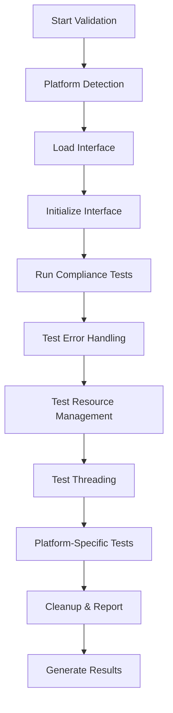

# HAL Validation Tools Guide

This guide provides comprehensive information about the HAL validation tools, including interface compliance validators, driver inspection tools, and error tracking systems.

## Table of Contents

1. [Overview](#overview)
2. [Getting Started](#getting-started)
3. [Interface Validation](#interface-validation)
4. [Command-Line Tools](#command-line-tools)
5. [Validation Categories](#validation-categories)
6. [Platform-Specific Validation](#platform-specific-validation)
7. [Output Formats](#output-formats)
8. [Integration with CI/CD](#integration-with-cicd)
9. [Extending the Validation System](#extending-the-validation-system)
10. [Troubleshooting](#troubleshooting)

## Overview

The HAL validation toolset provides comprehensive validation and debugging capabilities for HAL interface implementations. The system includes:

- **Interface Compliance Validator**: Verifies that interface implementations follow HAL contracts
- **Driver Inspection Tools**: Runtime analysis of driver behavior and resource usage
- **Error Tracking System**: Comprehensive error logging and pattern analysis
- **Performance Validation**: Integration with benchmarking and profiling tools
- **Platform-Specific Validation**: Ensures compliance with platform requirements

### Key Features

- ✅ **Multi-Platform Support**: Validates across all target platforms (Dreamcast, PSP, Web, Desktop)
- ✅ **Comprehensive Coverage**: Tests interface contracts, error handling, threading, and resource management
- ✅ **Flexible Output**: Console, JSON, and custom output formats
- ✅ **CI/CD Integration**: Easy integration with continuous integration pipelines
- ✅ **Extensible Architecture**: Plugin-based system for custom validators

## Getting Started

### Building the Validation Tools

The validation tools are built as part of the HAL project:

```bash
mkdir build && cd build
cmake .. -DBUILD_TOOLS=ON
make hal_validator
```

### Running Your First Validation

```bash
# Validate all interfaces for the current platform
./hal_validator --all

# Validate a specific interface
./hal_validator --interface IMemoryInterface --platform dreamcast

# List available validators
./hal_validator --list-validators
```

### Using the Convenience Script

On Unix systems, a convenience script is provided:

```bash
# Install the tools
make install

# Use the convenience script
hal_validate.sh validate-all dreamcast
hal_validate.sh validate-memory --platform psp --verbose
```

## Interface Validation

### What Gets Validated

Interface validation checks multiple aspects of HAL interface implementations:

#### 1. **Method Implementation Completeness**
- Verifies all required methods are implemented
- Tests basic interface lifecycle (initialize/shutdown)
- Validates method signatures and return types

#### 2. **Error Handling Patterns**
- Tests proper error code propagation
- Validates exception safety
- Checks error recovery mechanisms

#### 3. **Resource Management**
- Verifies proper resource allocation and cleanup
- Tests for memory leaks
- Validates resource ownership patterns

#### 4. **Thread Safety**
- Tests concurrent access patterns (where applicable)
- Validates synchronization mechanisms
- Checks for race conditions

#### 5. **Platform Compliance**
- Ensures compliance with platform-specific constraints
- Validates memory usage limits
- Checks for platform-specific feature usage

### Validation Process

Each interface validation follows this process:



## Command-Line Tools

### hal_validator

The main validation tool provides comprehensive interface and driver validation.

#### Usage

```bash
hal_validator [OPTIONS]
```

#### Options

| Option | Description | Example |
|--------|-------------|---------|
| `--interface NAME` | Validate specific interface | `--interface IMemoryInterface` |
| `--platform NAME` | Target platform | `--platform dreamcast` |
| `--all` | Run all available validations | `--all` |
| `--output FORMAT` | Output format (console, json) | `--output json` |
| `--output-file FILE` | Write output to file | `--output-file report.json` |
| `--verbose` | Enable verbose output | `--verbose` |
| `--list-validators` | List available validators | `--list-validators` |
| `--list-platforms` | List supported platforms | `--list-platforms` |
| `--help` | Show help message | `--help` |

#### Examples

```bash
# Validate memory interface for Dreamcast
hal_validator --interface IMemoryInterface --platform dreamcast --verbose

# Run all validations and output JSON report
hal_validator --all --output json --output-file validation_report.json

# Validate graphics interface for web platform
hal_validator --interface IGraphicsInterface --platform web

# List all available validators
hal_validator --list-validators
```

### hal_validate.sh (Convenience Script)

Provides simplified access to common validation tasks.

#### Commands

| Command | Description | Example |
|---------|-------------|---------|
| `validate-all [platform]` | Run all validations | `validate-all dreamcast` |
| `validate-interface <name>` | Validate specific interface | `validate-interface IMemoryInterface` |
| `validate-memory` | Validate memory interface | `validate-memory --platform psp` |
| `validate-graphics` | Validate graphics interface | `validate-graphics --platform web` |
| `validate-audio` | Validate audio interface | `validate-audio --verbose` |
| `list-validators` | List available validators | `list-validators` |
| `list-platforms` | List supported platforms | `list-platforms` |

## Validation Categories

### Interface Compliance
- Method implementation completeness
- API contract adherence
- Interface lifecycle management

### Error Handling
- Proper error code usage
- Exception safety guarantees
- Error recovery mechanisms

### Resource Usage
- Memory allocation patterns
- Resource leak detection
- Cleanup verification

### Threading
- Thread safety validation
- Concurrency testing
- Synchronization verification

### Platform Support
- Platform-specific constraints
- Capability detection
- Feature availability

### Performance
- Latency requirements
- Throughput expectations
- Resource efficiency

### Memory Management
- Allocation patterns
- Fragmentation analysis
- Memory pressure handling

### Configuration
- Parameter validation
- Setting compatibility
- Configuration hierarchy

## Platform-Specific Validation

### Dreamcast Platform
- **Memory Constraints**: 16MB total system memory validation
- **Single Threading**: No threading validation required
- **Hardware Features**: PowerVR2 graphics validation
- **Storage**: VMU storage pattern validation

```bash
hal_validator --interface IMemoryInterface --platform dreamcast
```

### PSP Platform
- **Memory Constraints**: 32-64MB memory validation
- **Power Management**: Battery usage validation
- **WiFi Capabilities**: Network interface validation
- **Memory Stick**: Storage validation

```bash
hal_validator --interface INetworkInterface --platform psp
```

### Web Platform
- **Sandbox Restrictions**: Security constraint validation
- **WebGL Features**: Graphics capability validation
- **Browser APIs**: Feature availability validation
- **Memory Limits**: Browser memory constraint validation

```bash
hal_validator --interface IGraphicsInterface --platform web
```

### Desktop Platforms (macOS, Windows, Linux)
- **High Performance**: Strict performance requirements
- **Threading**: Full concurrency validation
- **Advanced Features**: Modern API validation
- **Large Memory**: High-capacity memory validation

```bash
hal_validator --all --platform macos --verbose
```

## Output Formats

### Console Output (Default)

Provides human-readable validation results with colored output and categorized results.

```
=== HAL Validation Report ===
Duration: 234ms
Total Checks: 15
Status: PASSED

WARNINGS (2):
  🟡 ThreadSafety: Thread safety validation requires platform-specific tests
     Platform supports threading: 1

INFO (13):
  ✅ InitializeMethod: Interface initialization successful
  ✅ ShutdownMethod: Interface shutdown successful
  ✅ MemoryAllocationTest: Memory allocation test successful
  ...

Results by Category:
  Interface: 13 passed, 0 failed
  Threading: 1 passed, 0 failed
  Platform Support: 1 passed, 0 failed
```

### JSON Output

Machine-readable format suitable for CI/CD integration and automated processing.

```json
{
  "summary": {
    "total_checks": 15,
    "duration_ms": 234,
    "passed": true,
    "info_count": 13,
    "warning_count": 2,
    "error_count": 0,
    "critical_count": 0
  },
  "results": [
    {
      "check_name": "InitializeMethod",
      "category": "Interface",
      "severity": "INFO",
      "message": "Interface initialization successful",
      "details": "",
      "passed": true
    }
  ]
}
```

## Integration with CI/CD

### GitHub Actions

```yaml
name: HAL Validation
on: [push, pull_request]

jobs:
  validate:
    runs-on: ubuntu-latest
    steps:
      - uses: actions/checkout@v3
      - name: Build HAL
        run: |
          mkdir build && cd build
          cmake .. -DBUILD_TOOLS=ON
          make hal_validator
      - name: Run Validation
        run: |
          cd build
          ./hal_validator --all --output json --output-file validation_report.json
      - name: Upload Results
        uses: actions/upload-artifact@v3
        with:
          name: validation-report
          path: build/validation_report.json
```

### Jenkins

```groovy
pipeline {
    agent any
    stages {
        stage('Build') {
            steps {
                sh 'mkdir -p build && cd build'
                sh 'cmake .. -DBUILD_TOOLS=ON'
                sh 'make hal_validator'
            }
        }
        stage('Validate') {
            steps {
                sh 'cd build && ./hal_validator --all --output json --output-file validation_report.json'
                archiveArtifacts artifacts: 'build/validation_report.json'
            }
        }
    }
    post {
        always {
            publishHTML([
                allowMissing: false,
                alwaysLinkToLastBuild: true,
                keepAll: true,
                reportDir: 'build',
                reportFiles: 'validation_report.json',
                reportName: 'HAL Validation Report'
            ])
        }
    }
}
```

### Exit Codes

The validation tools use standard exit codes for CI/CD integration:

- `0`: All validations passed
- `1`: Validation failures detected
- `2`: Tool configuration error
- `3`: System error

## Extending the Validation System

### Creating Custom Validators

1. **Implement the IValidator Interface**

```cpp
class CustomValidator : public IValidator {
public:
    std::string get_name() const override {
        return "Custom Validator";
    }
    
    std::string get_description() const override {
        return "Validates custom requirements";
    }
    
    std::vector<ValidationCategory> get_supported_categories() const override {
        return {ValidationCategory::Interface};
    }
    
    ValidationReport validate(const std::any& context) override {
        ValidationReport report;
        // Implement validation logic
        return report;
    }
    
    bool supports_platform(PlatformType platform) const override {
        return true; // Support all platforms
    }
};
```

2. **Register the Validator**

```cpp
auto& registry = ValidationRegistry::instance();
registry.register_validator(std::make_unique<CustomValidator>());
```

### Adding New Validation Categories

1. **Extend ValidationCategory Enum**

```cpp
enum class ValidationCategory {
    // Existing categories...
    Security,          ///< Security-related validation
    Compatibility,     ///< Backward compatibility validation
    CustomCategory     ///< Your custom category
};
```

2. **Update Utility Functions**

```cpp
static std::string category_to_string(ValidationCategory category) {
    switch (category) {
        // Existing cases...
        case ValidationCategory::Security: return "Security";
        case ValidationCategory::CustomCategory: return "Custom Category";
        default: return "Unknown";
    }
}
```

### Custom Output Formatters

```cpp
class XMLFormatter : public OutputFormatter {
public:
    void format_report(const ValidationReport& report, std::ostream& output) override {
        output << "<?xml version=\"1.0\" encoding=\"UTF-8\"?>\n";
        output << "<validation_report>\n";
        // Format as XML
        output << "</validation_report>\n";
    }
    
    std::string get_name() const override { return "xml"; }
};
```

## Troubleshooting

### Common Issues

#### 1. "HAL validator not found"
- Ensure the tools are built with `-DBUILD_TOOLS=ON`
- Check that `hal_validator` is in your PATH
- Verify installation completed successfully

#### 2. "Interface instance is null"
- This is expected when validating without real interface implementations
- The validator tests interface contracts without requiring actual hardware
- Add mock implementations for more comprehensive testing

#### 3. "Unknown platform"
- Use `--list-platforms` to see supported platforms
- Check spelling of platform names
- Platform names are case-sensitive

#### 4. "No validation target specified"
- Specify `--interface <name>`, `--all`, or use `--help`
- Use the convenience script for simplified commands

### Debug Mode

Enable verbose output for detailed debugging:

```bash
hal_validator --interface IMemoryInterface --platform dreamcast --verbose
```

### Log Analysis

Check validation logs for detailed error information:

```bash
hal_validator --all --output json --output-file debug.json
cat debug.json | jq '.results[] | select(.severity == "ERROR")'
```

## Best Practices

### Development Workflow

1. **Run Validation Early**: Integrate validation into your development workflow
2. **Platform-Specific Testing**: Test on target platforms regularly
3. **Automated Validation**: Set up CI/CD validation for all changes
4. **Review Reports**: Regularly review validation reports for trends

### Performance Considerations

- Validation tools have minimal performance impact
- Use `--verbose` sparingly in automated environments
- JSON output is more efficient than console output for large reports

### Maintenance

- Keep validation tools updated with HAL interface changes
- Review and update platform-specific validation rules
- Monitor validation coverage and add new checks as needed

## Resources

- [HAL Interface Documentation](interface_compliance_testing_framework.md)
- [Platform Detection System](platform_detection_system.md)
- [Error Handling Guide](error_handling_system.md)
- [Performance Benchmarking](performance_benchmarking_system.md)

## Support

For issues with the validation tools:

1. Check this documentation first
2. Review the troubleshooting section
3. Examine validation logs and reports
4. Open an issue with detailed reproduction steps
