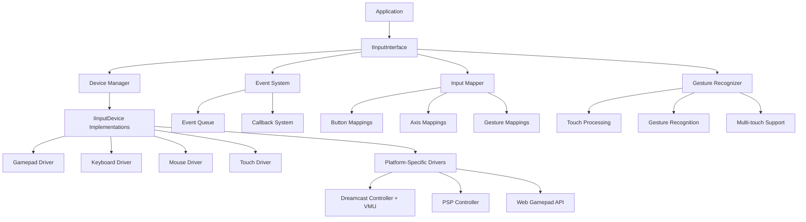

# Flight HAL Input Interface Design

## Overview

The Flight HAL Input Interface provides a unified abstraction layer for all input devices across diverse platforms, from legacy systems like Dreamcast controllers with VMU support to modern multi-touch interfaces and gesture recognition. This interface enables consistent input handling while supporting platform-specific optimizations and features.

## Design Philosophy

### 1. **Unified Abstraction**
- Single interface for all input types: gamepads, keyboards, mice, touch screens, motion controllers
- Consistent API across platforms from Dreamcast to modern web browsers
- Event-driven and polling access patterns supported simultaneously

### 2. **Platform Awareness**
- Native support for platform-specific features (Dreamcast VMU, PSP analog modes)
- Hardware-accelerated input processing where available
- Graceful degradation on limited hardware

### 3. **Flexible Input Mapping**
- Configurable input mapping between physical inputs and logical actions
- Context-sensitive input handling
- Support for button combinations and gesture mapping

### 4. **Performance Optimized**
- Low-latency input processing for real-time applications
- Efficient event queuing and batch processing
- Minimal overhead for high-frequency input updates

## Architecture



## Core Components

### Input Interface (`IInputInterface`)

The main interface providing:
- **Device Management**: Enumeration, connection detection, hot-plug support
- **Event Handling**: Global event callbacks and polling mechanisms
- **Resource Creation**: Input mappers, gesture recognizers, haptic controllers
- **Performance Monitoring**: Latency tracking, event statistics

### Input Device (`IInputDevice`)

Individual device abstraction supporting:
- **State Queries**: Button states, analog values, touch points
- **Calibration**: Dead zones, sensitivity settings, bias correction
- **Haptic Feedback**: Rumble, pulse, and custom waveform effects
- **Event Generation**: Real-time input event callbacks

### Input Mapper (`IInputMapper`)

Flexible input mapping system:
- **Action Mapping**: Physical inputs to logical game actions
- **Context Switching**: Different mappings for different game states
- **Configuration**: Save/load mapping profiles from files
- **Real-time Updates**: Dynamic mapping changes during gameplay

### Gesture Recognizer (`IGestureRecognizer`)

Touch gesture processing:
- **Basic Gestures**: Tap, double-tap, long press, swipe
- **Complex Gestures**: Pinch-to-zoom, rotation, multi-touch panning
- **Custom Gestures**: User-defined gesture recognition
- **Parameter Tuning**: Configurable thresholds and timing

## Platform-Specific Features

### Dreamcast Support

**Controller Features:**
- 8 digital buttons with analog triggers
- Analog stick with 256-level precision
- 2 VMU expansion slots per controller

**VMU Integration:**
```cpp
// Access VMU-specific functionality
auto* vmu_ext = input_interface->get_vmu_extension();
if (vmu_ext) {
    // Read/write VMU memory
    vmu_ext->read_vmu_memory(vmu_slot, address, data, size);
    
    // Display on VMU LCD (48x32 pixels)
    vmu_ext->display_vmu_image(vmu_slot, lcd_data);
    
    // VMU beep functionality
    vmu_ext->vmu_beep(vmu_slot, frequency, duration);
}
```

### PSP Support

**Controller Features:**
- Digital and analog input modes
- Pressure-sensitive analog stick
- System button handling

**PSP-Specific API:**
```cpp
// Access PSP-specific functionality
auto* psp_ext = input_interface->get_psp_extension();
if (psp_ext) {
    // Toggle analog mode
    psp_ext->set_analog_mode(true);
    
    // Configure button repeat
    psp_ext->set_button_repeat(500ms, 100ms);
}
```

### Web Platform Support

**Web Gamepad API Integration:**
- Standard gamepad mapping
- Vibration API support
- Browser compatibility handling

**Touch and Gesture Support:**
- Multi-touch event processing
- Gesture recognition pipeline
- Mobile-optimized input handling

## Input Event System

### Event Types

The system supports comprehensive event types:

```cpp
enum class InputEventType : uint8_t {
    ButtonDown,         // Button press
    ButtonUp,           // Button release  
    ButtonRepeat,       // Key repeat
    AnalogChange,       // Analog value change
    MouseMove,          // Mouse movement
    MouseWheel,         // Mouse wheel scroll
    TouchDown,          // Touch begin
    TouchUp,            // Touch end
    TouchMove,          // Touch movement
    GestureBegin,       // Gesture start
    GestureEnd,         // Gesture end
    GestureUpdate,      // Gesture progress
    DeviceConnected,    // Device plugged in
    DeviceDisconnected, // Device unplugged
    CalibrationChanged, // Calibration update
    InputModeChanged,   // Mode change (e.g., PSP analog)
    HotKeyPressed       // System hotkey
};
```

### Event Processing Patterns

**Event-Driven Processing:**
```cpp
input_interface->set_global_event_callback([](const InputEvent& event) {
    switch (event.event_type) {
        case InputEventType::ButtonDown:
            handle_button_press(event.button_event.button);
            break;
        case InputEventType::AnalogChange:
            handle_analog_input(event.analog_event.axis, event.analog_event.value);
            break;
        case InputEventType::TouchDown:
            handle_touch_begin(event.touch_event.touch_id, event.touch_event.position);
            break;
    }
});
```

**Polling-Based Processing:**
```cpp
// Frame-based input polling
auto gamepad_result = input_interface->get_device_by_type(InputDeviceType::Gamepad, 0);
if (gamepad_result.is_success()) {
    auto* gamepad = gamepad_result.value();
    
    // Check button states
    bool jump_pressed = gamepad->is_button_pressed(InputButton::ButtonA);
    
    // Read analog values
    float move_x = gamepad->get_axis_value(InputAxis::LeftStickX);
    float move_y = gamepad->get_axis_value(InputAxis::LeftStickY);
    
    // Apply dead zone and sensitivity
    move_x = input::apply_dead_zone(move_x, 0.1f);
    move_x = input::apply_sensitivity(move_x, 1.5f);
}
```

## Input Mapping System

### Basic Mapping Configuration

```cpp
// Create input mapping
InputMapping mapping = input::make_default_mapping("Game Controls", "gameplay");

// Button mappings
mapping.button_actions[InputButton::ButtonA] = "jump";
mapping.button_actions[InputButton::ButtonB] = "attack";
mapping.button_actions[InputButton::Start] = "pause";

// Axis mappings  
mapping.axis_actions[InputAxis::LeftStickX] = "move_horizontal";
mapping.axis_actions[InputAxis::LeftStickY] = "move_vertical";
mapping.axis_actions[InputAxis::RightStickX] = "camera_horizontal";
mapping.axis_actions[InputAxis::RightStickY] = "camera_vertical";

// Configure dead zones
mapping.dead_zones[InputAxis::LeftStickX] = 0.15f;
mapping.dead_zones[InputAxis::LeftStickY] = 0.15f;

// Set sensitivities
mapping.sensitivities[InputAxis::RightStickX] = 2.0f;
mapping.sensitivities[InputAxis::RightStickY] = 1.8f;

// Invert axes if needed
mapping.invert_flags[InputAxis::RightStickY] = true; // Invert look Y
```

### Advanced Mapping Features

**Button Combinations:**
```cpp
// Multi-button actions
mapping.combo_actions[{InputButton::LeftShoulder, InputButton::ButtonA}] = "special_attack";
mapping.combo_actions[{InputButton::Select, InputButton::Start}] = "quick_save";
```

**Context-Sensitive Mapping:**
```cpp
// Different mappings for different game states
auto menu_mapping = input::make_default_mapping("Menu Controls", "menu");
menu_mapping.button_actions[InputButton::ButtonA] = "select";
menu_mapping.button_actions[InputButton::ButtonB] = "back";

auto gameplay_mapping = input::make_default_mapping("Game Controls", "gameplay");
gameplay_mapping.button_actions[InputButton::ButtonA] = "jump";
gameplay_mapping.button_actions[InputButton::ButtonB] = "attack";

// Switch contexts dynamically
input_mapper->set_context("menu");    // Activate menu controls
input_mapper->set_context("gameplay"); // Activate game controls
```

## Gesture Recognition

### Supported Gestures

```cpp
enum class GestureType : uint8_t {
    None,           // No gesture
    Tap,            // Single tap
    DoubleTap,      // Double tap
    LongPress,      // Long press/hold
    Swipe,          // Swipe gesture
    Pinch,          // Pinch to zoom
    Rotate,         // Rotation gesture
    Pan,            // Pan/drag gesture
    Custom          // Custom gesture
};
```

### Gesture Configuration

```cpp
auto gesture_recognizer = input_interface->create_gesture_recognizer();
if (gesture_recognizer.is_success()) {
    auto* recognizer = gesture_recognizer.value().get();
    
    // Configure gesture parameters
    std::map<std::string, float> tap_params = {
        {"max_duration", 200.0f},     // Maximum tap duration (ms)
        {"max_movement", 10.0f},      // Maximum movement tolerance (pixels)
    };
    recognizer->configure_gesture(GestureType::Tap, tap_params);
    
    std::map<std::string, float> swipe_params = {
        {"min_distance", 50.0f},      // Minimum swipe distance
        {"max_duration", 1000.0f},    // Maximum swipe duration
        {"min_velocity", 100.0f},     // Minimum swipe velocity
    };
    recognizer->configure_gesture(GestureType::Swipe, swipe_params);
    
    // Set gesture callback
    recognizer->set_gesture_callback([](const GestureData& gesture) {
        switch (gesture.type) {
            case GestureType::Tap:
                handle_tap(gesture.current_position);
                break;
            case GestureType::Swipe:
                handle_swipe(gesture.start_position, gesture.current_position, gesture.velocity);
                break;
            case GestureType::Pinch:
                handle_pinch(gesture.scale);
                break;
        }
    });
}
```

## Haptic Feedback

### Effect Types and Configuration

```cpp
// Create haptic effects
auto rumble_effect = input::make_haptic_effect(HapticType::Rumble, 0.8f, 500ms);
auto click_effect = input::make_haptic_effect(HapticType::Click, 1.0f, 50ms);

// Custom waveform effect
HapticEffect custom_effect;
custom_effect.type = HapticType::CustomWaveform;
custom_effect.intensity = 0.7f;
custom_effect.duration = 1000ms;
custom_effect.waveform_data = {0.0f, 0.5f, 1.0f, 0.5f, 0.0f}; // Custom pattern
custom_effect.sample_rate = 100.0f;

// Play effects on device
auto gamepad_result = input_interface->get_device_by_type(InputDeviceType::Gamepad, 0);
if (gamepad_result.is_success()) {
    auto* gamepad = gamepad_result.value();
    
    gamepad->play_haptic_effect(rumble_effect);
    std::this_thread::sleep_for(500ms);
    gamepad->play_haptic_effect(click_effect);
}
```

## Performance and Optimization

### Low-Latency Mode

```cpp
// Enable low-latency input processing
input_interface->set_low_latency_mode(true);

// Check input latency
auto latency_result = input_interface->get_input_latency();
if (latency_result.is_success()) {
    double latency_ms = latency_result.value();
    std::cout << "Average input latency: " << latency_ms << "ms\n";
}
```

### Performance Monitoring

```cpp
// Get detailed performance statistics
auto stats = input_interface->get_stats();

std::cout << "Input Performance Statistics:\n";
std::cout << "  Total events processed: " << stats.total_events_processed << "\n";
std::cout << "  Button events: " << stats.button_events << "\n";
std::cout << "  Analog events: " << stats.analog_events << "\n";
std::cout << "  Touch events: " << stats.touch_events << "\n";
std::cout << "  Average latency: " << stats.average_input_latency_ms << "ms\n";
std::cout << "  Peak latency: " << stats.peak_input_latency_ms << "ms\n";
std::cout << "  Polling cycles: " << stats.polling_cycles << "\n";
std::cout << "  Connected devices: " << stats.connected_devices << "\n";
```

### Memory Management

```cpp
// Monitor input system memory usage
std::cout << "Event buffer usage: " << stats.event_buffer_usage << " bytes\n";
std::cout << "Total input memory: " << stats.total_input_memory << " bytes\n";

// Configure event queue size for memory optimization
input_interface->set_event_queue_size(1000); // Limit to 1000 events
```

## Cross-Platform Considerations

### Platform Detection and Adaptation

```cpp
// Check platform-specific capabilities
if (input_interface->supports_input_capability(InputCapability::VMUSupport)) {
    // Enable Dreamcast-specific features
    setup_vmu_integration();
}

if (input_interface->supports_input_capability(InputCapability::TouchInput)) {
    // Enable touch-based controls
    setup_touch_interface();
}

if (input_interface->supports_input_capability(InputCapability::WebGamepad)) {
    // Configure for web platform
    setup_web_gamepad_handling();
}
```

### Device Hot-Plug Support

```cpp
// Enable device hot-plug detection
input_interface->set_hot_plug_enabled(true);

// Set device connection callback
input_interface->set_device_connection_callback([](InputResourceHandle device, bool connected) {
    if (connected) {
        std::cout << "Device connected: " << device.id << "\n";
        // Initialize device-specific settings
        configure_new_device(device);
    } else {
        std::cout << "Device disconnected: " << device.id << "\n";
        // Clean up device resources
        cleanup_device_resources(device);
    }
});
```

## Error Handling

### Comprehensive Error Management

```cpp
// Initialize with error checking
auto init_result = input_interface->initialize();
if (!init_result.is_success()) {
    const auto& error = init_result.error();
    std::cerr << "Input initialization failed: " << error.message();
    
    switch (error.category()) {
        case HALErrorCategory::Hardware:
            std::cerr << " (Hardware issue)";
            break;
        case HALErrorCategory::Driver:
            std::cerr << " (Driver issue)";
            break;
        case HALErrorCategory::Configuration:
            std::cerr << " (Configuration issue)";
            break;
    }
    std::cerr << "\n";
}

// Device operation error handling
auto device_result = input_interface->get_device_by_type(InputDeviceType::Gamepad, 0);
if (!device_result.is_success()) {
    std::cerr << "Failed to get gamepad: " << device_result.error().message() << "\n";
    // Fall back to keyboard controls
    setup_keyboard_fallback();
}
```

## Integration Examples

### Game Integration Pattern

```cpp
class GameInputManager {
private:
    std::unique_ptr<IInputInterface> input_interface_;
    std::unique_ptr<IInputMapper> input_mapper_;
    
public:
    bool initialize() {
        // Create and initialize input interface
        input_interface_ = create_platform_input_interface();
        auto init_result = input_interface_->initialize();
        if (!init_result.is_success()) {
            return false;
        }
        
        // Create input mapper
        auto mapper_result = input_interface_->create_input_mapper();
        if (mapper_result.is_success()) {
            input_mapper_ = std::move(mapper_result.value());
            
            // Load game input mapping
            auto mapping = load_game_input_mapping();
            input_mapper_->load_mapping(mapping);
        }
        
        // Set up event handling
        input_interface_->set_global_event_callback([this](const InputEvent& event) {
            handle_game_input(event);
        });
        
        return true;
    }
    
    void update(float delta_time) {
        // Update input system
        auto duration = std::chrono::duration<float>(delta_time);
        input_interface_->update(duration);
        
        // Process input actions
        if (input_mapper_) {
            // Check mapped actions
            if (input_mapper_->is_action_active("jump")) {
                player_->jump();
            }
            
            float move_x = input_mapper_->get_action_value("move_horizontal");
            float move_y = input_mapper_->get_action_value("move_vertical");
            player_->move(move_x, move_y);
        }
    }
    
private:
    void handle_game_input(const InputEvent& event) {
        // Process raw input events if needed
        if (event.event_type == InputEventType::DeviceConnected) {
            show_controller_connected_message();
        } else if (event.event_type == InputEventType::DeviceDisconnected) {
            show_controller_disconnected_message();
        }
    }
};
```

## Future Enhancements

### Planned Features

1. **Advanced Gesture Recognition**
   - Machine learning-based gesture classification
   - User-trainable custom gestures
   - Multi-modal input fusion (touch + motion)

2. **Enhanced Platform Support**
   - Modern console controller integration
   - VR controller support
   - Eye tracking and gaze input

3. **Performance Optimizations**
   - GPU-accelerated input processing
   - Predictive input latency compensation
   - Adaptive polling rate optimization

4. **Accessibility Features**
   - Voice command integration
   - Switch control support
   - Customizable accessibility profiles

The Flight HAL Input Interface provides a comprehensive, high-performance foundation for unified input handling across diverse platforms while maintaining the flexibility to leverage platform-specific capabilities and optimizations.
