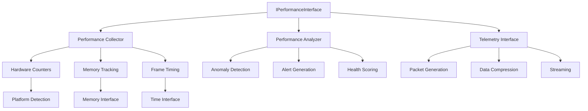

# Flight HAL Performance Monitoring System

## Overview

The Flight HAL Performance Monitoring System provides comprehensive, low-overhead performance analysis capabilities across diverse platforms from resource-constrained retro consoles (Dreamcast with 16MB RAM) to modern high-end desktop systems. The system is designed with adaptive monitoring modes, hardware counter integration, and real-time telemetry streaming.

## Key Features

### 🎯 **Cross-Platform Performance Counters**
- Hardware CPU performance counters (cycles, instructions, cache hits/misses)
- GPU performance metrics (vertices processed, pixels drawn, shader invocations)
- Memory bandwidth and access pattern monitoring
- Platform-specific counters (battery level on PSP, thermal state)

### 🔧 **Adaptive Monitoring Modes**
- **Minimal**: Essential metrics only (~1% overhead)
- **Standard**: Balanced monitoring for production use
- **Detailed**: Comprehensive monitoring for development
- **Profiling**: Maximum detail for performance analysis
- **Custom**: User-defined counter selection

### 📊 **Memory Performance Tracking**
- Real-time allocation/deallocation monitoring
- Memory leak detection and fragmentation analysis
- Peak usage tracking and pressure monitoring
- Integration with existing memory interface

### 🎮 **Frame Performance Analysis**
- Frame rate monitoring with jitter analysis
- VSync detection and frame dropping metrics
- Performance stability scoring
- Target frame rate compliance checking

### 🚨 **Real-Time Alerting**
- Statistical anomaly detection
- Configurable threshold-based alerts
- Performance degradation warnings
- System health scoring

### 📡 **Telemetry Integration**
- Structured telemetry packet generation
- Real-time streaming capabilities
- Data compression for bandwidth optimization
- Integration with Flight telemetry system

## Architecture



## Usage Examples

### Basic Performance Monitoring

```cpp
#include "flight/hal/interfaces/performance.hpp"

// Get performance interface from driver registry
auto perf_interface = DriverRegistry::instance().get_interface<IPerformanceInterface>();

// Configure for minimal monitoring
auto config = PerformanceMonitoringConfig::for_mode(MonitoringMode::Minimal);
perf_interface->configure_monitoring(config);

// Start monitoring
perf_interface->start_monitoring();

// Collect performance snapshot
auto snapshot_result = perf_interface->get_current_snapshot();
if (snapshot_result.is_ok()) {
    const auto& snapshot = snapshot_result.value();
    std::cout << "CPU: " << snapshot.overall_cpu_usage << "%" << std::endl;
    std::cout << "Memory: " << snapshot.overall_memory_usage << "%" << std::endl;
    std::cout << "FPS: " << snapshot.frame.current_fps << std::endl;
}
```

### Advanced Monitoring with Alerts

```cpp
// Configure detailed monitoring with alerts
auto config = PerformanceMonitoringConfig::for_mode(MonitoringMode::Detailed);
config.enable_alerts = true;
config.cpu_alert_threshold = 80.0;
config.memory_alert_threshold = 75.0;
config.frame_rate_alert_threshold = 50.0;

// Register alert callback
auto alert_callback = [](const PerformanceAlert& alert) {
    std::cout << "ALERT: " << alert.message << std::endl;
    std::cout << "Level: " << performance::to_string(alert.level) << std::endl;
    std::cout << "Threshold: " << alert.threshold_value << std::endl;
    std::cout << "Actual: " << alert.actual_value << std::endl;
};

auto callback_id = perf_interface->register_alert_callback(alert_callback);
```

### Platform-Adaptive Configuration

```cpp
// Get platform capabilities
const auto& capabilities = perf_interface->get_performance_capabilities();

// Create optimal configuration for this platform
auto config = performance::create_optimal_config(capabilities, MonitoringMode::Standard);

// Validate configuration before use
auto validation_result = performance::validate_config(config, capabilities);
if (!validation_result.is_ok()) {
    std::cout << "Configuration invalid: " << validation_result.error().message() << std::endl;
}

// Estimate monitoring overhead
uint64_t overhead_ns = performance::estimate_overhead(config, capabilities);
std::cout << "Estimated overhead: " << overhead_ns << "ns per collection" << std::endl;
```

### Telemetry Integration

```cpp
// Enable telemetry streaming
auto telemetry_callback = [](const PerformanceTelemetryPacket& packet) {
    // Send packet to telemetry system
    std::cout << "Telemetry packet: " << packet.get_packet_size() << " bytes" << std::endl;
    // ... integrate with Flight telemetry system
};

perf_interface->enable_telemetry_streaming(telemetry_callback, 1000); // 1 second interval
```

### Custom Counter Selection

```cpp
// Create custom monitoring configuration
PerformanceMonitoringConfig custom_config;
custom_config.mode = MonitoringMode::Custom;
custom_config.strategy = CollectionStrategy::Polling;
custom_config.collection_interval_ms = 500;
custom_config.history_size = 120; // 1 minute at 500ms intervals

// Select specific counters
custom_config.enabled_counters = {
    PerformanceCounterType::CPUCycles,
    PerformanceCounterType::FrameRate,
    PerformanceCounterType::MemoryAllocations,
    PerformanceCounterType::GPUPixelsDrawn  // If GPU monitoring available
};

custom_config.enable_alerts = true;
custom_config.enable_telemetry_streaming = false; // Disable for lower overhead
```

## Platform-Specific Features

### Dreamcast (Resource-Constrained)
- **Available Counters**: Frame rate, basic memory tracking
- **Max Mode**: Minimal
- **Collection Interval**: 1000ms minimum
- **History Size**: 60 samples maximum
- **Special Features**: None

```cpp
// Dreamcast-optimized configuration
auto dreamcast_config = PerformanceMonitoringConfig::minimal();
dreamcast_config.collection_interval_ms = 1000; // 1 second
dreamcast_config.history_size = 60; // 1 minute
dreamcast_config.enable_telemetry_streaming = false; // Save bandwidth
```

### PSP (Handheld)
- **Available Counters**: CPU, memory, battery, thermal
- **Max Mode**: Standard
- **Collection Interval**: 100ms minimum
- **Special Features**: Battery monitoring, thermal protection

```cpp
// PSP configuration with battery monitoring
auto psp_config = PerformanceMonitoringConfig::for_mode(MonitoringMode::Standard);
psp_config.enabled_counters.push_back(PerformanceCounterType::BatteryLevel);
psp_config.enabled_counters.push_back(PerformanceCounterType::ThermalState);
```

### Web (Browser)
- **Available Counters**: Limited to browser Performance API
- **Max Mode**: Standard
- **Collection Interval**: 16ms minimum (60 FPS)
- **Special Features**: Network latency monitoring

```cpp
// Web-specific configuration
auto web_config = PerformanceMonitoringConfig::for_mode(MonitoringMode::Standard);
web_config.enabled_counters = {
    PerformanceCounterType::FrameRate,
    PerformanceCounterType::FrameTime,
    PerformanceCounterType::NetworkLatency
};
```

### macOS/Desktop (Full-Featured)
- **Available Counters**: Full hardware counter access
- **Max Mode**: Profiling
- **Collection Interval**: 1ms minimum
- **Special Features**: Advanced profiling integration

```cpp
// Desktop configuration with full hardware counters
auto desktop_config = PerformanceMonitoringConfig::for_mode(MonitoringMode::Profiling);
desktop_config.collection_interval_ms = 10; // 10ms for high precision
desktop_config.history_size = 6000; // 1 minute at 10ms
```

## Performance Counter Types

### CPU Counters
- `CPUCycles`: Total CPU cycles executed
- `Instructions`: Instructions retired
- `CacheMisses`/`CacheHits`: Cache performance
- `BranchMisses`/`BranchHits`: Branch prediction performance

### Memory Counters
- `MemoryReads`/`MemoryWrites`: Memory access counts
- `MemoryBandwidth`: Memory bandwidth utilization
- `PageFaults`: Memory page faults
- `TLBMisses`: Translation lookaside buffer misses

### Graphics Counters
- `GPUCycles`: GPU processing cycles
- `GPUVerticesProcessed`: Vertex shader throughput
- `GPUPixelsDrawn`: Pixel fill rate
- `GPUTextureReads`: Texture cache performance

### System Counters
- `InterruptCount`: Hardware interrupts
- `ContextSwitches`: Thread context switches
- `SystemCalls`: System call frequency
- `IOOperations`: Input/output operations

### Platform-Specific Counters
- `BatteryLevel`: Battery charge percentage (PSP, handhelds)
- `ThermalState`: Temperature/thermal throttling state
- `PowerConsumption`: Power usage metrics
- `NetworkLatency`: Network round-trip time

### Software Counters
- `FrameRate`: Frames per second
- `FrameTime`: Frame processing duration
- `MemoryAllocations`/`MemoryDeallocations`: Memory management
- `DriverOperations`: HAL driver operation count

## Best Practices

### 1. Choose Appropriate Monitoring Mode
```cpp
// For production games
auto production_config = PerformanceMonitoringConfig::for_mode(MonitoringMode::Standard);

// For development/debugging
auto debug_config = PerformanceMonitoringConfig::for_mode(MonitoringMode::Detailed);

// For performance profiling
auto profiling_config = PerformanceMonitoringConfig::for_mode(MonitoringMode::Profiling);
```

### 2. Validate Platform Compatibility
```cpp
// Always validate before applying configuration
auto validation_result = performance::validate_config(config, capabilities);
if (!validation_result.is_ok()) {
    // Fall back to a more conservative configuration
    config = performance::create_optimal_config(capabilities, MonitoringMode::Minimal);
}
```

### 3. Monitor Overhead
```cpp
// Estimate and check monitoring overhead
uint64_t overhead_ns = performance::estimate_overhead(config, capabilities);
if (overhead_ns > 100000) { // 100μs threshold
    std::cout << "Warning: High monitoring overhead detected" << std::endl;
}
```

### 4. Use Appropriate Collection Intervals
```cpp
// Game loop timing (60 FPS)
config.collection_interval_ms = 16; // Every frame

// Background monitoring
config.collection_interval_ms = 1000; // Every second

// High-precision profiling
config.collection_interval_ms = 1; // Every millisecond
```

### 5. Implement Alert Handlers
```cpp
void handle_performance_alert(const PerformanceAlert& alert) {
    switch (alert.level) {
        case PerformanceAlertLevel::Warning:
            // Log warning, consider reducing quality settings
            break;
        case PerformanceAlertLevel::Critical:
            // Immediate action required, reduce workload
            break;
        case PerformanceAlertLevel::Emergency:
            // Emergency measures, pause non-essential systems
            break;
    }
}
```

## Integration Guidelines

### Memory Interface Integration
The performance monitoring system integrates seamlessly with the existing memory interface:

```cpp
// Memory performance tracking is automatic when memory interface is available
auto memory_perf = perf_interface->get_memory_performance();
if (memory_perf.is_ok()) {
    const auto& mem_data = memory_perf.value();
    std::cout << "Allocations/sec: " << mem_data.allocations_per_second << std::endl;
    std::cout << "Fragmentation: " << mem_data.fragmentation_ratio * 100 << "%" << std::endl;
}
```

### Time Interface Integration
Frame timing leverages the high-precision time interface:

```cpp
// Frame timing is automatically integrated
auto frame_perf = perf_interface->get_frame_performance();
if (frame_perf.is_ok()) {
    const auto& frame_data = frame_perf.value();
    std::cout << "Average FPS: " << frame_data.average_fps << std::endl;
    std::cout << "Frame stability: " << frame_data.get_stability() * 100 << "%" << std::endl;
}
```

### Driver Performance Tracking
Track performance of individual HAL drivers:

```cpp
// Register a driver for performance monitoring
auto driver_id = perf_interface->register_driver_monitoring("graphics", "opengl");

// Record driver operations
perf_interface->record_driver_operation(driver_id.value(), "draw_call", 1500, true); // 1.5μs

// Get driver performance data
auto driver_perf = perf_interface->get_driver_performance(driver_id.value());
```

## Troubleshooting

### Common Issues

1. **High Monitoring Overhead**
   - Reduce collection frequency
   - Disable unused counters
   - Switch to a lower monitoring mode

2. **Missing Hardware Counters**
   - Check platform capabilities
   - Use software counters as fallback
   - Validate configuration before use

3. **Memory Pressure from History Buffer**
   - Reduce history size
   - Use streaming mode for real-time data
   - Implement data compression

4. **Alert Spam**
   - Adjust alert thresholds
   - Implement alert rate limiting
   - Use statistical anomaly detection

### Debugging Tools

```cpp
// Check platform capabilities
const auto& caps = perf_interface->get_performance_capabilities();
std::cout << "Max supported mode: " << performance::to_string(caps.max_supported_mode) << std::endl;
std::cout << "Available counters: " << caps.available_counters.size() << std::endl;

// Calibrate monitoring overhead
auto overhead_result = perf_interface->calibrate_overhead();
if (overhead_result.is_ok()) {
    for (const auto& [name, overhead_ns] : overhead_result.value()) {
        std::cout << name << ": " << overhead_ns << "ns" << std::endl;
    }
}

// Export performance data for analysis
auto export_result = perf_interface->export_performance_data("json", 60000); // 1 minute
if (export_result.is_ok()) {
    std::ofstream file("performance_data.json");
    file << export_result.value();
}
```

## API Reference

For complete API documentation, see:
- `include/flight/hal/interfaces/performance.hpp` - Main interface definitions
- `src/core/performance.cpp` - Utility function implementations
- `examples/performance_monitoring/` - Usage examples

## Performance Characteristics

| Platform | Max Overhead | Collection Interval | History Size | Special Features |
|----------|--------------|-------------------|--------------|------------------|
| Dreamcast | <0.5% | 1000ms | 60 samples | Frame rate only |
| PSP | <1% | 100ms | 300 samples | Battery/thermal |
| Web | <2% | 16ms | 1000 samples | Network latency |
| Desktop | <0.1% | 1ms | 10000 samples | Full HW counters |

The Flight HAL Performance Monitoring System provides a comprehensive solution for performance analysis across diverse gaming platforms while maintaining the low overhead required for production use.
