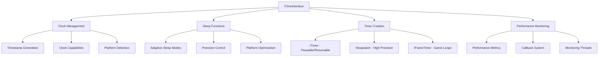

# Flight HAL Time Interface Design

## Overview

The Flight HAL Time Interface provides high-precision timing capabilities across platforms ranging from retro consoles (Dreamcast, PSP) to modern systems (macOS, Windows, Linux, Web). This document outlines the comprehensive timing system design that ensures microsecond precision timing, monotonic clock guarantees, and optimal performance for game development and real-time applications.

## Design Goals

### Primary Objectives
- **High-precision timing**: Microsecond resolution where supported, graceful degradation on limited platforms
- **Monotonic guarantees**: Provide stable, forward-moving time references unaffected by system clock adjustments
- **Platform abstraction**: Unified API across diverse platforms with vastly different timing capabilities
- **Game loop optimization**: Specialized frame timing utilities for consistent game performance
- **Zero-allocation operations**: Critical timing paths avoid dynamic memory allocation

### Platform Requirements
- **Dreamcast**: Work within SH-4 timer limitations, provide millisecond precision
- **PSP**: Handle dual-core synchronization, detect CPU frequency changes
- **Web**: Use Performance.now() with fallback strategies for precision limits
- **macOS**: Leverage mach_absolute_time() for nanosecond precision
- **Modern platforms**: Utilize clock_gettime() or QueryPerformanceCounter()

## Architecture Overview

### Core Components



### Type Hierarchy

```cpp
// Core timing types
enum class ClockType {
    Monotonic,        // Primary choice for game timing
    HighResolution,   // Platform's best precision
    Realtime,         // Wall clock time
    Process,          // Process execution time
    Thread,           // Thread execution time
    GameTimer,        // Pausable game time
    ProfileTimer      // Profiling measurements
};

enum class TimePrecision {
    Nanosecond,       // Modern platforms
    Microsecond,      // Most platforms
    Millisecond,      // Legacy systems
    Centisecond,      // Very limited systems
    Second            // Fallback only
};

enum class SleepMode {
    Busy,             // Spin wait - highest precision
    Yield,            // Thread yield - balanced
    Block,            // OS sleep - lowest CPU
    Adaptive          // Duration-based selection
};
```

## Platform-Specific Implementations

### Dreamcast (SH-4)
```cpp
class DreamcastTimeProvider {
    // Use SH-4 timer units
    // TMU0/TMU1 for microsecond timing
    // Handle CPU frequency variations
    // Provide millisecond precision guarantee
    
    ClockCapabilities capabilities_ = {
        .precision = TimePrecision::Millisecond,
        .frequency = 50000000, // 50MHz bus
        .supports_high_res = false
    };
};
```

### PSP (MIPS R4000)
```cpp
class PSPTimeProvider {
    // Use PSP's high-resolution timer
    // Handle Media Engine synchronization
    // Detect CPU frequency scaling
    // Provide microsecond precision
    
    void handle_core_synchronization() {
        // Ensure timer consistency across cores
        // Handle power management effects
    }
};
```

### Web Platform
```cpp
class WebTimeProvider {
    // Use Performance.now() API
    // Handle precision reduction for security
    // Provide fallback timing mechanisms
    
    uint64_t get_timestamp() override {
        // Use Performance.now() with precision handling
        auto timestamp = performance_now();
        return apply_precision_limits(timestamp);
    }
};
```

### macOS Implementation
```cpp
class MacOSTimeProvider {
    // Use mach_absolute_time() for nanosecond precision
    // Handle conversion to nanoseconds
    // Provide steady, monotonic timing
    
    uint64_t get_timestamp() override {
        auto raw_time = mach_absolute_time();
        return convert_to_nanoseconds(raw_time);
    }
};
```

## Core Interface Design

### Primary Time Interface
```cpp
class ITimeInterface : public IHALInterface {
public:
    // Timestamp operations
    virtual HALResult<Timestamp> now() = 0;
    virtual HALResult<Timestamp> now(ClockType clock_type) = 0;
    virtual HALResult<Duration> elapsed(const Timestamp& start, const Timestamp& end) = 0;
    
    // Sleep functions with mode selection
    virtual HALResult<void> sleep(const Duration& duration, SleepMode mode = SleepMode::Adaptive) = 0;
    virtual HALResult<void> sleep_until(const Timestamp& target_time, SleepMode mode = SleepMode::Adaptive) = 0;
    
    // Timer creation
    virtual HALResult<std::unique_ptr<ITimer>> create_timer(const TimerConfig& config) = 0;
    virtual HALResult<std::unique_ptr<IStopwatch>> create_stopwatch(ClockType clock_type = ClockType::HighResolution) = 0;
    virtual HALResult<std::unique_ptr<IFrameTimer>> create_frame_timer(double target_fps = 60.0, FrameTimingMode mode = FrameTimingMode::Variable) = 0;
    
    // Performance monitoring
    virtual HALResult<uint32_t> start_performance_monitoring(PerformanceCallback callback, const Duration& update_interval) = 0;
    virtual HALResult<void> stop_performance_monitoring(uint32_t monitor_id) = 0;
    
    // Capabilities and utilities
    virtual const PlatformTimingCapabilities& get_capabilities() const = 0;
    virtual bool supports_clock_type(ClockType clock_type) const = 0;
    virtual SleepMode get_recommended_sleep_mode(const Duration& duration) const = 0;
};
```

### Timer Interfaces
```cpp
// Pausable/resumable timer
class ITimer {
public:
    virtual HALResult<void> start() = 0;
    virtual HALResult<void> pause() = 0;
    virtual HALResult<void> resume() = 0;
    virtual HALResult<void> stop() = 0;
    virtual HALResult<Duration> get_elapsed() const = 0;
    virtual HALResult<Duration> get_remaining() const = 0;
    virtual TimerState get_state() const = 0;
    virtual bool has_expired() const = 0;
    virtual HALResult<void> set_callback(TimerCallback callback) = 0;
};

// High-precision stopwatch
class IStopwatch {
public:
    virtual HALResult<void> start() = 0;
    virtual HALResult<Duration> stop() = 0;
    virtual HALResult<void> reset() = 0;
    virtual HALResult<Duration> lap() = 0;
    virtual bool is_running() const = 0;
    virtual Duration get_total_elapsed() const = 0;
};

// Game loop frame timer
class IFrameTimer {
public:
    virtual HALResult<FrameTiming> begin_frame() = 0;
    virtual HALResult<FrameTiming> end_frame() = 0;
    virtual HALResult<void> set_target_fps(double fps) = 0;
    virtual const FrameTiming& get_current_timing() const = 0;
    virtual const PerformanceMetrics& get_performance_metrics() const = 0;
    virtual HALResult<void> set_timing_mode(FrameTimingMode mode) = 0;
    virtual HALResult<void> set_smoothing_factor(double factor) = 0;
};
```

## Frame Timing System

### Frame Timing Modes
```cpp
enum class FrameTimingMode {
    Variable,         // Delta time varies with actual frame duration
    Fixed,            // Fixed timestep with accumulation
    SemiFixed,        // Fixed timestep with maximum frame time cap
    Adaptive          // Adapts based on performance
};
```

### Frame Timing Implementation
```cpp
class FrameTimer {
    FrameTimingMode mode_;
    double target_fps_;
    double smoothing_factor_;
    Duration accumulated_time_;
    
public:
    HALResult<FrameTiming> end_frame() {
        auto now = get_timestamp();
        auto frame_duration = calculate_frame_duration(last_frame_time_, now);
        
        switch (mode_) {
            case FrameTimingMode::Variable:
                return handle_variable_timestep(frame_duration);
            case FrameTimingMode::Fixed:
                return handle_fixed_timestep(frame_duration);
            case FrameTimingMode::SemiFixed:
                return handle_semi_fixed_timestep(frame_duration);
            case FrameTimingMode::Adaptive:
                return handle_adaptive_timestep(frame_duration);
        }
    }
    
private:
    FrameTiming handle_variable_timestep(const Duration& frame_duration) {
        FrameTiming timing = {};
        timing.delta_seconds = frame_duration.to_seconds();
        timing.raw_delta_seconds = timing.delta_seconds;
        
        // Apply smoothing
        if (smoothing_factor_ > 0.0) {
            timing.delta_seconds = time::smooth_delta_time(
                timing.delta_seconds, 
                previous_delta_, 
                smoothing_factor_
            );
        }
        
        // Clamp to prevent spiral of death
        timing.delta_seconds = time::clamp_delta_time(timing.delta_seconds);
        
        return timing;
    }
    
    FrameTiming handle_fixed_timestep(const Duration& frame_duration) {
        auto fixed_delta = 1.0 / target_fps_;
        accumulated_time_ = accumulated_time_ + frame_duration;
        
        FrameTiming timing = {};
        timing.delta_seconds = fixed_delta;
        
        // Calculate how many fixed steps to process
        auto steps = static_cast<uint32_t>(accumulated_time_.to_seconds() / fixed_delta);
        if (steps > 0) {
            accumulated_time_ = accumulated_time_ - Duration::from_seconds(steps * fixed_delta);
        }
        
        return timing;
    }
};
```

## Sleep Function Implementation

### Adaptive Sleep Mode Selection
```cpp
SleepMode TimeInterface::get_recommended_sleep_mode(const Duration& duration) const {
    auto nanoseconds = duration.to_nanoseconds();
    
    if (nanoseconds < 1000) {        // < 1μs
        return SleepMode::Busy;
    } else if (nanoseconds < 1000000) { // < 1ms
        return SleepMode::Yield;
    } else {
        return SleepMode::Block;
    }
}
```

### Platform-Specific Sleep Implementation
```cpp
HALResult<void> TimeInterface::sleep_internal(const Duration& duration, SleepMode mode) {
    switch (mode) {
        case SleepMode::Busy:
            return busy_wait(duration);
        case SleepMode::Yield:
            return yield_sleep(duration);
        case SleepMode::Block:
            return blocking_sleep(duration);
        case SleepMode::Adaptive:
            auto recommended = get_recommended_sleep_mode(duration);
            return sleep_internal(duration, recommended);
    }
}

HALResult<void> TimeInterface::busy_wait(const Duration& duration) {
    auto start = now();
    if (!start.is_ok()) return HALResult<void>::error(start.error());
    
    auto target = start.value();
    target.value += duration.value;
    
    while (true) {
        auto current = now();
        if (!current.is_ok()) return HALResult<void>::error(current.error());
        
        if (current.value().value >= target.value) {
            break;
        }
        
        // Yield occasionally to prevent complete CPU starvation
        if ((current.value().value - start.value().value) % 100000 == 0) {
            std::this_thread::yield();
        }
    }
    
    return HALResult<void>::success();
}
```

## Performance Monitoring

### Metrics Collection
```cpp
struct PerformanceMetrics {
    Duration min_frame_time;
    Duration max_frame_time;
    Duration avg_frame_time;
    Duration frame_time_stddev;
    uint32_t total_frames;
    uint32_t dropped_frames;
    uint32_t late_frames;
    double frame_time_variance;
    double stability_ratio;
    
    double get_efficiency() const {
        if (total_frames == 0) return 0.0;
        double success_rate = 1.0 - (static_cast<double>(dropped_frames + late_frames) / total_frames);
        return std::max(0.0, std::min(100.0, success_rate * 100.0));
    }
};
```

### Performance Monitoring Implementation
```cpp
class PerformanceMonitor {
    std::vector<Duration> frame_history_;
    size_t history_size_;
    PerformanceCallback callback_;
    Duration update_interval_;
    
public:
    void update_frame_timing(const Duration& frame_time) {
        frame_history_.push_back(frame_time);
        
        if (frame_history_.size() > history_size_) {
            frame_history_.erase(frame_history_.begin());
        }
        
        if (should_update_metrics()) {
            auto metrics = calculate_metrics();
            if (callback_) {
                callback_(metrics);
            }
        }
    }
    
private:
    PerformanceMetrics calculate_metrics() {
        PerformanceMetrics metrics = {};
        
        if (frame_history_.empty()) {
            return metrics;
        }
        
        // Calculate min/max/average
        auto [min_it, max_it] = std::minmax_element(frame_history_.begin(), frame_history_.end());
        metrics.min_frame_time = *min_it;
        metrics.max_frame_time = *max_it;
        
        // Calculate average
        uint64_t total_ns = 0;
        for (const auto& duration : frame_history_) {
            total_ns += duration.value;
        }
        metrics.avg_frame_time = Duration::from_nanoseconds(total_ns / frame_history_.size());
        
        // Calculate standard deviation
        double variance = 0.0;
        double avg_seconds = metrics.avg_frame_time.to_seconds();
        for (const auto& duration : frame_history_) {
            double diff = duration.to_seconds() - avg_seconds;
            variance += diff * diff;
        }
        variance /= frame_history_.size();
        metrics.frame_time_stddev = Duration::from_seconds(std::sqrt(variance));
        
        // Calculate stability ratio
        metrics.stability_ratio = calculate_stability_ratio();
        
        return metrics;
    }
};
```

## Platform Capability Detection

### Capability Detection System
```cpp
struct PlatformTimingCapabilities {
    std::vector<ClockCapabilities> available_clocks;
    TimePrecision best_precision;
    ClockType preferred_clock;
    ClockType preferred_game_clock;
    bool supports_nanosleep;
    bool supports_busy_wait;
    bool supports_yield;
    bool supports_vsync_detection;
    uint32_t timer_overhead_ns;
};

class CapabilityDetector {
public:
    static PlatformTimingCapabilities detect() {
        PlatformTimingCapabilities caps = {};
        
        // Detect available clocks
        caps.available_clocks = detect_available_clocks();
        
        // Determine best precision
        caps.best_precision = determine_best_precision();
        
        // Select preferred clocks
        caps.preferred_clock = select_preferred_clock();
        caps.preferred_game_clock = select_game_clock();
        
        // Test sleep capabilities
        caps.supports_nanosleep = test_nanosleep_support();
        caps.supports_busy_wait = test_busy_wait_efficiency();
        caps.supports_yield = test_yield_support();
        
        // Calibrate timer overhead
        caps.timer_overhead_ns = calibrate_timer_overhead();
        
        return caps;
    }
    
private:
    static std::vector<ClockCapabilities> detect_available_clocks() {
        std::vector<ClockCapabilities> clocks;
        
        // Test each clock type
        if (test_clock_availability(ClockType::Monotonic)) {
            clocks.push_back(create_clock_capabilities(ClockType::Monotonic));
        }
        
        if (test_clock_availability(ClockType::HighResolution)) {
            clocks.push_back(create_clock_capabilities(ClockType::HighResolution));
        }
        
        // Continue for other clock types...
        
        return clocks;
    }
    
    static uint32_t calibrate_timer_overhead() {
        const int iterations = 1000;
        auto start = std::chrono::high_resolution_clock::now();
        
        for (int i = 0; i < iterations; ++i) {
            volatile auto timestamp = std::chrono::high_resolution_clock::now();
            (void)timestamp; // Prevent optimization
        }
        
        auto end = std::chrono::high_resolution_clock::now();
        auto total_ns = std::chrono::duration_cast<std::chrono::nanoseconds>(end - start).count();
        
        return static_cast<uint32_t>(total_ns / iterations);
    }
};
```

## Utility Functions

### Time Conversion Utilities
```cpp
namespace time {
    // String conversion functions
    const char* to_string(ClockType type);
    const char* to_string(TimePrecision precision);
    const char* to_string(SleepMode mode);
    const char* to_string(TimerState state);
    
    // Frame timing utilities
    double calculate_fps(const Duration& frame_duration);
    Duration calculate_frame_duration(double fps);
    double smooth_delta_time(double current_delta, double previous_delta, double smoothing_factor);
    double clamp_delta_time(double delta_time, double min_delta = 0.001, double max_delta = 0.1);
    
    // Timestamp utilities
    bool are_timestamps_compatible(const Timestamp& a, const Timestamp& b);
    uint64_t get_precision_multiplier(TimePrecision precision);
    uint64_t get_precision_divisor(TimePrecision precision);
}
```

## Usage Examples

### Basic Timing Operations
```cpp
// Get current timestamp
auto time_interface = get_time_interface();
auto timestamp = time_interface->now();
if (timestamp.is_ok()) {
    std::cout << "Current time: " << timestamp.value().to_seconds() << " seconds\n";
}

// Measure elapsed time
auto start = time_interface->now();
// ... perform operation ...
auto end = time_interface->now();
auto elapsed = time_interface->elapsed(start.value(), end.value());
std::cout << "Operation took: " << elapsed.value().to_seconds() << " seconds\n";
```

### Timer Usage
```cpp
// Create and use a timer
auto timer_config = TimerConfig::from_seconds(5.0, false);
auto timer = time_interface->create_timer(timer_config);

timer.value()->set_callback([](uint32_t id, const Duration& elapsed) {
    std::cout << "Timer " << id << " expired after " << elapsed.to_seconds() << "s\n";
});

timer.value()->start();
// Timer will callback when it expires
```

### Frame Timing
```cpp
// Create frame timer for 60 FPS
auto frame_timer = time_interface->create_frame_timer(60.0, FrameTimingMode::Variable);

// Game loop
while (running) {
    auto frame_start = frame_timer.value()->begin_frame();
    
    // Update game logic
    update_game(frame_start.value().delta_seconds);
    
    // Render frame
    render_frame();
    
    auto frame_end = frame_timer.value()->end_frame();
    
    // Check performance
    const auto& metrics = frame_timer.value()->get_performance_metrics();
    if (metrics.get_efficiency() < 95.0) {
        // Consider reducing quality
    }
}
```

### Sleep Functions
```cpp
// Precise short sleep using busy wait
time_interface->sleep_microseconds(100, SleepMode::Busy);

// Efficient longer sleep
time_interface->sleep_milliseconds(16, SleepMode::Block);

// Adaptive sleep (automatically chooses best mode)
auto sleep_duration = Duration::from_milliseconds(5);
time_interface->sleep(sleep_duration, SleepMode::Adaptive);
```

## Best Practices

### Clock Selection
1. **Use monotonic clocks for game timing** - Prevents time jumps from system clock adjustments
2. **Use high-resolution clocks for profiling** - Maximum precision for performance measurements
3. **Use realtime clocks only when wall clock time is needed** - Such as displaying current time to user

### Frame Timing
1. **Apply delta time smoothing** - Reduces jitter in frame timing
2. **Clamp delta time** - Prevents spiral of death during frame drops
3. **Monitor performance metrics** - Track frame drops and timing stability
4. **Choose appropriate timing mode** - Fixed timestep for deterministic physics, variable for smooth rendering

### Sleep Strategy
1. **Use adaptive sleep mode** - Let the system choose optimal strategy
2. **Avoid busy waiting for long durations** - Wastes CPU and battery
3. **Consider timer overhead** - Account for timing function call costs

### Performance Optimization
1. **Minimize timer calls in tight loops** - Cache timestamps when possible
2. **Use appropriate precision** - Don't request nanosecond precision on millisecond platforms
3. **Monitor timer overhead** - Measure and account for timing function costs

## Platform-Specific Considerations

### Dreamcast
- Limited to millisecond precision
- Use TMU (Timer Unit) for consistent timing
- Handle CPU frequency variations
- Minimize timer overhead due to limited processing power

### PSP
- Microsecond precision available
- Handle dual-core synchronization
- Monitor CPU frequency scaling effects
- Optimize for battery life

### Web Platform
- Performance.now() precision may be limited for security
- Handle reduced precision gracefully
- Use fallback timing mechanisms
- Consider browser differences

### Modern Platforms
- Leverage high-resolution timers (nanosecond precision)
- Use OS-specific optimizations (mach_absolute_time, QueryPerformanceCounter)
- Handle multi-core timing consistency
- Optimize for low-latency applications

## Error Handling

### Common Error Scenarios
```cpp
// Handle timing failures gracefully
auto result = time_interface->now();
if (!result.is_ok()) {
    switch (result.error().category()) {
        case HALErrorCategory::Hardware:
            // Hardware timer failure
            fallback_to_system_timer();
            break;
        case HALErrorCategory::Platform:
            // Platform limitation
            reduce_precision_requirements();
            break;
        default:
            // Other errors
            handle_generic_error(result.error());
    }
}
```

### Fallback Strategies
1. **Precision degradation** - Fall back to lower precision when high precision unavailable
2. **Clock source fallback** - Use alternative clock sources when preferred unavailable
3. **Sleep mode fallback** - Switch to less precise but more compatible sleep modes
4. **Timer implementation fallback** - Use software timers when hardware timers unavailable

## Testing and Validation

### Timing Accuracy Tests
```cpp
void test_timing_accuracy() {
    auto time_interface = get_time_interface();
    
    // Test timestamp precision
    auto start = time_interface->now();
    auto end = time_interface->now();
    auto diff = time_interface->elapsed(start.value(), end.value());
    
    // Verify minimum resolution
    assert(diff.value().value > 0);
    
    // Test sleep accuracy
    auto sleep_start = time_interface->now();
    time_interface->sleep_milliseconds(100);
    auto sleep_end = time_interface->now();
    auto sleep_duration = time_interface->elapsed(sleep_start.value(), sleep_end.value());
    
    // Verify sleep was approximately correct (within tolerance)
    double expected = 0.1; // 100ms
    double actual = sleep_duration.value().to_seconds();
    double tolerance = 0.01; // 10ms tolerance
    assert(std::abs(actual - expected) < tolerance);
}
```

### Performance Benchmarks
```cpp
void benchmark_timer_overhead() {
    auto time_interface = get_time_interface();
    const int iterations = 10000;
    
    auto start = std::chrono::high_resolution_clock::now();
    for (int i = 0; i < iterations; ++i) {
        auto timestamp = time_interface->now();
        (void)timestamp; // Prevent optimization
    }
    auto end = std::chrono::high_resolution_clock::now();
    
    auto total_ns = std::chrono::duration_cast<std::chrono::nanoseconds>(end - start).count();
    auto avg_overhead = total_ns / iterations;
    
    std::cout << "Average timer overhead: " << avg_overhead << " ns\n";
}
```

## Integration with HAL System

### Driver Registration
```cpp
// Time drivers register with the HAL system
REGISTER_HAL_DRIVER(TimeDriver, "time", HALCapability::HighResolutionTiming);

class TimeDriver : public IHALDriver {
public:
    HALResult<void> initialize(const DriverConfig& config) override {
        time_interface_ = create_platform_time_interface();
        return time_interface_->initialize();
    }
    
    std::string_view get_interface_name() const override {
        return "time";
    }
    
    ITimeInterface* get_time_interface() {
        return time_interface_.get();
    }
    
private:
    std::unique_ptr<ITimeInterface> time_interface_;
};
```

### Capability Integration
```cpp
// Time capabilities integrate with platform detection
HALCapability::HighResolutionTiming,
HALCapability::MonotonicClock,
HALCapability::NanosecondPrecision,
HALCapability::FrameTiming,
HALCapability::PerformanceMonitoring
```

## Conclusion

The Flight HAL Time Interface provides a comprehensive, cross-platform timing solution that addresses the unique challenges of game development across diverse hardware platforms. From the resource-constrained Dreamcast to modern high-performance systems, the interface maintains consistent APIs while optimizing for each platform's specific timing capabilities.

Key benefits of this design:

1. **Unified API** across all platforms with platform-specific optimizations
2. **High precision** where available, graceful degradation on limited platforms  
3. **Game-focused features** like frame timing and performance monitoring
4. **Zero-allocation design** for performance-critical timing operations
5. **Comprehensive utility functions** for common timing tasks
6. **Robust error handling** with fallback strategies
7. **Extensive testing framework** for validation across platforms

This timing interface forms a critical foundation for the Flight HAL system, enabling developers to create high-performance, cross-platform applications with consistent timing behavior across all supported platforms.
