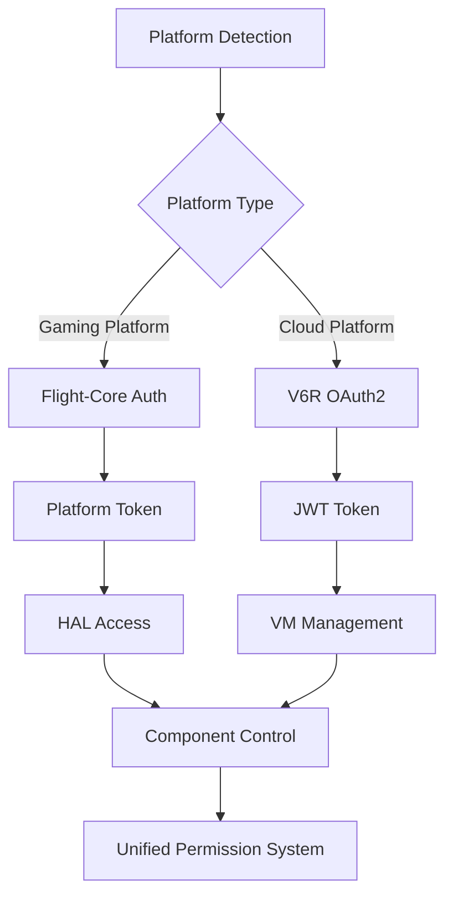

# Flight-Core Authentication Types Integration Guide

## Overview

Flight-Core Authentication provides a comprehensive, universal authentication system that bridges traditional gaming platforms with modern cloud infrastructure. This system supports both legacy gaming platforms (Dreamcast, PSP, PlayStation Vita) and modern V6R cloud environments with a unified, secure authentication model.

## 🎯 Key Features

- **🎮 Multi-Platform Support**: Native authentication for Dreamcast, PSP, Vita, and modern platforms
- **☁️ V6R Cloud Integration**: Full OAuth2/JWT support for V6R cloud services  
- **🔒 Security-First Design**: Platform-specific security models with proper permission isolation
- **🌐 Cross-Language Compatibility**: Rust, TypeScript, Go, and C++17 bindings
- **⚡ Performance Optimized**: Minimal overhead for constrained gaming platforms
- **🛡️ Permission System**: Fine-grained role-based access control (RBAC)

## 🏗️ Architecture

### Core Components

```
┌─────────────────────────────────────────────────────────────┐
│                    Authentication System                     │
├─────────────────────────────────────────────────────────────┤
│  WIT Interface Definition (authentication.wit)             │
├─────────────────────────────────────────────────────────────┤
│  Platform Authentication Patterns (Rust Core)              │
├─────────────────────────────────────────────────────────────┤
│  Multi-Language Bindings                                   │
│  ├─ TypeScript + React Hooks                               │
│  ├─ Go Types + Auth Manager                                │
│  ├─ C++17 Platform Integration                             │
│  └─ Rust Validation + Benchmarks                          │
├─────────────────────────────────────────────────────────────┤
│  Cross-Platform Compatibility Layer                        │
└─────────────────────────────────────────────────────────────┘
```

### Authentication Flow



## 🚀 Quick Start

### TypeScript Integration

```typescript
import { 
  V6RAuthManager, 
  AuthState, 
  Permission, 
  UserRole 
} from '@flight-core/authentication';

// Initialize V6R authentication
const authManager = new V6RAuthManager({
  v6rApiUrl: 'https://api.v6r.dev',
  clientId: 'your-client-id',
  scopes: ['vm:read', 'vm:write']
});

// Authenticate user
const result = await authManager.authenticateUser(
  'user@example.com', 
  'password',
  'v6r-cloud'
);

if (result.success) {
  console.log('Authenticated:', result.data.userAuth?.username);
  
  // Check permissions
  if (authManager.hasPermission(Permission.ManageVms)) {
    console.log('User can manage VMs');
  }
}
```

### React Integration

```typescript
import { 
  AuthProvider, 
  useAuth, 
  usePermissions, 
  ProtectedRoute 
} from '@flight-core/authentication/react';

function App() {
  return (
    <AuthProvider config={authConfig}>
      <Router>
        <Routes>
          <Route path="/login" element={<LoginPage />} />
          <Route path="/dashboard" element={
            <ProtectedRoute requiredRoles={[UserRole.Developer]}>
              <Dashboard />
            </ProtectedRoute>
          } />
        </Routes>
      </Router>
    </AuthProvider>
  );
}

function Dashboard() {
  const { isAuthenticated } = useAuth();
  const { hasPermission } = usePermissions();
  
  return (
    <div>
      {hasPermission(Permission.ManageVms) && (
        <VmManagementPanel />
      )}
    </div>
  );
}
```

### Go Integration

```go
package main

import (
    "github.com/flight-core/authentication-types"
)

func main() {
    // Create V6R authentication context
    authContext := authentication.AuthContext{
        State: authentication.AuthStateAuthenticated,
        UserAuth: &authentication.UserAuth{
            UserID:   "enterprise-user",
            Provider: authentication.AuthProviderV6RCloud,
            Roles:    []authentication.UserRole{authentication.UserRoleAdmin},
            Permissions: []authentication.Permission{
                authentication.PermissionRead,
                authentication.PermissionWrite,
                authentication.PermissionManageVMs,
            },
        },
        Platform: "v6r-enterprise",
        Provider: authentication.AuthProviderV6RCloud,
    }
    
    // Check permissions
    if authContext.UserAuth.HasPermission(authentication.PermissionManageVMs) {
        fmt.Println("User can manage VMs")
    }
}
```

### Rust Platform Authentication

```rust
use flight_authentication_validation::*;

fn main() -> Result<(), String> {
    // Validate Dreamcast authentication
    let suite = AuthValidationSuite::default();
    let dreamcast_auth = suite.validate_flight_core_auth("dreamcast")?;
    
    println!("Dreamcast authentication validated!");
    println!("User: {}", dreamcast_auth.user_auth.unwrap().username);
    
    // Validate V6R enterprise authentication  
    let v6r_auth = suite.validate_v6r_auth(
        "enterprise-user", 
        "enterprise", 
        "large"
    )?;
    
    println!("V6R enterprise authentication validated!");
    
    Ok(())
}
```

## 🎮 Platform-Specific Authentication

### Gaming Platforms (Dreamcast, PSP, Vita)

Gaming platforms use **platform-native authentication** with hardware-based trust models:

```typescript
// Platform detection and authentication
const platform = detectPlatform(); // "dreamcast", "psp", "vita"
const authContext = createFlightCoreAuth(platform);

// Platform-specific permissions
switch (platform) {
  case 'dreamcast':
    // Limited permissions for resource-constrained platform
    assert(authContext.userAuth?.permissions.includes(Permission.AccessHal));
    assert(authContext.userAuth?.permissions.includes(Permission.Read));
    break;
    
  case 'psp':
    // Enhanced permissions with write access
    assert(authContext.userAuth?.permissions.includes(Permission.Write));
    break;
    
  case 'vita':
    // Full platform capabilities
    assert(authContext.userAuth?.permissions.includes(Permission.ManageComponents));
    break;
}
```

**Platform Token Format:**
```
Token Type: PlatformSpecific
Scopes: ["platform:access", "hal:control"]
Issuer: "flight-core"
Platform: "dreamcast" (platform-locked)
Expiry: 24 hours (long-lived for gaming sessions)
```

### V6R Cloud Platform

V6R uses **OAuth2 with JWT tokens** for cloud-native authentication:

```typescript
// V6R subscription-based authentication
const v6rAuth = await authenticateV6RUser(
  'user@enterprise.com',
  'enterprise',  // subscription tier
  'large'        // VM size
);

// Subscription-based permissions
const permissions = getV6RPermissions(v6rAuth.subscriptionTier);
/*
Free:       [Permission.Read]
Individual: [Permission.Read, Permission.Write, Permission.Create]  
Team:       [Permission.Read, Permission.Write, Permission.ManageVms]
Enterprise: [Permission.Admin, Permission.ConfigurePlatform, ...]
*/
```

**V6R JWT Token Format:**
```
Token Type: JWT
Scopes: ["vm:*", "admin:*", "org:*"] (tier-dependent)
Issuer: "v6r-auth-service"
Platform: undefined (cross-platform)
Expiry: 12 hours (with auto-refresh)
```

## 🔒 Security Model

### Permission Hierarchy

```
Admin
├── ConfigurePlatform
├── ManageSessions  
├── ManageVms
│   ├── Create
│   ├── Delete
│   └── Execute
├── ManageComponents
├── AccessHal
├── ViewMetrics
├── Write
└── Read
```

### Role-Based Access Control (RBAC)

| Role | Platforms | Permissions | Use Case |
|------|-----------|-------------|----------|
| `PlatformOperator` | Gaming | HAL + Components | Platform control |
| `VmManager` | V6R | VM lifecycle | Cloud resource management |
| `Developer` | Both | Read + Write + Create | Development workflows |
| `Admin` | V6R | All permissions | System administration |
| `Observer` | Both | Read + ViewMetrics | Monitoring |

### Security Boundaries

1. **Platform Isolation**: Gaming platform tokens cannot access cloud resources
2. **Subscription Enforcement**: V6R permissions tied to subscription tier
3. **Token Scope Limitation**: JWT scopes restrict resource access
4. **Cross-Platform Compatibility**: V6R tokens work across platforms, gaming tokens are locked

## 📊 Performance Characteristics

### Memory Usage (JSON serialization)
- **Flight-Core Auth**: ~512 bytes (optimized for constrained platforms)
- **V6R Auth**: ~1024 bytes (rich metadata for cloud features)

### Authentication Performance
- **Platform Detection**: ~10 μs
- **Token Validation**: ~50 μs  
- **Permission Check**: ~5 μs
- **Cross-language JSON**: ~100 μs

### Platform Constraints

| Platform | Memory Limit | Token Expiry | Features |
|----------|--------------|--------------|----------|
| Dreamcast | 16MB total | 24 hours | Basic HAL access |
| PSP | 32MB total | 12 hours | Enhanced I/O |
| Vita | 512MB total | 8 hours | Full capabilities |
| V6R Cloud | Unlimited | 12 hours + refresh | All features |

## 🛠️ Development Guide

### Adding New Platforms

1. **Define WIT Interface**:
```wit
// In authentication.wit
variant platform-auth-config {
    new-platform(new-platform-config)
}

record new-platform-config {
    hardware-id: string,
    capabilities: list<string>,
    memory-limit: u32
}
```

2. **Implement Platform Patterns**:
```rust
// In platform_auth.rs
impl PlatformAuthPatterns {
    pub fn create_new_platform_auth(config: &NewPlatformConfig) -> AuthContext {
        // Platform-specific implementation
    }
}
```

3. **Add Language Bindings**:
```typescript
// In types.ts
export interface NewPlatformConfig {
  hardwareId: string;
  capabilities: string[];
  memoryLimit: number;
}
```

### Custom Permission Systems

```typescript
// Define custom permissions
const CustomPermission = {
  AccessHardware: "access-hardware" as const,
  ModifyFirmware: "modify-firmware" as const,
} as const;

// Extend validation
function validateCustomAuth(context: AuthContext): boolean {
  return context.userAuth?.permissions.includes(CustomPermission.AccessHardware);
}
```

### Testing Strategy

```rust
#[cfg(test)]
mod tests {
    use super::*;

    #[test]
    fn test_platform_isolation() {
        let dreamcast_auth = create_flight_core_auth("dreamcast");
        let v6r_auth = create_v6r_auth("user", "enterprise", "large");
        
        // Dreamcast tokens should not work on V6R
        assert!(!is_platform_compatible(&dreamcast_auth, "v6r-cloud"));
        
        // V6R tokens should work cross-platform
        assert!(is_platform_compatible(&v6r_auth, "any-platform"));
    }
    
    #[test]
    fn test_permission_escalation_prevention() {
        let free_user = create_v6r_auth("user", "free", "small");
        
        // Free users cannot have admin permissions
        assert!(!free_user.user_auth.unwrap().permissions.contains(&Permission::Admin));
    }
}
```

## 🔄 Migration Guide

### From Legacy Authentication

```typescript
// Before: Platform-specific auth
const dreamcastAuth = initializeDreamcastAuth();
const pspAuth = initializePSPAuth();

// After: Unified Flight-Core auth
const authManager = new FlightCoreAuthManager();
const authContext = authManager.authenticateForPlatform(platform);
```

### V6R Integration

```typescript
// Before: Direct V6R API calls
const vmList = await fetch('/api/vms', { 
  headers: { 'Authorization': 'Bearer ' + token } 
});

// After: Authentication-aware API calls  
const authManager = new V6RAuthManager(config);
await authManager.authenticateUser(username, password);

if (authManager.hasPermission(Permission.ManageVms)) {
  const vmList = await authenticatedFetch('/api/vms');
}
```

## 📚 API Reference

### Core Types

| Type | Description | Platforms |
|------|-------------|-----------|
| `AuthContext` | Complete authentication state | All |
| `AuthToken` | Token representation + metadata | All |
| `UserAuth` | User identity + permissions | All |
| `AuthProvider` | Authentication source | All |
| `TokenType` | Token format specification | All |

### Authentication Managers

| Class | Language | Use Case |
|-------|----------|----------|
| `V6RAuthManager` | TypeScript | V6R cloud integration |
| `FlightCoreAuthValidator` | Rust | Platform validation |
| `AuthContext` | Go | Server-side auth |

### React Hooks

| Hook | Purpose | Returns |
|------|---------|---------|
| `useAuth()` | Current auth state | `{ authManager, authContext }` |
| `useAuthState()` | Authentication status | `{ isAuthenticated, isLoading, ... }` |
| `usePermissions()` | Permission checking | `{ hasPermission, hasAnyPermission, ... }` |
| `useRoles()` | Role management | `{ hasRole, hasAnyRole, ... }` |

## 🔧 Configuration

### V6R Authentication Config

```typescript
interface AuthConfig {
  v6rApiUrl: string;           // V6R API endpoint
  clientId: string;            // OAuth2 client ID
  clientSecret?: string;       // OAuth2 client secret (server-side)
  scopes: string[];           // Required OAuth2 scopes
  autoRefresh?: boolean;      // Enable automatic token refresh
  refreshThreshold?: number;  // Seconds before expiry to refresh
  storageKey?: string;        // LocalStorage key for persistence
}
```

### Platform Detection Config

```rust
pub struct PlatformDetectionConfig {
    pub hardware_signatures: HashMap<String, PlatformType>,
    pub capability_detection: bool,
    pub memory_constraints: HashMap<PlatformType, u32>,
    pub security_model: SecurityModel,
}
```

## 🧪 Testing & Validation

### Comprehensive Test Suite

```bash
# Run Rust validation tests
cd validation/authentication
cargo test

# Run TypeScript integration tests  
cd bindings/typescript/authentication
npm test

# Run Go cross-language tests
cd bindings/go/authentication
go test

# Run performance benchmarks
cargo bench
```

### Security Validation

The authentication system includes comprehensive security validation:

1. **Permission Escalation Prevention**: Free users cannot gain admin permissions
2. **Platform Isolation**: Gaming tokens cannot access cloud resources  
3. **Token Scope Validation**: JWT scopes properly restrict access
4. **Cross-Language Compatibility**: Types serialize consistently across languages

### Performance Benchmarks

All authentication operations are benchmarked to ensure performance requirements:

- **Dreamcast**: All operations < 100μs (hardware constraints)
- **Modern Platforms**: All operations < 50μs  
- **Memory Usage**: < 2KB per auth context (constrained platforms)

## 🤝 Contributing

### Development Setup

1. **Install Dependencies**:
```bash
# Rust toolchain
curl --proto '=https' --tlsv1.2 -sSf https://sh.rustup.rs | sh

# Node.js (for TypeScript)
nvm install 18

# Go toolchain  
go version  # Ensure Go 1.21+
```

2. **Build All Bindings**:
```bash
# Generate all language bindings
./tools/generate-auth-bindings.sh

# Run validation suite
./tools/validate-auth-types.sh
```

3. **Run Tests**:
```bash
# Comprehensive test suite
./tools/run-auth-tests.sh
```

### Code Style

- **Rust**: Follow `rustfmt` + `clippy` recommendations
- **TypeScript**: ESLint + Prettier configuration  
- **Go**: `gofmt` + `golint` standards
- **Documentation**: All public APIs must be documented

## 📖 Examples

### Complete Integration Examples

- **[TypeScript React App](./examples/typescript-react-auth/)**
- **[Go Backend Service](./examples/go-auth-service/)**  
- **[Rust Platform Validation](./examples/rust-platform-auth/)**
- **[C++17 Platform Integration](./examples/cpp17-dreamcast-auth/)**

## 🐛 Troubleshooting

### Common Issues

1. **Token Validation Failures**
   - Check token expiration timestamps
   - Verify JWT signature with correct secret
   - Ensure token issuer matches expected value

2. **Permission Denied Errors**
   - Validate user subscription tier for V6R
   - Check platform compatibility for gaming platforms
   - Verify required roles are assigned

3. **Cross-Language Type Issues**
   - Ensure JSON serialization compatibility
   - Check enum value consistency across languages
   - Validate timestamp format (Unix epoch vs ISO strings)

## 📞 Support

- **Documentation**: [Flight-Core Auth Docs](https://docs.flight-core.dev/auth)
- **API Reference**: [OpenAPI Specification](https://api.flight-core.dev/auth/docs)
- **Community**: [Flight-Core Discord](https://discord.gg/flight-core)
- **Issues**: [GitHub Issues](https://github.com/flight-core/authentication/issues)

---

**Flight-Core Authentication** - Universal authentication for gaming platforms and cloud infrastructure.

*Built with ❤️ for the Flight-Core ecosystem.*
