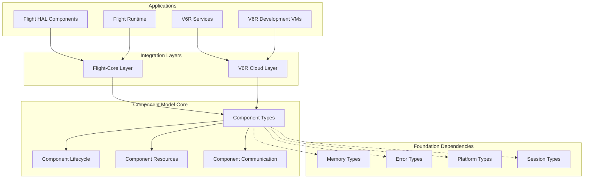
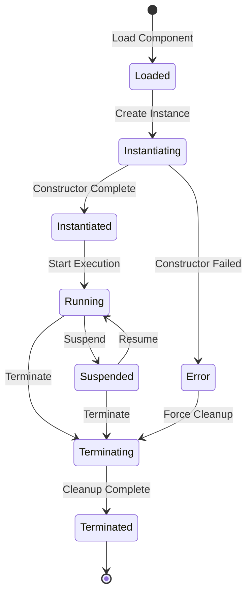

# Flight Component Model Infrastructure Documentation

## Overview

Flight Component Model infrastructure provides comprehensive component lifecycle management, resource handling, and inter-component communication across Flight-Core and V6R ecosystems. This universal system enables consistent component management from constrained retro gaming platforms (Dreamcast 16MB) to modern cloud environments (V6R 2GB+).

## Key Features

- **Universal Component Lifecycle**: Consistent component management from Dreamcast to V6R cloud
- **Resource Safety**: Prevent resource leaks and dangling references with comprehensive tracking
- **Inter-Component Communication**: Type-safe component interfaces and messaging
- **Platform Adaptation**: Components automatically adapt behavior based on platform capabilities
- **V6R Integration**: Cloud-native component features including container orchestration and auto-scaling
- **Flight-Core Integration**: Optimized patterns for retro gaming platforms with C++17 support

## Architecture



## Component Lifecycle

### States

Components progress through a well-defined lifecycle:

- **Loaded**: Component binary loaded but not instantiated
- **Instantiating**: Component calling constructors
- **Instantiated**: Component ready for execution
- **Running**: Component actively executing
- **Suspended**: Component execution paused
- **Terminating**: Component shutting down
- **Terminated**: Component fully stopped
- **Error**: Component in error state

### State Transitions



## Flight-Core Integration

### Platform-Specific HAL Components

Flight-Core HAL components are automatically configured for each platform:

```rust
use flight_component::FlightCoreComponentPatterns;

// Create Dreamcast HAL component
let dreamcast_hal = FlightCoreComponentPatterns::create_hal_component_config("dreamcast");
assert_eq!(dreamcast_hal.platform, "dreamcast");
assert_eq!(dreamcast_hal.memory_usage.total.bytes, 16 * 1024 * 1024); // 16MB

// Create PSP HAL component  
let psp_hal = FlightCoreComponentPatterns::create_hal_component_config("psp");
assert_eq!(psp_hal.memory_usage.total.bytes, 32 * 1024 * 1024); // 32MB
```

### Runtime Components

Flight-Core runtime components are optimized for UWRC WebAssembly execution:

```rust
// Create runtime component for single-threaded platforms
let dreamcast_runtime = FlightCoreComponentPatterns::create_runtime_component_config("dreamcast");
let metadata_map: HashMap<String, String> = dreamcast_runtime.metadata.into_iter().collect();
assert_eq!(metadata_map.get("execution_mode"), Some(&"single-threaded".to_string()));
assert_eq!(metadata_map.get("wasm_engine"), Some(&"uwrc".to_string()));
```

### C++17 Integration

Flight-Core provides comprehensive C++17 binding configuration:

```rust
let dreamcast_config = FlightCoreComponentPatterns::create_cpp17_binding_config("dreamcast");
assert_eq!(dreamcast_config.target_triple, "sh4-unknown-elf");
assert_eq!(dreamcast_config.toolchain, "kos-gcc");
assert!(dreamcast_config.compile_flags.contains(&"-std=c++17".to_string()));
assert!(dreamcast_config.compile_flags.contains(&"-Os".to_string())); // Size optimization
```

### Platform Memory Adaptation

Components automatically adapt to platform memory constraints:

```rust
let dreamcast_ctx = FlightCoreComponentPatterns::create_execution_context("test", "dreamcast");
let vita_ctx = FlightCoreComponentPatterns::create_execution_context("test", "vita");

// Dreamcast has more constrained resources
assert!(dreamcast_ctx.available_memory.bytes < vita_ctx.available_memory.bytes);
assert!(dreamcast_ctx.cpu_time_ms < vita_ctx.cpu_time_ms);
```

## V6R Cloud Extensions

### Development Environment Components

V6R development VMs are created with appropriate cloud-native features:

```typescript
import { V6RComponentManager } from '@flight/component/v6r';

// Create small development VM
const devComponent = await V6RComponentManager.createDevelopmentComponent(
  'user-session-123',
  'small',
  'development'
);

console.log(devComponent.name); // "V6R Development Environment - SMALL"
console.log(devComponent.platform); // "v6r-small"
```

### Production API Services

Production services include full cloud-native capabilities:

```typescript
// Create production API service
const apiService = await V6RComponentManager.createAPIServiceComponent(
  'auth-service',
  '1.2.3',
  'api'
);

// Service includes auto-scaling, load balancing, and monitoring
const extensions = apiService.v6rExtensions;
console.log(extensions.autoScaling.enabled); // true
console.log(extensions.loadBalancing); // true
console.log(extensions.monitoring.metricsEnabled); // true
```

### Health Monitoring

V6R components include comprehensive health monitoring:

```typescript
const healthStatus = await V6RComponentManager.monitorComponentHealth(
  'v6r-api-auth-service'
);

console.log(healthStatus.healthy); // true/false
console.log(healthStatus.metrics.cpuUsage); // CPU percentage
console.log(healthStatus.metrics.memoryUsage); // Memory percentage
console.log(healthStatus.issues); // Array of health issues
```

### Auto-Scaling

Components can be automatically or manually scaled:

```typescript
// Manual scaling
const result = await V6RComponentManager.scaleComponent(
  'v6r-api-auth-service',
  5, // Target 5 instances
  {
    enabled: true,
    cpuThreshold: 60.0, // Scale up at 60% CPU
    memoryThreshold: 70.0 // Scale up at 70% memory
  }
);

if (result.success) {
  console.log('Scaling operation successful');
}
```

### Cost Estimation

V6R provides cost estimation for deployment planning:

```typescript
import { V6RComponentUtils } from '@flight/component/v6r';

const costEstimate = V6RComponentUtils.calculateCostEstimate(
  'medium', // VM size
  3, // Instance count
  730 // Hours per month
);

console.log(`Monthly cost: $${costEstimate.monthlyCost}`);
console.log(`Breakdown: Compute $${costEstimate.breakdown.compute}`);
```

## Component Resource Management

### Resource Allocation

Components can allocate and track resources:

```typescript
// Allocate memory resource
const resourceHandle = await resourceManager.allocateResource(
  'component-123',
  'memory',
  { bytes: 1024n * 1024n, humanReadable: '1MB' }
);

// Share resource with another component
await resourceManager.shareResource(resourceHandle, 'component-456');

// Release resource when done
await resourceManager.releaseResource(resourceHandle);
```

### Dependency Management

Components can declare and resolve dependencies:

```typescript
// Add dependency
await resourceManager.addDependency(
  'flight-runtime',
  'flight-hal',
  'component-dependency',
  false // Not optional
);

// Check all dependencies are resolved
const resolved = await resourceManager.checkDependencies('flight-runtime');
console.log(resolved); // true if all dependencies resolved
```

## Inter-Component Communication

### Interface Registration

Components can register interfaces for other components to use:

```typescript
// Register interface
await communicationManager.registerInterface(
  'provider-component',
  'flight:hal-interface',
  '1.0.0',
  ['read_memory', 'write_memory', 'get_platform_info']
);

// Connect to interface
const interface = await communicationManager.connectInterface(
  'consumer-component',
  'flight:hal-interface'
);

// Send message through interface
const response = await communicationManager.sendMessage(
  'consumer-component',
  'provider-component',
  'flight:hal-interface',
  'read_memory',
  JSON.stringify({ address: 0x8c010000, size: 1024 })
);
```

## Platform Compatibility

### Supported Platforms

| Platform | Memory | CPU Arch | Threading | Graphics API | Status |
|----------|---------|----------|-----------|--------------|--------|
| Dreamcast | 16MB | SH4 | Single | PowerVR2 | ✅ Supported |
| PSP | 32MB | MIPS | Single | GU | ✅ Supported |
| Vita | 512MB | ARM | Limited | OpenGL ES | ✅ Supported |
| V6R Small | 512MB | x86-64 | Multi | Multiple | ✅ Supported |
| V6R Medium | 1GB | x86-64 | Multi | Multiple | ✅ Supported |
| V6R Large | 2GB+ | x86-64 | Multi | Multiple | ✅ Supported |

### Compatibility Checking

```rust
use flight_component::platform_matrix;

let compat = platform_matrix::check_compatibility("dreamcast", "v6r-small")?;
if compat.compatible {
    println!("Components can be migrated");
} else {
    for issue in compat.issues {
        println!("Issue: {}", issue.description);
    }
}
```

## Error Handling

All component operations return `FlightResult<T>` for consistent error handling:

```typescript
const result = await lifecycleManager.createComponent(
  'my-component',
  'flight:runtime-world',
  'dreamcast'
);

if (result.success) {
  console.log(`Created component: ${result.data}`);
} else {
  console.error(`Error: ${result.error.message}`);
  if (result.error.details) {
    console.error(`Details: ${result.error.details}`);
  }
}
```

## Performance Considerations

### Memory Constraints

- **Dreamcast**: Extremely limited (16MB) - use conservative allocation
- **PSP**: Limited (32MB) - balanced allocation strategy
- **V6R**: Abundant (512MB-2GB+) - aggressive allocation possible

### Threading Models

- **Dreamcast/PSP**: Cooperative threading only
- **Vita**: Preemptive threading with limitations
- **V6R**: Full preemptive multi-threading

### Optimization Guidelines

1. **Use platform detection** to adapt component behavior
2. **Implement resource pooling** for constrained platforms
3. **Leverage auto-scaling** in V6R environments
4. **Monitor component health** proactively
5. **Use dependency injection** for loose coupling

## Integration Examples

### Flight-Core Game Engine Component

```rust
// Create game engine component for Dreamcast
let game_engine = ComponentInfo {
    id: "flight-game-engine".to_string(),
    name: "Flight Game Engine".to_string(),
    version: "1.0.0".to_string(),
    state: ComponentState::Instantiated,
    world: "flight:game-world".to_string(),
    platform: "dreamcast".to_string(),
    session_id: Some("game-session".to_string()),
    // ... memory usage and metadata
};

// Add dependencies
dependencies = [
    ComponentDependency {
        dependent: "flight-game-engine".to_string(),
        dependency: "flight-hal".to_string(),
        dependency_type: DependencyType::ComponentDependency,
        optional: false,
        resolved: true,
    },
    ComponentDependency {
        dependent: "flight-game-engine".to_string(),
        dependency: "graphics-acceleration".to_string(),
        dependency_type: DependencyType::PlatformCapability,
        optional: true, // Fallback to software rendering
        resolved: true,
    },
];
```

### V6R Microservice Component

```typescript
// Create microservice with full cloud features
const microservice = await V6RComponentManager.createAPIServiceComponent(
  'user-service',
  '2.1.0',
  'api'
);

// Configure auto-scaling for production load
await V6RComponentManager.scaleComponent(
  microservice.id,
  2, // Start with 2 instances
  {
    enabled: true,
    minInstances: 2,
    maxInstances: 20,
    cpuThreshold: 70.0,
    memoryThreshold: 80.0
  }
);

// Monitor health continuously
setInterval(async () => {
  const health = await V6RComponentManager.monitorComponentHealth(microservice.id);
  if (!health.healthy) {
    console.warn(`Component ${microservice.id} unhealthy:`, health.issues);
  }
}, 30000); // Check every 30 seconds
```

## Best Practices

### Component Design

1. **Keep components focused** - Single responsibility principle
2. **Design for resource constraints** - Consider minimum platform capabilities
3. **Use async interfaces** - Non-blocking communication when possible
4. **Implement health checks** - Enable monitoring and auto-recovery
5. **Handle graceful shutdown** - Clean resource cleanup

### Resource Management

1. **Track all allocations** - Use resource handles consistently
2. **Share resources when appropriate** - Reduce memory fragmentation
3. **Release resources promptly** - Prevent resource leaks
4. **Monitor resource usage** - Stay within platform limits
5. **Implement resource pooling** - Reuse expensive resources

### Error Recovery

1. **Use circuit breakers** - Prevent cascading failures
2. **Implement retries with backoff** - Handle transient failures
3. **Log component events** - Enable debugging and monitoring
4. **Graceful degradation** - Continue with reduced functionality
5. **Health check endpoints** - Enable external monitoring

## Troubleshooting

### Common Issues

#### Component Won't Start
- Check all dependencies are resolved
- Verify platform compatibility
- Check resource availability
- Review component logs

#### High Memory Usage
- Monitor resource allocations
- Check for memory leaks
- Implement resource pooling
- Consider component splitting

#### Poor Performance
- Check execution context allocation
- Monitor CPU usage patterns
- Optimize component communication
- Consider auto-scaling in V6R

#### Communication Failures
- Verify interface registration
- Check network connectivity (V6R)
- Monitor service mesh health
- Review error logs

### Debugging Tools

1. **Component Health Monitor** - Real-time health status
2. **Resource Usage Tracker** - Memory and CPU monitoring
3. **Dependency Visualizer** - Component relationship mapping
4. **Performance Profiler** - Execution time analysis
5. **Log Aggregation** - Centralized logging (V6R)

## API Reference

### Core Interfaces

- `ComponentLifecycleManager` - Component lifecycle operations
- `ComponentResourceManager` - Resource allocation and tracking
- `ComponentCommunicationManager` - Inter-component communication

### Flight-Core Classes

- `FlightCoreComponentPatterns` - Platform-specific component configurations
- `ComponentUtils` - Utility functions for component management

### V6R Classes

- `V6RComponentManager` - Cloud-native component operations
- `V6RComponentUtils` - V6R-specific utilities and cost estimation

### Type Definitions

- `ComponentInfo` - Complete component metadata
- `ComponentState` - Component lifecycle states
- `ExecutionContext` - Runtime execution environment
- `V6RComponentExtensions` - Cloud-native component features

For complete API documentation, see the generated TypeScript and Rust documentation.
