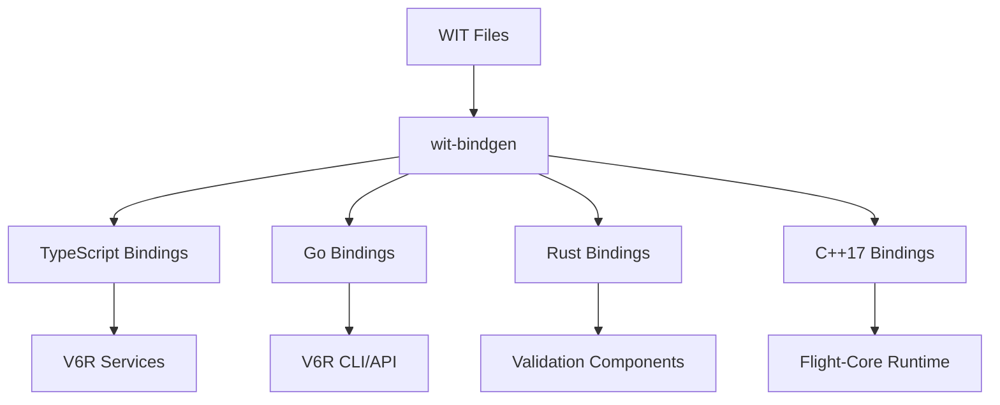
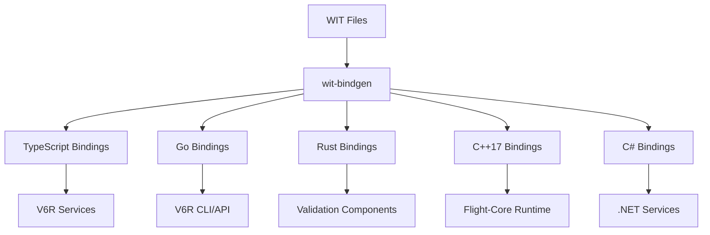

# Adding New Language Bindings to Flight Shared Types

A comprehensive guide for integrating new programming languages into the Flight-Core Component Model type system.

## Table of Contents

1. [Overview](#overview)
2. [Prerequisites](#prerequisites)
3. [Architecture Overview](#architecture-overview)
4. [Case Study: Adding C# Support](#case-study-adding-c-support)
5. [Step-by-Step Implementation](#step-by-step-implementation)
6. [Testing and Validation](#testing-and-validation)
7. [Build System Integration](#build-system-integration)
8. [Documentation and Examples](#documentation-and-examples)
9. [Maintenance and Updates](#maintenance-and-updates)

## Overview

The Flight Shared Types system is designed to support multiple programming languages through WebAssembly Component Model (WIT) bindings. Currently supported languages include:

- **TypeScript** - V6R mobile & bridge services
- **Go** - V6R API & CLI services  
- **Rust** - Validation components
- **C++17** - Flight-Core runtime integration

This guide demonstrates how to add **C#** support as a new target language, following established patterns and best practices.

## Prerequisites

### Required Tools
- **wit-bindgen CLI** (v0.15.0+) with C# support
- **.NET SDK** (8.0+) for C# development
- **NuGet** package management
- **MSBuild** or similar build system integration

### Knowledge Requirements
- Understanding of WebAssembly Component Model
- Familiarity with WIT (WebAssembly Interface Type) definitions
- C# development experience
- Flight-Core domain architecture knowledge

### Infrastructure Access
- Write access to Flight Shared Types repository
- ORAS registry credentials for publishing
- Buck2 build system configuration access

## Architecture Overview

### Current Binding Generation Flow



### Target Architecture with C#



## Case Study: Adding C# Support

### Use Cases for C# Integration

1. **Enterprise Integration**
   - .NET-based enterprise services
   - Windows-native Flight-Core applications
   - Azure cloud service integration

2. **Cross-Platform Development**
   - .NET Core applications on Linux/macOS
   - Unity game engine integration
   - Xamarin mobile applications

3. **Legacy System Integration**
   - Existing .NET Framework applications
   - COM interop requirements
   - Windows service integration

### Technical Requirements

- **Memory Safety**: C# managed memory + WebAssembly linear memory
- **Type Mapping**: WIT types → C# types with proper serialization
- **Error Handling**: WebAssembly exceptions → C# exceptions
- **Performance**: Minimal overhead for Dreamcast (16MB) constraints

## Step-by-Step Implementation

### Phase 1: Directory Structure Setup

```bash
# Create C# binding directory
mkdir -p bindings/csharp

# Create subdirectories for different aspects
mkdir -p bindings/csharp/{src,tests,examples,nuget}
mkdir -p bindings/csharp/src/{FlightTypes,Generated}
```

### Phase 2: Update Toolchain Configuration

#### 2.1 Verify wit-bindgen C# Support

```bash
# Check if wit-bindgen supports C#
wit-bindgen --help | grep -i csharp

# If not available, check for alternative generators
# May need to use community implementations or custom generators
```

#### 2.2 Update Generation Scripts

Update `tools/generate-bindings.sh` to include C#:

```bash
# Add to generate-bindings.sh after existing languages

# C# bindings
if command -v wit-bindgen >/dev/null 2>&1; then
    if wit-bindgen --help | grep -q csharp; then
        wit-bindgen csharp "$wit_file" --out-dir "$BINDINGS_DIR/csharp/$name"
    else
        echo "⚠️  C# bindings not supported by current wit-bindgen version"
        # Use alternative generator or custom implementation
        generate_csharp_bindings "$wit_file" "$BINDINGS_DIR/csharp/$name"
    fi
fi
```

### Phase 3: C# Project Structure

#### 3.1 Create Base C# Project

```xml
<!-- bindings/csharp/FlightSharedTypes.csproj -->
<Project Sdk="Microsoft.NET.Sdk">

  <PropertyGroup>
    <TargetFrameworks>net8.0;net6.0;netstandard2.1</TargetFrameworks>
    <LangVersion>latest</LangVersion>
    <Nullable>enable</Nullable>
    <GeneratePackageOnBuild>true</GeneratePackageOnBuild>
    <PackageId>FlightCore.SharedTypes</PackageId>
    <PackageVersion>1.0.0</PackageVersion>
    <Authors>Flight-Core Team</Authors>
    <Description>WebAssembly Component Model types for Flight-Core and V6R integration</Description>
    <RepositoryUrl>https://github.com/flight-core/flight-core</RepositoryUrl>
    <PackageTags>webassembly;component-model;flight-core;v6r</PackageTags>
  </PropertyGroup>

  <ItemGroup>
    <PackageReference Include="System.Memory" Version="4.5.5" />
    <PackageReference Include="System.Text.Json" Version="8.0.0" />
  </ItemGroup>

</Project>
```

#### 3.2 Create Base Type System

```csharp
// bindings/csharp/src/FlightTypes/Common.cs
using System;
using System.Runtime.InteropServices;

namespace FlightCore.SharedTypes
{
    /// <summary>
    /// Base interface for all Flight Component Model types
    /// </summary>
    public interface IComponentType
    {
        /// <summary>
        /// Serialize to WebAssembly linear memory
        /// </summary>
        ReadOnlySpan<byte> Serialize();
        
        /// <summary>
        /// Deserialize from WebAssembly linear memory
        /// </summary>
        void Deserialize(ReadOnlySpan<byte> data);
    }

    /// <summary>
    /// Memory constraints for different Flight-Core platforms
    /// </summary>
    public static class PlatformConstraints
    {
        public const int DreamcastMaxMemory = 16 * 1024 * 1024; // 16MB
        public const int PSPMaxMemory = 64 * 1024 * 1024; // 64MB
        public const int V6RSmallMaxMemory = 512 * 1024 * 1024; // 512MB
        public const int V6RMediumMaxMemory = 1024 * 1024 * 1024; // 1GB
        public const int V6RLargeMaxMemory = 2 * 1024 * 1024 * 1024; // 2GB
    }
}
```

### Phase 4: WIT Type Mapping

#### 4.1 Create Type Mapping System

```csharp
// bindings/csharp/src/FlightTypes/TypeMapping.cs
using System;
using System.Collections.Generic;

namespace FlightCore.SharedTypes
{
    /// <summary>
    /// Maps WIT primitive types to C# types
    /// </summary>
    public static class WitTypeMapping
    {
        public static readonly Dictionary<string, Type> PrimitiveTypes = new()
        {
            ["bool"] = typeof(bool),
            ["u8"] = typeof(byte),
            ["u16"] = typeof(ushort),
            ["u32"] = typeof(uint),
            ["u64"] = typeof(ulong),
            ["s8"] = typeof(sbyte),
            ["s16"] = typeof(short),
            ["s32"] = typeof(int),
            ["s64"] = typeof(long),
            ["f32"] = typeof(float),
            ["f64"] = typeof(double),
            ["char"] = typeof(char),
            ["string"] = typeof(string)
        };
    }

    /// <summary>
    /// Base class for generated WIT types
    /// </summary>
    public abstract class WitType : IComponentType
    {
        public abstract ReadOnlySpan<byte> Serialize();
        public abstract void Deserialize(ReadOnlySpan<byte> data);
        
        protected static void ValidateMemoryConstraints(int size, int maxSize)
        {
            if (size > maxSize)
                throw new InvalidOperationException(
                    $"Type size {size} exceeds platform constraint {maxSize}");
        }
    }
}
```

#### 4.2 Memory Type Implementation Example

```csharp
// bindings/csharp/src/Generated/MemoryTypes.cs
// This would be generated from wit/memory.wit

using System;
using System.Text.Json;

namespace FlightCore.SharedTypes.Memory
{
    /// <summary>
    /// Represents a memory allocation request in the Component Model
    /// Generated from WIT: memory-allocation-request
    /// </summary>
    public sealed class MemoryAllocationRequest : WitType
    {
        public uint Size { get; set; }
        public uint Alignment { get; set; }
        public string Purpose { get; set; } = string.Empty;
        public bool Critical { get; set; }

        public override ReadOnlySpan<byte> Serialize()
        {
            ValidateMemoryConstraints(
                (int)Size, 
                PlatformConstraints.DreamcastMaxMemory);

            var json = JsonSerializer.Serialize(this);
            return System.Text.Encoding.UTF8.GetBytes(json);
        }

        public override void Deserialize(ReadOnlySpan<byte> data)
        {
            var json = System.Text.Encoding.UTF8.GetString(data);
            var deserialized = JsonSerializer.Deserialize<MemoryAllocationRequest>(json);
            
            if (deserialized != null)
            {
                Size = deserialized.Size;
                Alignment = deserialized.Alignment;
                Purpose = deserialized.Purpose;
                Critical = deserialized.Critical;
            }
        }
    }

    /// <summary>
    /// Memory allocation result
    /// Generated from WIT: memory-allocation-result
    /// </summary>
    public sealed class MemoryAllocationResult : WitType
    {
        public bool Success { get; set; }
        public uint Address { get; set; }
        public string? ErrorMessage { get; set; }

        public override ReadOnlySpan<byte> Serialize()
        {
            var json = JsonSerializer.Serialize(this);
            return System.Text.Encoding.UTF8.GetBytes(json);
        }

        public override void Deserialize(ReadOnlySpan<byte> data)
        {
            var json = System.Text.Encoding.UTF8.GetString(data);
            var deserialized = JsonSerializer.Deserialize<MemoryAllocationResult>(json);
            
            if (deserialized != null)
            {
                Success = deserialized.Success;
                Address = deserialized.Address;
                ErrorMessage = deserialized.ErrorMessage;
            }
        }
    }
}
```

### Phase 5: Error Handling Integration

```csharp
// bindings/csharp/src/FlightTypes/Errors.cs
using System;

namespace FlightCore.SharedTypes
{
    /// <summary>
    /// Base exception for Flight Component Model operations
    /// </summary>
    public class FlightComponentException : Exception
    {
        public string ComponentName { get; }
        public uint ErrorCode { get; }

        public FlightComponentException(string componentName, uint errorCode, string message)
            : base(message)
        {
            ComponentName = componentName;
            ErrorCode = errorCode;
        }

        public FlightComponentException(string componentName, uint errorCode, string message, Exception innerException)
            : base(message, innerException)
        {
            ComponentName = componentName;
            ErrorCode = errorCode;
        }
    }

    /// <summary>
    /// Memory-related component exceptions
    /// </summary>
    public class FlightMemoryException : FlightComponentException
    {
        public uint RequestedSize { get; }
        public uint AvailableSize { get; }

        public FlightMemoryException(uint errorCode, string message, uint requestedSize, uint availableSize)
            : base("memory", errorCode, message)
        {
            RequestedSize = requestedSize;
            AvailableSize = availableSize;
        }
    }
}
```

## Testing and Validation

### Phase 6: Unit Testing Framework

#### 6.1 Create Test Project

```xml
<!-- bindings/csharp/tests/FlightSharedTypes.Tests.csproj -->
<Project Sdk="Microsoft.NET.Sdk">

  <PropertyGroup>
    <TargetFramework>net8.0</TargetFramework>
    <ImplicitUsings>enable</ImplicitUsings>
    <Nullable>enable</Nullable>
    <IsPackable>false</IsPackable>
  </PropertyGroup>

  <ItemGroup>
    <PackageReference Include="Microsoft.NET.Test.Sdk" Version="17.8.0" />
    <PackageReference Include="xunit" Version="2.6.4" />
    <PackageReference Include="xunit.runner.visualstudio" Version="2.5.6" />
    <PackageReference Include="FluentAssertions" Version="6.12.0" />
  </ItemGroup>

  <ItemGroup>
    <ProjectReference Include="../FlightSharedTypes.csproj" />
  </ItemGroup>

</Project>
```

#### 6.2 Memory Type Tests

```csharp
// bindings/csharp/tests/MemoryTypesTests.cs
using FluentAssertions;
using FlightCore.SharedTypes.Memory;
using Xunit;

namespace FlightCore.SharedTypes.Tests
{
    public class MemoryTypesTests
    {
        [Fact]
        public void MemoryAllocationRequest_SerializeDeserialize_PreservesData()
        {
            // Arrange
            var request = new MemoryAllocationRequest
            {
                Size = 1024,
                Alignment = 8,
                Purpose = "Test allocation",
                Critical = true
            };

            // Act
            var serialized = request.Serialize();
            var newRequest = new MemoryAllocationRequest();
            newRequest.Deserialize(serialized);

            // Assert
            newRequest.Size.Should().Be(request.Size);
            newRequest.Alignment.Should().Be(request.Alignment);
            newRequest.Purpose.Should().Be(request.Purpose);
            newRequest.Critical.Should().Be(request.Critical);
        }

        [Fact]
        public void MemoryAllocationRequest_ExceedsDreamcastLimit_ThrowsException()
        {
            // Arrange
            var request = new MemoryAllocationRequest
            {
                Size = PlatformConstraints.DreamcastMaxMemory + 1024,
                Alignment = 8,
                Purpose = "Too large allocation",
                Critical = false
            };

            // Act & Assert
            Assert.Throws<InvalidOperationException>(() => request.Serialize());
        }

        [Theory]
        [InlineData(1024, 8)]
        [InlineData(4096, 16)]
        [InlineData(65536, 32)]
        public void MemoryAllocationRequest_ValidSizes_SerializesSuccessfully(uint size, uint alignment)
        {
            // Arrange
            var request = new MemoryAllocationRequest
            {
                Size = size,
                Alignment = alignment,
                Purpose = "Valid allocation",
                Critical = false
            };

            // Act
            var result = () => request.Serialize();

            // Assert
            result.Should().NotThrow();
        }
    }
}
```

### Phase 7: Cross-Language Validation

#### 7.1 Create Cross-Language Test Suite

```csharp
// bindings/csharp/tests/CrossLanguageTests.cs
using FlightCore.SharedTypes.Memory;
using System.Diagnostics;
using Xunit;

namespace FlightCore.SharedTypes.Tests
{
    public class CrossLanguageTests
    {
        [Fact]
        public void MemoryTypes_CompatibleWithRustValidation()
        {
            // Arrange
            var request = new MemoryAllocationRequest
            {
                Size = 2048,
                Alignment = 16,
                Purpose = "Cross-language test",
                Critical = true
            };

            var serialized = request.Serialize();
            
            // Act - Call Rust validation component
            var result = CallRustValidation(serialized.ToArray());
            
            // Assert
            Assert.True(result, "C# serialized data should be valid according to Rust validator");
        }

        private bool CallRustValidation(byte[] data)
        {
            // This would call the Rust validation component
            // For testing, we'd run the actual Rust validator as a subprocess
            var startInfo = new ProcessStartInfo
            {
                FileName = "cargo",
                Arguments = "run --bin memory-validator",
                WorkingDirectory = "../../validation/memory",
                RedirectStandardInput = true,
                RedirectStandardOutput = true,
                UseShellExecute = false
            };

            using var process = Process.Start(startInfo);
            if (process != null)
            {
                process.StandardInput.BaseStream.Write(data);
                process.StandardInput.Close();
                process.WaitForExit();
                return process.ExitCode == 0;
            }

            return false;
        }
    }
}
```

## Build System Integration

### Phase 8: Update Build Scripts

#### 8.1 Update Binding Generation Script

```bash
# Add to tools/generate-bindings.sh

generate_csharp_bindings() {
    local wit_file="$1"
    local output_dir="$2"
    local name=$(basename "$wit_file" .wit)
    
    echo "Generating C# bindings for $name..."
    
    # Create output directory
    mkdir -p "$output_dir"
    
    # Generate C# code (custom implementation if wit-bindgen doesn't support C#)
    if command -v wit-bindgen >/dev/null 2>&1 && wit-bindgen --help | grep -q csharp; then
        wit-bindgen csharp "$wit_file" --out-dir "$output_dir"
    else
        # Use custom C# generator
        python3 tools/csharp-generator.py "$wit_file" "$output_dir"
    fi
    
    # Build the C# project
    if [ -f "$output_dir/FlightSharedTypes.csproj" ]; then
        dotnet build "$output_dir/FlightSharedTypes.csproj" --configuration Release
    fi
}
```

#### 8.2 Add C# to Main Generation Loop

```bash
# In tools/generate-bindings.sh, add to the main loop:

# C# bindings
generate_csharp_bindings "$wit_file" "$BINDINGS_DIR/csharp/$name"
```

### Phase 9: NuGet Package Configuration

#### 9.1 Create NuGet Package Script

```bash
#!/bin/bash
# tools/package-csharp.sh

set -euo pipefail

CSHARP_DIR="/Users/punk1290/git/flight-core/domains/flight-shared-types/bindings/csharp"
PACKAGE_OUTPUT_DIR="$CSHARP_DIR/nuget"

echo "📦 Creating NuGet packages..."

# Clean previous packages
rm -rf "$PACKAGE_OUTPUT_DIR"
mkdir -p "$PACKAGE_OUTPUT_DIR"

# Build and package each generated binding
for binding_dir in "$CSHARP_DIR"/*/; do
    if [ -f "$binding_dir/FlightSharedTypes.csproj" ]; then
        echo "Packaging $(basename "$binding_dir")..."
        
        dotnet pack "$binding_dir/FlightSharedTypes.csproj" \
            --configuration Release \
            --output "$PACKAGE_OUTPUT_DIR" \
            --include-symbols \
            --include-source
    fi
done

echo "✅ NuGet packages created in $PACKAGE_OUTPUT_DIR"
```

### Phase 10: ORAS Integration

#### 10.1 Update ORAS Configuration

```yaml
# Add to oras-config.yaml
artifacts:
  memory-types:
    category: "shared-types"
    platforms: ["dreamcast", "psp", "windows", "macos", "linux", "v6r-small", "v6r-medium", "v6r-large"]
    bindings: ["typescript", "go", "rust", "cpp17", "csharp"]  # Added csharp
    
  error-types:
    category: "shared-types"
    platforms: ["all"]
    bindings: ["typescript", "go", "rust", "cpp17", "csharp"]  # Added csharp
    
  platform-types:
    category: "shared-types" 
    platforms: ["all"]
    bindings: ["typescript", "go", "rust", "cpp17", "csharp"]  # Added csharp

# Add C#-specific publishing configuration
csharp_publishing:
  nuget_feed: "https://api.nuget.org/v3/index.json"
  package_prefix: "FlightCore.SharedTypes"
  target_frameworks: ["net8.0", "net6.0", "netstandard2.1"]
```

#### 10.2 Update Buck2 Configuration

```python
# Add to buck2/BUCK

# C# memory types publishing
flight_shared_types_publish(
    name = "publish_memory_types_csharp",
    wit_files = ["//domains/flight-shared-types/wit:memory.wit"],
    platforms = ["windows", "linux", "macos"],
    bindings = ["csharp"],
    annotations = {
        "flight.types": "memory",
        "flight.language": "csharp",
        "flight.dotnet.version": "8.0",
    },
)

# C# NuGet package publishing
nuget_publish(
    name = "publish_nuget_packages",
    packages = ["//domains/flight-shared-types/bindings/csharp:nuget"],
    feed = "$(NUGET_FEED_URL)",
    api_key = "$(NUGET_API_KEY)",
)
```

### Phase 11: CI/CD Integration

#### 11.1 GitHub Actions Workflow

```yaml
# .github/workflows/csharp-bindings.yml
name: C# Bindings CI

on:
  push:
    paths:
      - 'domains/flight-shared-types/wit/**'
      - 'domains/flight-shared-types/bindings/csharp/**'
      - 'domains/flight-shared-types/tools/**'
  pull_request:
    paths:
      - 'domains/flight-shared-types/wit/**'
      - 'domains/flight-shared-types/bindings/csharp/**'

jobs:
  csharp-bindings:
    runs-on: ubuntu-latest
    
    steps:
    - uses: actions/checkout@v4
    
    - name: Setup .NET
      uses: actions/setup-dotnet@v4
      with:
        dotnet-version: '8.0.x'
    
    - name: Install Rust and WIT tools
      run: |
        curl --proto '=https' --tlsv1.2 -sSf https://sh.rustup.rs | sh -s -- -y
        source ~/.cargo/env
        cargo install wit-bindgen-cli wasm-tools
    
    - name: Generate C# bindings
      run: |
        cd domains/flight-shared-types
        ./tools/generate-bindings.sh
    
    - name: Build C# projects
      run: |
        cd domains/flight-shared-types/bindings/csharp
        find . -name "*.csproj" -exec dotnet build {} --configuration Release \;
    
    - name: Run C# tests
      run: |
        cd domains/flight-shared-types/bindings/csharp
        find . -name "*Tests.csproj" -exec dotnet test {} --configuration Release --logger trx \;
    
    - name: Run cross-language validation
      run: |
        cd domains/flight-shared-types
        cargo check
        ./tools/validate-wit.sh
    
    - name: Package NuGet
      if: github.ref == 'refs/heads/main'
      run: |
        cd domains/flight-shared-types
        ./tools/package-csharp.sh
    
    - name: Publish to NuGet (Release only)
      if: github.ref == 'refs/heads/main' && github.event_name == 'push'
      env:
        NUGET_API_KEY: ${{ secrets.NUGET_API_KEY }}
      run: |
        cd domains/flight-shared-types/bindings/csharp/nuget
        for package in *.nupkg; do
          dotnet nuget push "$package" --api-key "$NUGET_API_KEY" --source https://api.nuget.org/v3/index.json
        done
```

## Documentation and Examples

### Phase 12: API Documentation

#### 12.1 Create XML Documentation

```csharp
// Example with comprehensive XML documentation
namespace FlightCore.SharedTypes.Memory
{
    /// <summary>
    /// Represents a memory allocation request in the Flight Component Model.
    /// This type is generated from the WIT definition and provides cross-language
    /// compatibility with TypeScript, Go, Rust, and C++17 implementations.
    /// </summary>
    /// <remarks>
    /// Memory allocations must respect platform constraints:
    /// - Dreamcast: 16MB maximum
    /// - PSP: 64MB maximum  
    /// - V6R Small: 512MB maximum
    /// - V6R Medium: 1GB maximum
    /// - V6R Large: 2GB maximum
    /// 
    /// All allocations are validated against these constraints during serialization.
    /// </remarks>
    /// <example>
    /// <code>
    /// var request = new MemoryAllocationRequest
    /// {
    ///     Size = 1024,
    ///     Alignment = 8,
    ///     Purpose = "Texture buffer",
    ///     Critical = true
    /// };
    /// 
    /// var serialized = request.Serialize();
    /// // Send to Component Model runtime...
    /// </code>
    /// </example>
    public sealed class MemoryAllocationRequest : WitType
    {
        // Implementation...
    }
}
```

#### 12.2 Integration Examples

```csharp
// bindings/csharp/examples/BasicUsage.cs
using FlightCore.SharedTypes;
using FlightCore.SharedTypes.Memory;
using System;

namespace FlightCore.Examples
{
    /// <summary>
    /// Basic usage examples for Flight Shared Types in C#
    /// </summary>
    public static class BasicUsage
    {
        /// <summary>
        /// Example: Memory allocation for a Dreamcast application
        /// </summary>
        public static void DreamcastMemoryAllocation()
        {
            try
            {
                var request = new MemoryAllocationRequest
                {
                    Size = 8192, // 8KB for sprite data
                    Alignment = 32, // 32-byte alignment for DMA
                    Purpose = "Sprite texture buffer",
                    Critical = false
                };

                Console.WriteLine("Creating memory allocation request...");
                var serialized = request.Serialize();
                
                // In a real application, this would be sent to the
                // Flight-Core Component Model runtime
                Console.WriteLine($"Serialized {serialized.Length} bytes");
                
                // Simulate receiving a response
                var result = new MemoryAllocationResult
                {
                    Success = true,
                    Address = 0x8C010000, // Dreamcast RAM address
                    ErrorMessage = null
                };

                Console.WriteLine($"Allocation successful at address: 0x{result.Address:X8}");
            }
            catch (FlightMemoryException ex)
            {
                Console.WriteLine($"Memory allocation failed: {ex.Message}");
                Console.WriteLine($"Requested: {ex.RequestedSize}, Available: {ex.AvailableSize}");
            }
        }

        /// <summary>
        /// Example: Cross-platform memory allocation with constraint checking
        /// </summary>
        public static void CrossPlatformAllocation(string targetPlatform, uint size)
        {
            var maxMemory = targetPlatform.ToLowerInvariant() switch
            {
                "dreamcast" => PlatformConstraints.DreamcastMaxMemory,
                "psp" => PlatformConstraints.PSPMaxMemory,
                "v6r-small" => PlatformConstraints.V6RSmallMaxMemory,
                "v6r-medium" => PlatformConstraints.V6RMediumMaxMemory,
                "v6r-large" => PlatformConstraints.V6RLargeMaxMemory,
                _ => throw new ArgumentException($"Unknown platform: {targetPlatform}")
            };

            if (size > maxMemory)
            {
                throw new FlightMemoryException(
                    1001, 
                    $"Allocation size exceeds {targetPlatform} memory limit",
                    size, 
                    (uint)maxMemory);
            }

            var request = new MemoryAllocationRequest
            {
                Size = size,
                Alignment = 16,
                Purpose = $"Cross-platform allocation for {targetPlatform}",
                Critical = size > maxMemory / 2 // Mark as critical if > 50% of available memory
            };

            Console.WriteLine($"Allocating {size} bytes on {targetPlatform}...");
            var serialized = request.Serialize();
            Console.WriteLine($"Request serialized: {serialized.Length} bytes");
        }
    }
}
```

### Phase 13: Integration Guide

#### 13.1 Create Integration Documentation

```markdown
<!-- bindings/csharp/docs/integration-guide.md -->

# C# Integration Guide

## Installation

### Via NuGet Package Manager
```bash
dotnet add package FlightCore.SharedTypes
```

### Via Package Manager Console
```powershell
Install-Package FlightCore.SharedTypes
```

## Quick Start

### 1. Basic Setup
```csharp
using FlightCore.SharedTypes;
using FlightCore.SharedTypes.Memory;

// Initialize Flight Component Model types
var request = new MemoryAllocationRequest
{
    Size = 1024,
    Alignment = 8,
    Purpose = "Application buffer",
    Critical = false
};

// Serialize for Component Model
var serialized = request.Serialize();
```

### 2. Cross-Platform Usage
```csharp
// Check platform constraints before allocation
if (request.Size <= PlatformConstraints.DreamcastMaxMemory)
{
    var serialized = request.Serialize();
    // Safe for Dreamcast deployment
}
```

### 3. Error Handling
```csharp
try
{
    var request = new MemoryAllocationRequest { Size = uint.MaxValue };
    var serialized = request.Serialize();
}
catch (FlightMemoryException ex)
{
    Console.WriteLine($"Memory error: {ex.Message}");
    Console.WriteLine($"Error code: {ex.ErrorCode}");
}
```

## Advanced Integration

### Custom Type Extensions
```csharp
public static class MemoryExtensions
{
    public static bool IsValidForPlatform(this MemoryAllocationRequest request, string platform)
    {
        var limit = platform.ToLowerInvariant() switch
        {
            "dreamcast" => PlatformConstraints.DreamcastMaxMemory,
            "psp" => PlatformConstraints.PSPMaxMemory,
            _ => int.MaxValue
        };
        
        return request.Size <= limit;
    }
}
```

### Performance Optimization
```csharp
// Use Span<byte> for zero-copy operations
public static ReadOnlySpan<byte> SerializeToSpan(this IComponentType type)
{
    return type.Serialize();
}

// Pooled memory for frequent allocations
private static readonly ArrayPool<byte> _bufferPool = ArrayPool<byte>.Shared;

public static void SerializePooled(this IComponentType type, out byte[] buffer)
{
    var span = type.Serialize();
    buffer = _bufferPool.Rent(span.Length);
    span.CopyTo(buffer);
}
```
```

## Troubleshooting

### Common Issues

1. **Serialization Failures**
   - Check platform memory constraints
   - Validate input data types
   - Ensure proper error handling

2. **Cross-Language Compatibility**
   - Verify WIT definitions match
   - Test with validation components
   - Check byte order and alignment

3. **Performance Issues**
   - Use Span<byte> for large data
   - Pool memory allocations
   - Profile serialization overhead

## Platform-Specific Considerations

### Dreamcast (16MB Constraint)
```csharp
public class DreamcastMemoryManager
{
    private const int MaxAllocationSize = PlatformConstraints.DreamcastMaxMemory / 4; // 4MB max
    
    public static MemoryAllocationRequest CreateSafeRequest(uint size, string purpose)
    {
        if (size > MaxAllocationSize)
            throw new FlightMemoryException(1001, "Allocation too large for Dreamcast", size, MaxAllocationSize);
            
        return new MemoryAllocationRequest
        {
            Size = size,
            Alignment = 32, // Dreamcast prefers 32-byte alignment
            Purpose = purpose,
            Critical = size > MaxAllocationSize / 2
        };
    }
}
```

### V6R Integration
```csharp
public class V6RMemoryAdapter
{
    public static async Task<MemoryAllocationResult> AllocateAsync(MemoryAllocationRequest request)
    {
        var serialized = request.Serialize();
        
        // Send to V6R service
        var response = await V6RClient.PostAsync("/memory/allocate", serialized);
        
        var result = new MemoryAllocationResult();
        result.Deserialize(response);
        
        return result;
    }
}
```
```

## Maintenance and Updates

### Version Management

The C# bindings follow semantic versioning aligned with the WIT definitions:

- **Major version**: Breaking changes to WIT interfaces
- **Minor version**: New WIT types or optional fields
- **Patch version**: Bug fixes and optimizations

### Update Process

#### 1. WIT Definition Changes
When WIT files are updated:
```bash
# Regenerate bindings
./tools/generate-bindings.sh

# Rebuild C# projects
cd bindings/csharp
find . -name "*.csproj" -exec dotnet build {} \;

# Run tests
find . -name "*Tests.csproj" -exec dotnet test {} \;
```

#### 2. Dependency Updates
Update NuGet dependencies regularly:
```xml
<PackageReference Include="System.Text.Json" Version="8.0.0" />
<PackageReference Include="System.Memory" Version="4.5.5" />
```

#### 3. Cross-Language Validation
After any changes, run cross-language tests:
```bash
# Run full validation suite
./tools/validate-wit.sh

# Test C# against Rust validator
cd bindings/csharp/tests
dotnet test --filter CrossLanguageTests
```

### Breaking Change Guidelines

When introducing breaking changes:

1. **Deprecation Period**: Mark old APIs as `[Obsolete]` for one minor version
2. **Migration Guide**: Provide clear upgrade documentation
3. **Compatibility Layer**: Offer temporary adapters when possible
4. **Version Bumping**: Follow semantic versioning strictly

Example deprecation:
```csharp
[Obsolete("Use MemoryAllocationRequest.CreateSafe() instead. This method will be removed in v2.0.0")]
public static MemoryAllocationRequest Create(uint size)
{
    return CreateSafe(size, "Legacy allocation");
}

public static MemoryAllocationRequest CreateSafe(uint size, string purpose)
{
    // New implementation with validation
}
```

### Performance Monitoring

Monitor binding performance across platforms:

```csharp
public class PerformanceMetrics
{
    private static readonly ActivitySource _activitySource = new("FlightCore.SharedTypes");
    
    public static ReadOnlySpan<byte> SerializeWithMetrics<T>(this T type) where T : IComponentType
    {
        using var activity = _activitySource.StartActivity("serialize");
        activity?.SetTag("type", typeof(T).Name);
        
        var start = Stopwatch.GetTimestamp();
        var result = type.Serialize();
        var elapsed = Stopwatch.GetElapsedTime(start);
        
        activity?.SetTag("duration_ms", elapsed.TotalMilliseconds);
        activity?.SetTag("size_bytes", result.Length);
        
        return result;
    }
}
```

### Testing Strategy

#### Unit Tests
- Test each generated type independently
- Validate serialization round-trips
- Test platform constraint enforcement
- Verify error handling

#### Integration Tests
- Cross-language compatibility tests
- End-to-end Component Model workflows
- Performance benchmarks
- Memory usage validation

#### Platform Tests
- Dreamcast constraint validation
- V6R service integration
- Windows/.NET Framework compatibility
- Linux/macOS .NET Core compatibility

### Support and Documentation

#### API Documentation
Generate XML documentation for all public APIs:
```xml
<PropertyGroup>
    <GenerateDocumentationFile>true</GenerateDocumentationFile>
    <IncludeSymbols>true</IncludeSymbols>
    <SymbolPackageFormat>snupkg</SymbolPackageFormat>
</PropertyGroup>
```

#### Example Repository
Maintain a separate examples repository with:
- Basic usage samples
- Integration patterns
- Performance optimization examples
- Platform-specific implementations

#### Community Support
- GitHub Issues for bug reports
- Stack Overflow tag: `flight-core-csharp`
- Discord channel for real-time help
- Quarterly community calls

## Conclusion

Adding C# support to Flight Shared Types involves:

1. **Infrastructure Setup**: Directory structure, toolchain, build systems
2. **Type System Implementation**: WIT mapping, serialization, error handling
3. **Testing Framework**: Unit tests, cross-language validation, platform testing
4. **Build Integration**: CI/CD pipelines, NuGet packaging, ORAS publishing
5. **Documentation**: API docs, examples, integration guides
6. **Maintenance**: Version management, updates, performance monitoring

This comprehensive approach ensures that C# bindings integrate seamlessly with the existing Flight-Core ecosystem while maintaining the high standards of performance, reliability, and cross-platform compatibility required for the diverse range of target platforms from Dreamcast (16MB) to V6R VMs (2GB).

The key to success is following established patterns, thorough testing, and maintaining compatibility with the broader Component Model ecosystem. By leveraging the existing infrastructure and extending it thoughtfully, new language bindings can be added efficiently while preserving the integrity of the shared type system.

## Additional Resources

- [WebAssembly Component Model Specification](https://github.com/WebAssembly/component-model)
- [WIT Bindgen Documentation](https://github.com/bytecodealliance/wit-bindgen)
- [Flight-Core Architecture Overview](../../README.md)
- [V6R Integration Guide](../api/v6r-integration.md)
- [Platform Constraints Reference](../api/platform-constraints.md)
- [Cross-Language Testing Guide](../guides/cross-language-testing.md)

---

*This guide provides a comprehensive template for adding any new language to the Flight Shared Types system. Adapt the specific implementation details to match the target language's conventions and ecosystem.*
